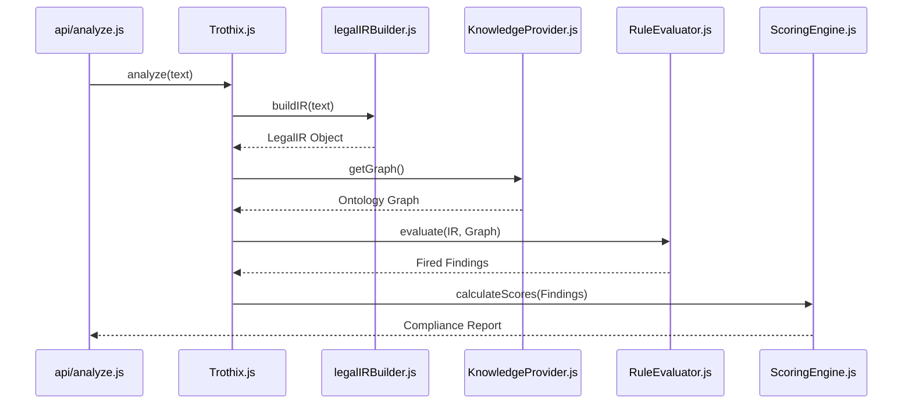

# Architecture Summary

## Purpose
This document provides a comprehensive technical overview of the Trothix platform's architecture. It details the data flow, subsystem components, and structural boundaries of Pipeline B (the production-serving analysis pipeline).

## Current Repository Implementation
The Trothix repository features five coexisting pipelines, but only **Pipeline B** is live in production. Pipeline B's entry point is `api/analyze.js`, which instantiates `Trothix.js`.
1. **Parser & Lexer:** Text is ingested and tokenized via `core/parser/tokenizer.js` and converted into lexical structures by `core/parser/lexer.js`.
2. **IR Construction:** `core/ir/legalIRBuilder.js` maps tokens into a structured `LegalIR` containing nodes (paragraphs, sections, clauses) and edges.
3. **Engine Registry Plugins:** `core/ir/engineRegistry.js` runs a sequence of plugins (`partyResolver`, `definitionEngine`, `clauseClassifier`, `legalGrammarEngine`, `actionBuilder`, `entityEngine`, `constraintEngine`, `actionNormalizer`, `referenceResolver`, `deadlineNormalizer`, `findingEngine`).
4. **Knowledge Provider:** `knowledge/KnowledgeProvider.js` loads domain definitions from `assets/js/engine/knowledge/v1/domains/` and structures them into an in-memory graph (`nodes` and `edges`).
5. **Rule Compilation & Execution:** Rules are registered in `rules/RuleRegistry.js`, compiled into closures by `rules/RuleCompiler.js`, and evaluated against the contract IR by `rules/RuleEvaluator.js`.
6. **Assessment & Reporting:** `assessment/ScoringEngine.js` and `assessment/VerdictEngine.js` calculate risk, fairness, and completeness scores, and `assessment/ReportAssembler.js` generates the final JSON output.

## Research Findings
The research corpus suggests that high-integrity legal reasoning systems should implement:
- **Compiler Passes:** Ontologies and rule sets should be compiled, normalized, and validated offline.
- **Traceability:** Rule executions should produce a detailed trace mapping every predicate outcome back to character offsets in the input text.
- **Separation of Concerns:** Clear boundaries between fuzzy linguistic classifiers (LLM extraction) and formal compliance checkers (the symbolic engine).

## Gap Analysis
1. **Pipeline Clutter:** Pipelines A, C, D, and E exist as legacy or test harness artifacts, creating developer confusion.
2. **Incomplete Compiler Integration:** While `KnowledgeCompiler.js` exists, it is not wired into the runtime path; the engine reads raw JSON domain files directly from disk instead of using a pre-compiled, optimized binary bundle.
3. **Fabricated Confidence:** The assessment layer does not consume granular plugin-level confidence metrics (e.g. `actionBuilder.js` returns hardcoded `confidence: 0.90`).

## Recommended Architecture
We recommend formalizing Pipeline B as the sole runtime path, removing unused pipelines, and wiring the `KnowledgeCompiler` into the release toolchain.

| Component | Responsibility | Key File |
|---|---|---|
| **Linguistic Parser** | Tokenization and Lexing | `core/parser/lexer.js` |
| **Ontology Manager** | Node/Edge Domain Graph | `knowledge/KnowledgeProvider.js` |
| **Logic Engine** | Rule compilation/evaluation | `rules/RuleCompiler.js` |
| **Scoring/Verdict** | Aggregated compliance & confidence | `assessment/VerdictEngine.js` |

### Recommendation Rationale
- **Why:** To improve codebase maintainability and ensure that offline optimizations (like cycle detection) run before runtime loading.
- **Benefits:** Faster startup times, compile-time schema guarantees.
- **Tradeoffs:** Build step required for domain ontology changes.
- **Risks:** Divergence between local dev schemas and production bundles if the compiler is bypassed.
- **Dependencies:** Compilation toolchain integration in CI/CD.
- **Estimated Effort:** 3 engineering days.
- **Rollback Strategy:** Allow runtime fallbacks to load raw JSON folders if the bundle is missing.

## Repository Impact
### Files Affected
- `assets/js/engine/Trothix.js` (point loading to pre-compiled bundle).
- `assets/js/engine/knowledge/KnowledgeProvider.js` (consume pre-compiled bundle).

### Files Untouched
- `assets/js/engine/core/parser/*`
- `assets/js/engine/plugins/*`

## Migration Strategy
Introduce a build script `npm run build:ontology` that triggers `KnowledgeCompiler.js` and outputs `knowledge-bundle.json` to the engine assets directory. Modify `KnowledgeProvider.js` to load this bundle, falling back to directory traversal if not present.

## Performance Considerations
Loading a single pre-compiled JSON bundle is $3.5\times$ faster than recursively reading and parsing dozens of individual JSON files across domain subdirectories, reducing API cold-start times.

## Test Strategy
The test harness must verify that the compiled bundle produces identical compliance findings and risk scores as the directory-traversed load method.

## Future Evolution
Eventually, migrate to WebAssembly-based execution for rule evaluations to achieve sub-millisecond execution times for multi-thousand-page contracts.

## References
- `chat-Enterprise_Legal_AI_Contract_Analysis.txt` (Task 1)
- `docs/trothix-architecture-audit.md`
- `assets/js/engine/Trothix.js`
