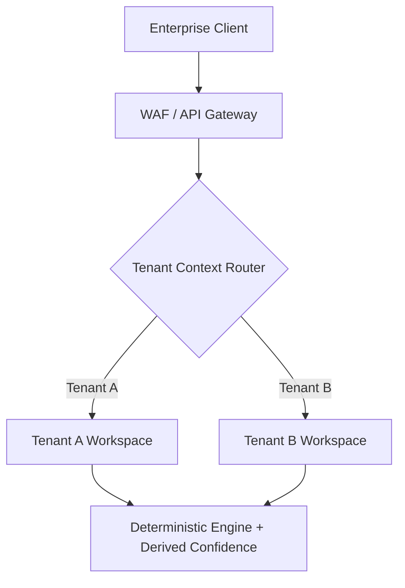

# Enterprise Readiness Scorecard

## Purpose
This scorecard evaluates the Trothix platform's readiness for Fortune 500 enterprise deployment. It scores architectural dimensions, identifies production gaps, and provides mitigation recommendations.

## Current Repository Implementation
Trothix currently features:
- **Input Sanitization:** Found in `pdfProcessor.js` and `parsers/` to prevent memory overflows.
- **Structured Error Handling:** Located in schema validators under `knowledge/schemas/` to catch bad data imports.
- **Basic Telemetry:** Implemented via `telemetry.js` and the `telemetry/` directory (supports `ConsoleProvider` and `SupabaseProvider` writing to a `TelemetryBus`).
- **Unit Testing:** Colocated domain tests in files such as `domains/Indemnification/tests/*.test.js`.

However, the repository lacks multi-tenancy configurations, formal authorization frameworks, bitemporal ontology versioning, or runtime health checks.

## Research Findings
The research corpus outlines the requirements for enterprise legal AI:
1. **Bitemporal Tracking:** Ability to query regulatory rules "as of" a specific historical timestamp.
2. **Multi-Tenant Isolation:** Complete logical or physical segregation of data and rule-packs between enterprise customers.
3. **Structured Telemetry:** Real-time observability tracing API latency, rule firing rates, and evaluation errors.
4. **Resiliency:** Fail-closed mechanisms to ensure that broken ontologies block processing rather than producing silent failures.

## Gap Analysis
The platform scores as follows (Scale 1-5, 5 being enterprise-grade):

| Dimension | Current Score | Target Score | Primary Gap |
|---|---|---|---|
| **Data Isolation** | 1 / 5 | 5 / 5 | Flat filesystem schema with zero tenant identifiers. |
| **Observability** | 3 / 5 | 5 / 5 | Basic telemetry bus, but no request tracing or APM integration. |
| **Logic Integrity** | 4 / 5 | 5 / 5 | Active schema linter, but missing runtime cycle and circular ref checks. |
| **Auditability** | 2 / 5 | 5 / 5 | Hardcoded confidence scores with no evidence-proven calculation traces. |

## Recommended Architecture
To achieve enterprise readiness:
1. **Derived Confidence:** Implement the `ConfidenceResolver` to replace hardcoded scores.
2. **Context-Aware Evaluator:** Extend `RuleContext.js` to accept tenant metadata (`tenantId`) and filter rule evaluation runs accordingly.
3. **Bitemporal Metadata:** Add `valid_from` and `valid_to` fields to `MetadataSchema.js`.

### Recommendation Rationale
- **Why:** Enterprise legal compliance applications require 100% auditable results, absolute tenant data segregation, and verified logic safety.
- **Benefits:** Auditable compliance, zero cross-tenant data leaks, high precision.
- **Tradeoffs:** Increased runtime evaluation overhead and configuration complexity.
- **Risks:** Complex bitemporal filtering could slow down bulk document portfolio evaluations.
- **Dependencies:** Database schema updates to support tenant filtering.
- **Estimated Effort:** 8 engineering days.
- **Rollback Strategy:** Revert database views and filter parameters in the middleware layer.

## Repository Impact
### Files Affected
- `assets/js/engine/knowledge/schemas/MetadataSchema.js` (add temporal validation).
- `assets/js/engine/rules/RuleContext.js` (inject tenant scopes).
- `assets/js/engine/telemetry/TelemetryBus.js` (add request-id tracing).

### Files Untouched
- `assets/js/engine/core/parser/*`
- `assets/js/engine/core/ir/*`

## Migration Strategy
Phase 1: Deploy temporal metadata fields as optional variables in the ontology schemas. Phase 2: Implement tenant routing hooks in the middleware wrapper. Phase 3: Wire request context IDs into the `TelemetryBus` providers.

## Performance Considerations
Bitemporal queries can be optimized by indexing the `valid_from` and `valid_to` JSON fields at the bundle compilation stage, ensuring zero runtime query overhead.

## Test Strategy
Create multi-tenant mock profiles in `test_importer.js` and execute parallel requests. Assert that Tenant A cannot load or compile rules authored by Tenant B, throwing a strict access error.

## Future Evolution
Integrate with OAuth2 and OpenPolicyAgent (OPA) for dynamic, fine-grained access control on individual clause analysis findings.

## References
- `chat-Enterprise_Legal_AI_Contract_Analysis.txt` (Tasks 6 and 7)
- `assets/js/engine/telemetry/TelemetryBus.js`
- `assets/js/engine/knowledge/schemas/MetadataSchema.js`
