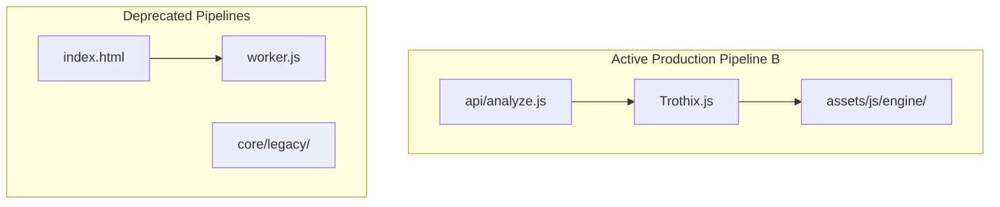

# Repository Map

> **Status update:** The "Coexisting Pipelines" section below describes the
> repository at the time this document was written. Per the status banner
> at the top of `docs/trothix-architecture-audit.md` (re-verified against
> the repository as it exists today):
> - **Pipeline A** (legacy browser pipeline) is no longer live — `index.html`
>   contains zero `Worker`/`worker.js` references, and `core/legacy/pipeline.js`,
>   `rules/fairness.js`, and `rules/riskEngine.js` have been removed as
>   confirmed dead code. The remaining `assets/js/engine/core/legacy/*.js`
>   files (`classifier.js`, `confidence.js`, `extractor.js`, `checklist.js`,
>   `segmenter.js`, `definitions.js`, `reportGenerator.js`) have since been
>   moved to `archive/core/legacy/` (confirmed unreferenced by anything
>   before moving), addressing the "Orphaned Files" gap and the
>   `/deprecated/`-folder recommendation below — via `archive/` rather than
>   a new `/deprecated/` folder, since `archive/` already existed and held
>   the rest of Pipeline A's remnants (`archive/core/router.js`,
>   `archive/core/worker.js`).
> - **Pipeline C** (root legacy pipeline) — `core/router.js`, `parsers/`,
>   and `rules/` no longer exist at the repository root. The harness that
>   drove them, `run-benchmark.mjs`, has been moved to
>   `archive/benchmark/run-benchmark.mjs` and the `benchmark:legacy` npm
>   script that invoked it has been removed.
> - **Pipeline D** (orphaned API-duplicate layer) and **Pipeline E**
>   (orphaned knowledge-authoring pipeline) are no longer present in the
>   repository at all.
> - **Pipeline B** remains the live, current production path — no change.
>
> The body of this document, including its Recommended Architecture, is
> preserved below for historical context; treat it as describing repository
> state at the time of writing, not today's state.

## Purpose
This document provides a detailed mapping of the files and directories inside the Trothix codebase, delineating active runtime paths, test files, compilers, and legacy code modules.

## Current Repository Implementation
The repository is structured with the following core directories:
- `api/analyze.js`: API entry point.
- `assets/js/engine/`: The core engine code (Pipeline B).
  - `core/parser/`: Lexer and Tokenizer.
  - `core/ir/`: Legal IR Builder and Engine Registry.
  - `plugins/`: Extractors and normalizers (e.g. `partyResolver.js`, `actionBuilder.js`).
  - `knowledge/`: Ontology files, compiler passes, and importer utilities.
    - `v1/domains/`: Runtime domain directories containing schema-validated JSONs.
    - `compiler/`: Build-time compiler passes.
    - `importer/`: Offline import and conflict resolution logic.
    - `schemas/`: The 15 schema validator classes.
  - `rules/`: Rule compilation and evaluator modules.
  - `assessment/`: Scoring, verdict, and report assembly classes.
- `benchmark/`: Test scripts and datasets for regression analysis.

### Coexisting Pipelines
- **Pipeline A (Legacy Browser):** `index.html` → `worker.js` → `core/legacy/router.js`.
- **Pipeline B (IR/Engine-Registry):** `api/analyze.js` → `Trothix.js` → `EngineRegistry` (Live Production Path).
- **Pipeline C (Root Legacy):** `benchmark/run-benchmark.mjs` → `core/router.js`.
- **Pipeline D (Orphaned API):** Unused duplicate modules.
- **Pipeline E (Orphaned Knowledge Authoring):** `knowledge/build/build.js` → `knowledge/source/domains`.

## Research Findings
The research advocates for strict repository organization:
- **Clean Separation:** Explicit separation between authoring tools, compiler passes, runtime engines, and diagnostic suites.
- **Dependency Isolation:** Strict encapsulation of modules to ensure no circular imports and explicit dependency DAGs.

## Gap Analysis
1. **Divergent Domain Folders:** The runtime domains directory (`assets/js/engine/knowledge/v1/domains/`) and the authoring directory (`knowledge/source/domains/`) have silently diverged. For example, `ForceMajeure/metadata.json` exists only in the runtime tree.
2. **Orphaned Files:** Legacy parser files (`core/legacy/`) clutter the repository, causing confusion for new engineers.

## Recommended Architecture
Formally isolate the active engine code by moving Pipeline B into a standalone workspace directory `/src/engine` and explicitly archive the `/core/legacy` directory under a `/deprecated/` folder. Create a sync script to unify the authoring and runtime ontology trees.

| Pipeline | Path | Status | Impact on Production |
|---|---|---|---|
| **Pipeline B** | `assets/js/engine/` | **Active** | Primary execution path |
| **Pipeline A** | `worker.js` | Legacy | None |
| **Pipeline C** | `benchmark/` | Test | Diagnostic validation only |

### Recommendation Rationale
- **Why:** To prevent developers from editing dead code pathways and ensure a unified source of truth for the ontology.
- **Benefits:** Decreased code bloat, zero runtime schema drift.
- **Tradeoffs:** Requires updating local test scripts and import paths.
- **Risks:** Breaking benchmark references if path updates are incomplete.
- **Dependencies:** None.
- **Estimated Effort:** 2 engineering days.
- **Rollback Strategy:** Revert path changes using Git.

## Repository Impact
### Files Affected
- `package.json` (update start script).
- `api/analyze.js` (update engine references).

### Files Untouched
- `assets/js/engine/core/parser/*`
- `assets/js/engine/rules/*`

## Migration Strategy
Create a `/deprecated/` root folder. Move `core/legacy/*` and Pipeline A components into it. Set up strict path aliases in `package.json` to reference the active engine directory.

## Performance Considerations
Directory reorganization has zero runtime CPU or memory impact but improves build times and developer velocity.

## Test Strategy
Ensure that all benchmark runs (`npm run benchmark`) execute successfully against the new paths and that the output matches the legacy baseline.

## Future Evolution
Eventually, containerize the symbolic engine separately from the API wrapper to enable microservices scaling.

## References
- `chat-Enterprise_Legal_AI_Contract_Analysis.txt` (Task 1)
- `docs/trothix-architecture-audit.md`
- `trothix_domain_maturity_report.md`
