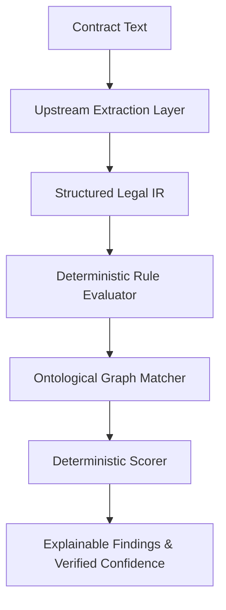

# Vision & System Design Philosophy

## Purpose
This document establishes the strategic vision and design philosophy of the Trothix platform. It outlines the core principles of deterministic, explainable, and ontology-driven contract analysis required for Fortune 500 enterprise deployment.

## Current Repository Implementation
Trothix's design principles are coded directly into its execution pipelines. The core platform resides in `assets/js/engine/` (specifically Pipeline B, which starts in `api/analyze.js` and flows through `Trothix.js`). 
- **Deterministic First:** The system relies on parsing contracts into a structured intermediate representation (IR) via `core/ir/legalIRBuilder.js` and running deterministic rule evaluations in `rules/RuleEvaluator.js`.
- **Explainability:** Findings are structured (as defined in `core/types.js`) and translated into human-readable narratives using `assessment/FindingNarrator.js` and `assessment/ExplanationLibrary.js`.
- **Ontology Driven:** Domain schemas are validated using the 15 schema classes in `knowledge/schemas/` and loaded into an in-memory graph representation in `knowledge/KnowledgeProvider.js`.
- **Compiler Driven:** The system separates offline build-time schema/ontology compilation (`knowledge/compiler/KnowledgeCompiler.js`) from runtime execution.

## Research Findings
The research corpus (`chat-Enterprise_Legal_AI_Contract_Analysis.txt`) highlights that enterprise legal AI must move away from "black-box" LLM generation for critical compliance tasks. Standard LLM analysis suffers from:
1. Non-deterministic hallucination of clauses.
2. Lack of character-level evidence tracing.
3. Inability to guarantee compliance with structured corporate playbooks.
4. "Fabricated confidence" where a model asserts high confidence with no underlying mathematical justification.

The research advocates for a hybrid architecture:
- **LLM/Extraction Layer:** Performs fuzzy extraction of concepts and parameters (located upstream of the core engine).
- **Symbolic Reasoning Layer:** Evaluates compliance deterministically using defeasible logic, strict schemas, and ontological validation.

## Gap Analysis
The live repository aligns well with the hybrid symbolic vision but contains key gaps:
1. **Unwired Pipelines:** There is divergence between the runtime tree (`assets/js/engine/knowledge/v1/domains/`) and the authoring tree (`knowledge/source/domains/`).
2. **Fabricated Confidence:** Confidence is currently hardcoded to literal constants (e.g., `0.95` in `VerdictEngine.js`) rather than mathematically derived from evidence.
3. **Incomplete Compiler Passes:** `KnowledgeCompiler.js` only implements 4 of the designed 6 passes (missing `NormalizePass` and `StatisticsPass`).
4. **Lack of Priority Resolution:** Fired findings simply accumulate in `ScoringEngine.js` with no capacity to model rule superiority or defeater logic (e.g., `lex specialis` or `lex posterior`).

## Recommended Architecture
To achieve the full enterprise vision, the system design philosophy must enforce:
1. **Always-Derived Confidence:** All confidence metrics must be dynamically calculated based on extraction strength, rule reliability, and evidence specificity.
2. **Strict Compiler Verification:** Add compile-time cycle detection and schema-normalization passes.
3. **Traceable Proof Graphs:** Build structured execution traces from `RuleEvaluator.js` to feed the explainability layer.

| Dimension | Current Implementation | Research Recommendation | Target Vision |
|---|---|---|---|
| **Execution** | Flat linear rules | Defeasible logic | Superiority-resolved logic |
| **Confidence** | Hardcoded literals | Evidence-derived score | Layered Geometric Mean |
| **Ontology** | Flat JSON schemas | SHACL-style Graph | Compiler-validated DAG |

### Recommendation Rationale
- **Why:** To eliminate ungrounded findings and prevent false confidence in contract risk analysis.
- **Benefits:** Auditable audit trail, zero hallucinations, high enterprise trust.
- **Tradeoffs:** Increased complexity in the assessment layer, strict runtime verification.
- **Risks:** Unoptimized graph traversals could degrade execution latency on large document portfolios.
- **Dependencies:** Complete execution of the Confidence & Evidence Architecture.
- **Estimated Effort:** 5 engineering days.
- **Rollback Strategy:** Revert to literal scoring configs without modifying rule compilation signature.

## Repository Impact
### Files Affected
- `assets/js/engine/assessment/VerdictEngine.js` (replace hardcoded `0.95` confidence).
- `assets/js/engine/assessment/ScoringEngine.js` (load confidence weights).
- `assets/js/engine/rules/RuleEvaluator.js` (populate trace evidence).

### Files Untouched
- `assets/js/engine/core/parser/lexer.js`
- `assets/js/engine/core/parser/tokenizer.js`
- `assets/js/engine/core/ir/legalIRBuilder.js`

## Migration Strategy
Introduce the changes in non-breaking phases. Phase 1 will implement the `ConfidenceResolver.js` calculation pipeline as a parallel process. Phase 2 will wire the output to `VerdictEngine.evaluate()`, deprecating the hardcoded outputs.

## Performance Considerations
All symbolic matching runs in $O(N)$ where $N$ is the number of extracted contract nodes. The runtime impact of adding derived confidence calculation is sub-millisecond, as it performs simple mathematical aggregation over memory-resident objects.

## Test Strategy
A regression suite must be executed comparing the results of the new derived confidence engine against the legacy 0.95 baseline. Synthesized contract test files with missing required fields must yield lower confidence scores than complete contracts.

## Future Evolution
Future iterations will incorporate temporal constraints (`valid_from` / `valid_to`) into the ontology graph model to support historical regulatory analysis.

## References
- `chat-Enterprise_Legal_AI_Contract_Analysis.txt` (Tasks 1, 2, and 4)
- `docs/trothix-architecture-audit.md`
- `assets/js/engine/core/types.js`
