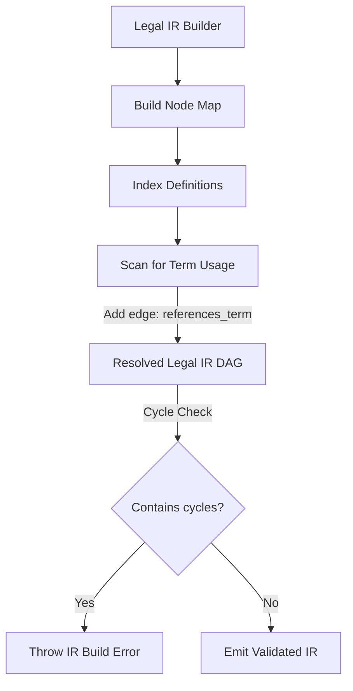

# Legal Intermediate Representation (IR)

## Purpose
This document specifies the schema, node types, and edge relationships of the Legal Intermediate Representation (IR) generated from lexed contract data.

## Current Repository Implementation
The Legal IR is defined structurally in `assets/js/engine/core/types.js` and built by `assets/js/engine/core/ir/legalIRBuilder.js`.
- **Nodes (`LegalNode`):** Represents legal components (e.g. `Clause`, `Section`, `Paragraph`, `Definition`, `Party`).
- **Edges (`LegalEdge`):** Encapsulates directed relationships (e.g. `parent_of`, `precedes`, `defines`).
- **Fingerprinting:** Each node carries content-addressable hashes (`fingerprints.raw`, `fingerprints.structural`, `fingerprints.canonical`) to detect changes and identify duplicates.

## Research Findings
The research advocates representing contracts as directed acyclic graphs (DAGs) rather than flat files. It highlights:
- **Relational Integrity:** Linking obligations back to specific definitions.
- **Evidence Binding:** Binding findings directly to content-addressable node IDs.
- **Cycle Prevention:** Structuring edges to ensure no circular containment hierarchies exist in the IR model.

## Gap Analysis
1. **Unresolved References at runtime:** `legalIRBuilder.js` creates edges between nodes, but does not perform cycles check at run time.
2. **Missing Node Linking:** Edge creation is limited to structural containment (`parent_of`); it does not connect definitions to the clauses that reference them (e.g., a "Disclosing Party" definition linked to the confidentiality obligation).

## Recommended Architecture
1. **Definition-Clause Linkage:** Modify `legalIRBuilder.js` to cross-reference identified capitalized terms with the definition index, creating `references_term` edges.
2. **Structural Cycle Enforcement:** Implement a depth-first search (DFS) containment cycle check during IR build execution.

| Edge Type | Origin Node | Destination Node | Meaning |
|---|---|---|---|
| `parent_of` | `Section` | `Clause` | Structural containment |
| `references_term` | `Clause` | `Definition` | Semantic reference to term |
| `governs` | `Clause` | `Party` | Scope of obligation |

### Recommendation Rationale
- **Why:** To resolve term scopes deterministically, allowing rules to evaluate definitions in context.
- **Benefits:** Auditable definitions, precise semantic verification.
- **Tradeoffs:** Increased complexity in the edge resolution logic.
- **Risks:** High term counts in large agreements might degrade edge resolution times.
- **Dependencies:** Definition extraction plugin.
- **Estimated Effort:** 4 engineering days.
- **Rollback Strategy:** Revert to structural containment edges only.

## Repository Impact
### Files Affected
- `assets/js/engine/core/ir/legalIRBuilder.js` (resolve definitions).
- `assets/js/engine/core/types.js` (declare new edge types).

### Files Untouched
- `assets/js/engine/core/parser/lexer.js`
- `assets/js/engine/core/parser/tokenizer.js`

## Migration Strategy
Introduce new edge types as optional flags in `types.js`. Implement the resolution check in a modular pass inside `legalIRBuilder.js` that runs after the base structural tree is compiled.

## Performance Considerations
Definition mapping runs in $O(N \times D)$ where $N$ is text nodes and $D$ is defined terms. Using a hash map index for $D$ reduces lookup times to $O(N)$, keeping runtime fast.

## Test Strategy
Construct test fixtures containing terms defined in Section 1 and referenced in Section 5. Assert that the generated IR maps `references_term` edges from Section 5 clauses to Section 1 definitions.

## Future Evolution
Extend the IR format to support native JSON serialization, allowing intermediate state caching and remote visual rendering of the parsed DAG.

## References
- `chat-Enterprise_Legal_AI_Contract_Analysis.txt` (Tasks 2 and 4)
- `assets/js/engine/core/types.js`
- `assets/js/engine/core/ir/legalIRBuilder.js`
