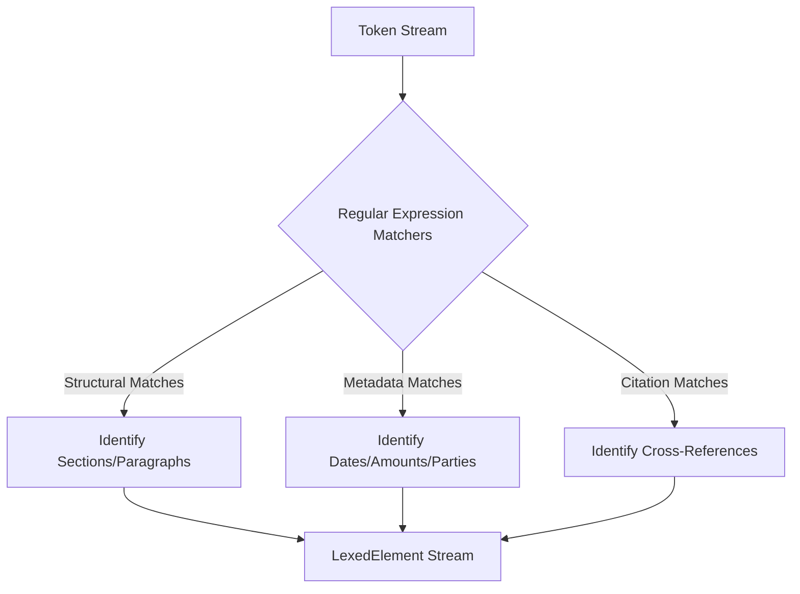

# Lexer Specification

## Purpose
This document specifies the lexical analysis component of the Trothix parser. It defines the patterns, rules, and semantic classifications used to classify parsed contract tokens.

## Current Repository Implementation
The lexer is implemented in `assets/js/engine/core/parser/lexer.js`. 
- It consumes a token stream produced by `core/parser/tokenizer.js`.
- It executes regular expression pattern matching and sequential state checks to assign classifications.
- Elements classified include:
  - **Structure:** `header`, `paragraph`, `bullet_point`, `list_item`.
  - **Data Types:** `date`, `amount`, `party_reference`, `defined_term_decl`.
- It records character offset spans (`start`, `end`) for each identified element to enable evidence tracing.

## Research Findings
The research transcript outlines the necessity of a deterministic lexer:
- Legal syntax patterns are highly repetitive (e.g. defined terms are typically capitalized and enclosed in quotation marks).
- Regulatory citations follow specific local formats (e.g. "Section 123 of the Companies Act").
- Lexing must be robust to OCR spelling errors (e.g., using fuzzy character match windows or spelling distance thresholds).

## Gap Analysis
1. **No Citation Parsing:** The lexer lacks patterns to identify and extract statutory or cross-document citations (e.g. "Section 4.2" vs "4.2").
2. **Strict Regex Matching:** The regex patterns are rigid and fail on simple OCR misread characters (e.g. "1.1" parsed as "l.l").

## Recommended Architecture
1. **Extend Classification Patterns:** Add regex definitions for cross-references and statutory citations in `lexer.js`.
2. **Spelling-Resilient Matching:** Integrate a Levenshtein distance check for common legal keywords (e.g., "Indemnification" vs "Indemnifcation").

| Element Type | Regular Expression / Match Criteria | Target Output |
|---|---|---|
| **Defined Term** | `/"([^"]+)"\s+means/g` | `defined_term_decl` |
| **Section Header** | `/^(?:Section|Article|Clause)\s+\d+(?:\.\d+)*\b/i` | `header` |
| **Monetary Value** | `/\$\d{1,3}(?:,\d{3})*(?:\.\d{2})?\b/` | `amount` |

### Recommendation Rationale
- **Why:** To improve cross-reference resolution (essential for `referenceResolver.js`) and prevent data omission from OCR documents.
- **Benefits:** Auditable cross-reference graphs, robust parsing.
- **Tradeoffs:** Increased compile time for matching extra regular expressions.
- **Risks:** Overly permissive citation regexes may misclassify regular text sequences.
- **Dependencies:** None.
- **Estimated Effort:** 3 engineering days.
- **Rollback Strategy:** Revert to standard regex definitions in `lexer.js`.

## Repository Impact
### Files Affected
- `assets/js/engine/core/parser/lexer.js` (add regex matches and distance helpers).

### Files Untouched
- `assets/js/engine/core/parser/tokenizer.js`
- `assets/js/engine/core/ir/legalIRBuilder.js`

## Migration Strategy
Deploy the updated regex patterns as additive variables. Implement the distance checks in a helper module `core/parser/fuzzyMatch.js` and import it in `lexer.js`.

## Performance Considerations
Regex matching is kept linear $O(N)$ with pre-compiled Javascript RegExp patterns. The fuzzy matching Levenshtein pass is only run on tokens matching structural prefixes, maintaining low latency.

## Test Strategy
Run tests using fixtures containing raw text with minor OCR typos. Assert that the lexer correctly maps fuzzy elements to their target semantic categories with character-level accuracy.

## Future Evolution
Expose lexer configuration schemas via JSON, allowing users to define domain-specific classification regexes without modifying core engine files.

## References
- `chat-Enterprise_Legal_AI_Contract_Analysis.txt` (Task 2)
- `assets/js/engine/core/parser/lexer.js`
