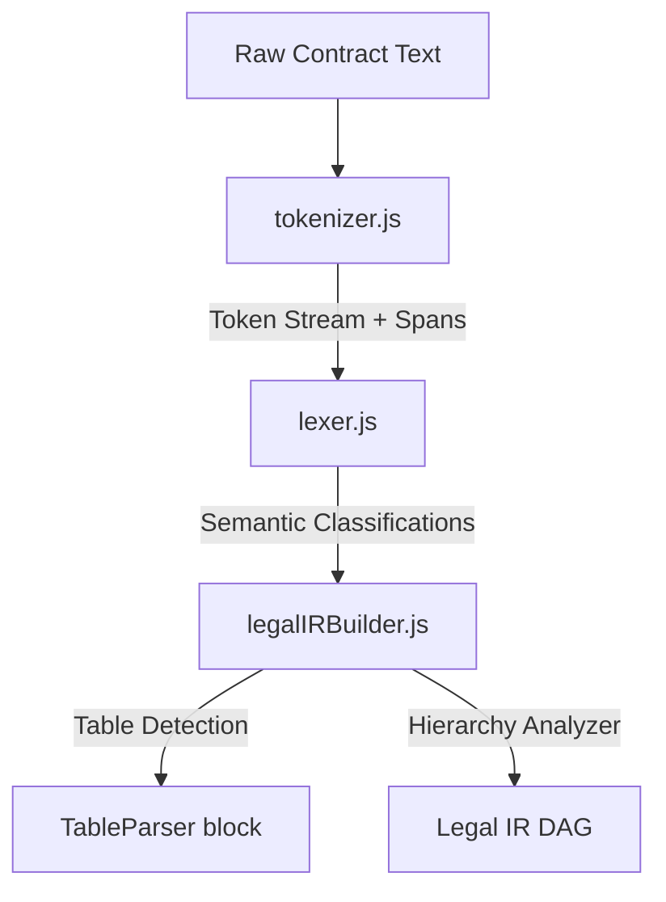

# Parser Subsystem Architecture

## Purpose
This document specifies the architecture of the Trothix parser subsystem. It details how raw contract text is tokenized, lexed, and compiled into a structured Legal Intermediate Representation (IR).

## Current Repository Implementation
The parser subsystem resides in `assets/js/engine/core/parser/` and `assets/js/engine/core/ir/`.
1. **Tokenizer (`core/parser/tokenizer.js`):** Ingests raw text and splits it into character-spanned tokens based on whitespace, punctuation, and structural breaks.
2. **Lexer (`core/parser/lexer.js`):** Reads the token stream and assigns semantic classifications (e.g. headers, paragraphs, bullet points, numbers, dates).
3. **Legal IR Builder (`core/ir/legalIRBuilder.js`):** Assembles the lexed tokens into a structured hierarchy represented as a DAG of `LegalNode` objects. Each node contains fingerprints, parent-child relations, and evidence spans.

## Research Findings
The research corpus suggests that legal documents feature hierarchical structural syntax (titles, articles, sections, clauses, paragraphs, items). The parser must:
- Build a formal representation that preserves the nesting structure.
- Map coordinates (start and end character offsets) of every token to ensure exact evidence traceability.
- Remain deterministic first: avoid LLM-based layout parsing unless layout details are completely lost (e.g. raw OCR).

## Gap Analysis
1. **No Layout-Aware Tokenization:** The current tokenizer operates on plain text, ignoring visual formatting (such as indentations, font weights) that define hierarchical relationships.
2. **Weak Table Handling:** The parser does not build structural grids for tables, resulting in table text being flattened and losing column/row associations.

## Recommended Architecture
Extend the parser to support a two-pass architecture:
- **Pass 1 (Lexical Structuring):** Build the flat token stream with character offsets.
- **Pass 2 (Hierarchical Assembly):** Construct the tree DAG with nested sections. Add a dedicated `TableParser` block within `legalIRBuilder.js` to parse CSV/markdown-style table grids.

| Parser Layer | Inputs | Output | Key Class/File |
|---|---|---|---|
| **Tokenization** | String | `Token[]` | `core/parser/tokenizer.js` |
| **Lexing** | `Token[]` | `LexedElement[]` | `core/parser/lexer.js` |
| **IR Compilation** | `LexedElement[]` | `LegalIR` (DAG) | `core/ir/legalIRBuilder.js` |

### Recommendation Rationale
- **Why:** Essential for analyzing complex tables in schedules and commercial terms (e.g. payment rates, liability limits).
- **Benefits:** Retains row-column semantic groupings, allowing rules to reason about tabular obligations.
- **Tradeoffs:** Increases the memory footprint of the Legal IR by representing grids.
- **Risks:** Complex table boundaries might cause parsing timeout errors on poorly formatted documents.
- **Dependencies:** None.
- **Estimated Effort:** 5 engineering days.
- **Rollback Strategy:** Fall back to treating table rows as standard paragraph elements if parsing fails.

## Repository Impact
### Files Affected
- `assets/js/engine/core/ir/legalIRBuilder.js` (add Table parsing block).
- `assets/js/engine/core/types.js` (add `TableNode` shape definition).

### Files Untouched
- `assets/js/engine/core/parser/tokenizer.js`
- `assets/js/engine/core/parser/lexer.js`

## Migration Strategy
Introduce `TableNode` as an additive node type in `types.js`. Implement table cell extraction in a separate file `assets/js/engine/core/parser/TableParser.js` and wire it as an optional step in `legalIRBuilder.js`.

## Performance Considerations
Table cell parsing runs in $O(R \times C)$ where $R$ is rows and $C$ is columns. This check runs only when the lexer identifies a table boundary block, maintaining sub-millisecond speeds for standard paragraphs.

## Test Strategy
Create test fixtures in `parsers/` containing markdown and raw text tables. Assert that `legalIRBuilder.js` correctly builds a 2D grid structure, verifying that cells are addressable by row and column indices.

## Future Evolution
Integrate layout-aware parsing models (such as LayoutLMv3) upstream to handle native PDF coordinate mappings directly.

## References
- `chat-Enterprise_Legal_AI_Contract_Analysis.txt` (Task 2)
- `assets/js/engine/core/ir/legalIRBuilder.js`
- `assets/js/engine/core/parser/lexer.js`
