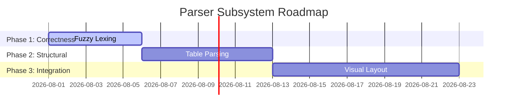

# Parsing Subsystem Roadmap

## Purpose
This document presents the implementation roadmap and gap-remediation schedule for the Trothix parser subsystem.

## Current Repository Implementation
The current parser files are fully functional for basic NDAs and structured service agreements. Key entry points include:
- `core/parser/tokenizer.js`
- `core/parser/lexer.js`
- `core/ir/legalIRBuilder.js`

No layout analysis, table cell structures, or fuzzy spelling corrections are currently active.

## Research Findings
The research advocates:
- Prioritizing deterministic layout-agnostic structures.
- Compiling parsing rules alongside the ontology definitions.
- Running regression benchmarks across standard document sets.

## Gap Analysis
1. **No visual coordinate mappings:** Fails on scanned multi-column layouts.
2. **Missing fuzzy lexer maps:** Fails on minor spelling errors.
3. **No table grids:** Fails on complex tabular obligations.

## Recommended Architecture
A phased execution schedule to extend parser capabilities:
- **Phase 1 (Correctness):** Fuzzy spelling matches in `lexer.js`.
- **Phase 2 (Tables):** Table grid parsing and `TableNode` injection.
- **Phase 3 (Visual):** Visual layout extraction integrations.

| Phase | Feature | Targeted Files | Estimated Effort |
|---|---|---|---|
| **Phase 1** | Fuzzy Lexing | `lexer.js` | 3 days |
| **Phase 2** | Table Node Support | `legalIRBuilder.js` | 5 days |
| **Phase 3** | Visual Coordinates | `tokenizer.js` | 10 days |

### Recommendation Rationale
- **Why:** To make the parser robust for complex enterprise service agreements containing rate tables.
- **Benefits:** Auditable tables, lower error rates on low-quality scans.
- **Tradeoffs:** Increased runtime parser latency.
- **Risks:** Visual layout parsing might introduce external binary dependencies.
- **Dependencies:** PDF extraction libraries upstream.
- **Estimated Effort:** 18 engineering days total.
- **Rollback Strategy:** Archive updates and fall back to legacy text parser.

## Repository Impact
### Files Affected
- `assets/js/engine/core/parser/lexer.js` (fuzzy lexing).
- `assets/js/engine/core/ir/legalIRBuilder.js` (table parsing).

### Files Untouched
- `assets/js/engine/rules/*`
- `assets/js/engine/assessment/*`

## Migration Strategy
Implement each phase as additive features with conditional compilation flags. Phase 1 and 2 updates will run inline within Pipeline B.

## Performance Considerations
Fuzzy string distance checks should be capped at short string lengths to maintain low CPU overhead.

## Test Strategy
Maintain a fixture folder under `benchmark/fixtures/parser/` and run regression checks after each phase.

## Future Evolution
Eventually, migrate structural lexing to WebAssembly to allow sub-millisecond execution directly in client-side web workers.

## References
- `chat-Enterprise_Legal_AI_Contract_Analysis.txt` (Tasks 2 and 5)
- `docs/trothix-architecture-audit.md`
