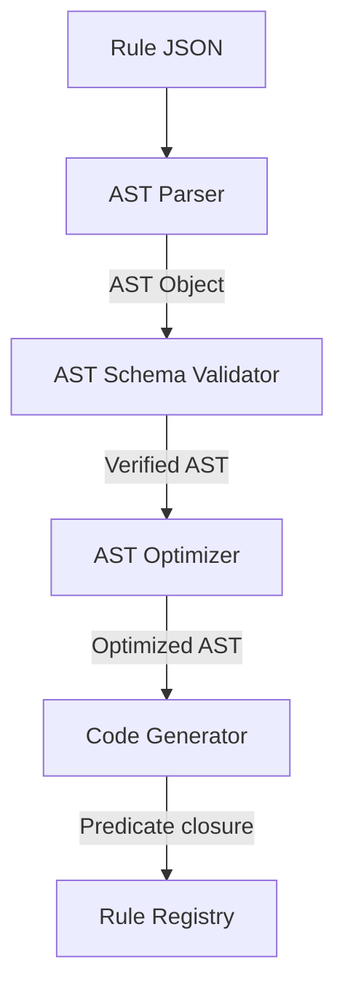

# Rule Compiler Specification

## Purpose
This document specifies the compilation pipeline of the Trothix rule engine. It details how the JSON-based declarative DSL rules are compiled into executable predicate closures.

## Current Repository Implementation
The rule compiler is implemented in `assets/js/engine/rules/RuleCompiler.js`.
- It exposes a single compilation entry point: `compile(ruleJson)`.
- It recursively parses condition objects using `_compileCondition(cond)`.
- Logical combinators are resolved into functional combinations:
  - `and` -> `(ctx) => conds.every(c => c(ctx))`
  - `or` -> `(ctx) => conds.some(c => c(ctx))`
  - `not` -> `(ctx) => !cond(ctx)`
- Field operations look up values in the `RuleContext` and run comparisons.
- The output of the compiler is a compiled predicate function `(context) => boolean`.

## Research Findings
The research advocates:
- Formal verification of rules before evaluation (such as compiling rules into abstract syntax trees (AST) and checking for logical consistency).
- Explicit verification of field paths against a known database schema during rule compilation rather than throwing missing field exceptions at runtime.

## Gap Analysis
1. **No Field Path Validation:** The compiler does not verify that the referenced `field` path actually exists in the legal schemas, leading to runtime failures on misspelled field targets.
2. **Lack of AST Inspection:** The JSON rule is compiled directly into code closures. Without an AST or intermediate structure, optimization passes (such as constraint simplification) cannot be performed.

## Recommended Architecture
1. **Schema-Aware Compilation:** Modify `RuleCompiler.js` to cross-reference target `field` strings against the `SchemaRegistry` to verify path validity.
2. **Intermediate Representation (AST):** Introduce a two-pass compiler step: parse DSL to AST, validate and optimize, and compile AST to closure.

| Compilation Pass | Target | Responsibility |
|---|---|---|
| **Pass 1: Parsing** | JSON | Compile AST Node tree |
| **Pass 2: Validation** | AST | Check field paths against schemas |
| **Pass 3: Generation** | AST | Emit runnable closures |

### Recommendation Rationale
- **Why:** To identify typing errors in rule files at authoring time rather than during active contract evaluations.
- **Benefits:** Guaranteed logical safety, optimized execution code.
- **Tradeoffs:** Increases the compilation time at engine startup.
- **Risks:** Complex field schemas might slow down startup times if validators are unoptimized.
- **Dependencies:** `SchemaRegistry.js` integration.
- **Estimated Effort:** 4 engineering days.
- **Rollback Strategy:** Allow bypassing path checks via a compiler config setting.

## Repository Impact
### Files Affected
- `assets/js/engine/rules/RuleCompiler.js` (implement AST pass and schema checks).

### Files Untouched
- `assets/js/engine/rules/RuleRegistry.js`
- `assets/js/engine/rules/RuleEvaluator.js`

## Migration Strategy
Introduce AST compilation as an internal step within `RuleCompiler.js`. Validate path schemas using the existing registry libraries before emitting closures.

## Performance Considerations
Since rule compilation only executes during engine startup, slight increases in compilation time do not affect active request analysis latency.

## Test Strategy
Create compiler unit tests containing rules referencing invalid schema fields (e.g. `actions[*].invalidField`). Assert that compiler execution throws a strict validation exception.

## Future Evolution
Eventually, compile rules into WebAssembly bytecode to support secure, high-performance distributed execution sandboxes.

## References
- `chat-Enterprise_Legal_AI_Contract_Analysis.txt` (Task 3)
- `assets/js/engine/rules/RuleCompiler.js`
- `assets/js/engine/knowledge/schemas/SchemaRegistry.js`
