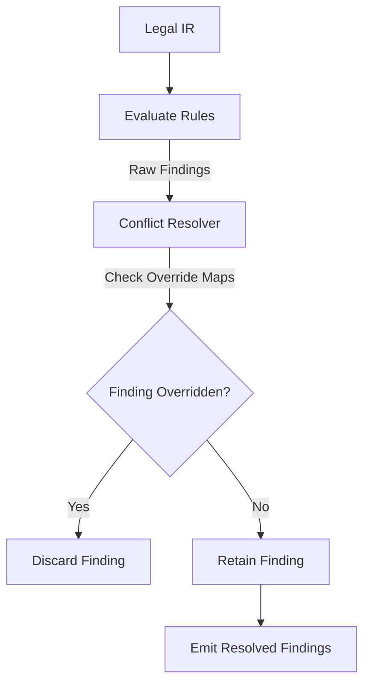

# Rule Conflict & Priority Resolution

## Purpose
This document specifies the conflict resolution and rule priority architecture of the Trothix platform. It details how the engine resolves contradictory findings and applies priority constraints (such as defeasible logic).

## Current Repository Implementation
No rule-priority, salience, or superiority-relation concept currently exists in the codebase (`RuleCompiler`, `RuleRegistry`, or `RuleEvaluator`).
- All active rules are executed independently.
- Findings simply accumulate inside `ScoringEngine.js` and `VerdictEngine.js`.
- If two rules produce contradictory findings (e.g. one flags a clause as high risk while another flags it as compliant due to a specific exception), both findings are reported, resulting in visual clutter.

## Research Findings
The research corpus recommends implementing:
- **Defeasible Logic superiority relations:** Explicit precedence definitions between rules to handle exceptions (e.g. `lex specialis` overrides `lex generalis`).
- **Defeaters:** Specific rules whose only function is to prevent another rule from firing, without producing a finding of their own.
- **Priority Scores (Salience):** Simple integer priority attributes to sequence rule evaluations and resolve conflicting findings.

## Gap Analysis
1. **No Priority Fields:** Rule schemas (`RulesSchema.js`) do not feature a priority or overrides attribute.
2. **Missing Defeater Logic:** The engine cannot represent defeasible conditions, requiring complex, nested boolean checks in rule condition statements.

## Recommended Architecture
1. **Rule Precedence Fields:** Add optional `priority` (integer) and `overrides` (array of rule IDs) fields to `RulesSchema.js`.
2. **Conflict Resolution Pass:** Implement a post-evaluation filter step in `RuleEvaluator.js` that discards any findings produced by rules that have been overridden by higher-priority matched rules.

| logic Pattern | Current Syntax | Target Precedence Shape |
|---|---|---|
| **Precedence** | Nested logic blocks | `"overrides": ["RULE_GENERIC_NDA"]` |
| **Defeater** | Hardcoded boolean nots | `"type": "defeater"` |

### Recommendation Rationale
- **Why:** Essential to support multi-layered rule packs (such as jurisdictional variations overriding base template rules).
- **Benefits:** Simpler rule authorship, clean compliance scoring without double-counting overrides.
- **Tradeoffs:** Adds an additional filter pass after rules are executed.
- **Risks:** Circular overrides definitions (e.g., Rule A overrides B, B overrides A) could lock the engine.
- **Dependencies:** Schema validation updates.
- **Estimated Effort:** 3 engineering days.
- **Rollback Strategy:** Disable the resolution pass and output all matched findings.

## Repository Impact
### Files Affected
- `assets/js/engine/knowledge/schemas/RulesSchema.js` (add override and priority validation).
- `assets/js/engine/rules/RuleEvaluator.js` (implement post-evaluation filter pass).

### Files Untouched
- `assets/js/engine/core/parser/*`
- `assets/js/engine/assessment/*`

## Migration Strategy
Phase 1: Update the schema validator to permit overrides and priority tags. Phase 2: Write the filter logic in `RuleEvaluator.js`. Phase 3: Update jurisdiction-specific rules to include overrides tags.

## Performance Considerations
The resolution pass uses a hash map lookup for overrides, running in $O(F)$ where $F$ is findings. Cycle detection on overrides maps must be run at engine startup rather than request time.

## Test Strategy
Create a test suite in `tests/rules/` containing two conflicting rules. Assert that when both trigger, the conflict resolution pass correctly discards the overridden finding.

## Future Evolution
Eventually, support dynamic overrides based on client parameters (e.g. client playbook overrides regional playbook).

## References
- `chat-Enterprise_Legal_AI_Contract_Analysis.txt` (Task 3)
- `assets/js/engine/rules/RuleEvaluator.js`
- `assets/js/engine/knowledge/schemas/RulesSchema.js`
