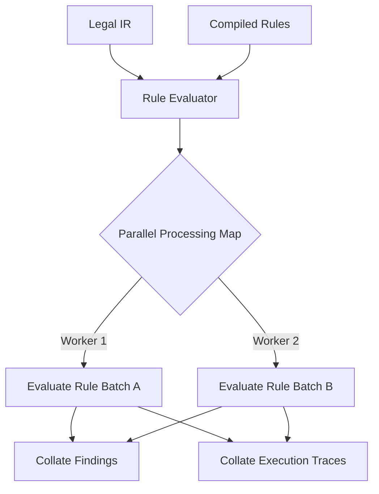

# Rule Evaluator Specification

## Purpose
This document specifies the execution stage of the rule engine. It details how compiled rules are evaluated against the contract IR using the rule context wrapper.

## Current Repository Implementation
The execution logic is implemented in `assets/js/engine/rules/RuleEvaluator.js`.
- It exposes the entry point: `evaluate(ir, compiledRules, customContext)`.
- It loops through the compiled rules array, instantiates a new `RuleContext` per contract node, and executes the compiled predicate function.
- If a predicate returns `true`, it constructs a `Finding` object (using parameters defined in `core/types.js` / `RulesSchema.js`) and appends it to the findings list.
- Unhandled evaluation exceptions are caught and logged, returning an empty list of findings.

## Research Findings
The research corpus suggests that rule evaluators must:
- Produce an audit log tracing every execution node path.
- Enable bitemporal logic evaluation, matching rules based on dates embedded in both rules and the active contract context.
- Support parallel execution of rules to leverage multi-core processor architectures.

## Gap Analysis
1. **No Execution Trace Logging:** `RuleEvaluator.js` does not record when a predicate evaluates to `false`, leaving developers with no insights into *why* a rule failed to fire.
2. **Sequential Evaluation:** Rule execution runs sequentially in a single thread, limiting processing throughput on large contract packages.

## Recommended Architecture
1. **Trace Accumulator:** Modify `RuleEvaluator.js` to record all matching decisions (both positive and negative matches) into a memory-resident `TraceAccumulator` object.
2. **Parallel Map Execution:** Use Node.js Worker Threads or parallel promise maps to process rules concurrently.

| Evaluation Parameter | Current Implementation | Target Implementation |
|---|---|---|
| **Execution Mode** | Sequential Single Thread | Parallelized Map |
| **Trace Detail** | Findings only | Complete Match / Miss Log |
| **Bitemporal Match** | Not supported | Filter rules by date |

### Recommendation Rationale
- **Why:** To support real-time user-facing debugging ("explain why this rule didn't flag an issue") and reduce evaluation times on document portfolios.
- **Benefits:** Auditable logic, lower query response times.
- **Tradeoffs:** Higher CPU utilization during active analysis runs.
- **Risks:** Parallel processing might introduce trace order non-determinism.
- **Dependencies:** None.
- **Estimated Effort:** 5 engineering days.
- **Rollback Strategy:** Revert thread allocations and process sequentially on the main event loop.

## Repository Impact
### Files Affected
- `assets/js/engine/rules/RuleEvaluator.js` (implement tracing and concurrent maps).

### Files Untouched
- `assets/js/engine/rules/RuleCompiler.js`
- `assets/js/engine/rules/RuleRegistry.js`

## Migration Strategy
Implement parallel processing as an opt-in runtime option inside `RuleEvaluator.js`. Maintain sequential loop evaluation as the default execution method for serverless environments.

## Performance Considerations
For small agreements, spawning threads adds overhead. Use simple concurrent loop mappings (`Promise.all`) for contracts below 50 paragraphs, reserving worker threads for larger portfolios.

## Test Strategy
Run unit tests in `tests/rules/` with a mocked execution trace context. Assert that both success paths and failure paths are accurately logged.

## Future Evolution
Compile the evaluator logic into client-compatible JS files to execute contract compliance checks directly in web browsers.

## References
- `chat-Enterprise_Legal_AI_Contract_Analysis.txt` (Task 3)
- `assets/js/engine/rules/RuleEvaluator.js`
- `assets/js/engine/rules/RuleContext.js`
