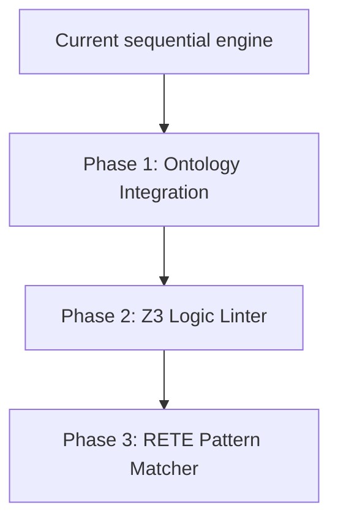

# Future Rule Engine Evolution

## Purpose
This document presents the long-term design roadmap and capability expansions for the Trothix rule engine.

## Current Repository Implementation
The current rule engine is built as an in-memory compiler executing Javascript closure functions sequentially. The main files are:
- `rules/RuleCompiler.js`
- `rules/RuleEvaluator.js`
- `rules/RuleRegistry.js`

No external Datalog engines, RETE network pipelines, or SAT solvers are present.

## Research Findings
The research corpus discusses:
- **Datalog integration (Soufflé):** Compiling rule sets into highly optimized Datalog/C++ binaries.
- **SAT/SMT Solvers (Z3):** Validating logical rule packs at build time to identify compile-time contradictions.
- **RETE/PHREAK Matchers:** Optimizing structural matching for very large rule sets.

## Gap Analysis
The platform lacks:
1. **Datalog compilation bindings:** Cannot compile rules to external execution environments.
2. **SMT contradiction validation:** Circular rules or logical deadlocks are not detected.
3. **Graph-reasoning operators:** Evaluation is restricted to the Legal IR, ignoring ontology concepts.

## Recommended Architecture
A phased development strategy for rule engine upgrades:
- **Phase 1 (Ontology Integration):** Wire ontology matching helpers into `RuleContext.js`.
- **Phase 2 (Logic Linting):** Implement a simple SMT validator using an online Z3 binding during compilation testing.
- **Phase 3 (RETE Engine):** Introduce a custom RETE matching engine when active rules exceed 500.

| Evolution Step | Why | Benefit | Estimated Effort |
|---|---|---|---|
| **Phase 1** | Enable graph queries | Ontology-aware rules | 5 days |
| **Phase 2** | Pre-compile validation | Detect contradictions | 10 days |
| **Phase 3** | Scalability | Fast matches at scale | 15 days |

### Recommendation Rationale
- **Why:** To support complex enterprise playbooks that require logical consistency guarantees.
- **Benefits:** No runtime deadlocks, scalable matching.
- **Tradeoffs:** High tooling complexity.
- **Risks:** Adding heavy external engines like Z3 or Soufflé creates deployment complexity.
- **Dependencies:** WebAssembly Z3 bindings.
- **Estimated Effort:** 30 engineering days total.
- **Rollback Strategy:** Archive advanced phases and run the sequential closure engine.

## Repository Impact
### Files Affected
- `assets/js/engine/rules/RuleCompiler.js` (ontology matching helpers).
- `assets/js/engine/rules/RuleContext.js` (expose graph accessors).

### Files Untouched
- `assets/js/engine/core/parser/*`
- `assets/js/engine/assessment/*`

## Migration Strategy
Deploy Phase 1 directly within Pipeline B. Implement Phase 2 as a separate offline build step (`npm run test:logic`).

## Performance Considerations
Keep rule evaluations inside the Node.js event loop for standard contracts, reserving RETE/SMT operations for build-time validation.

## Test Strategy
Run regression benchmarks on existing contract test cases. Ensure execution outputs are byte-identical across the legacy closure path and new logic paths.

## Future Evolution
Eventually, compile rule sets into isolated WebAssembly sandboxes for deployment in edge functions.

## References
- `chat-Enterprise_Legal_AI_Contract_Analysis.txt` (Tasks 3 and 8)
- `docs/trothix-architecture-audit.md`
