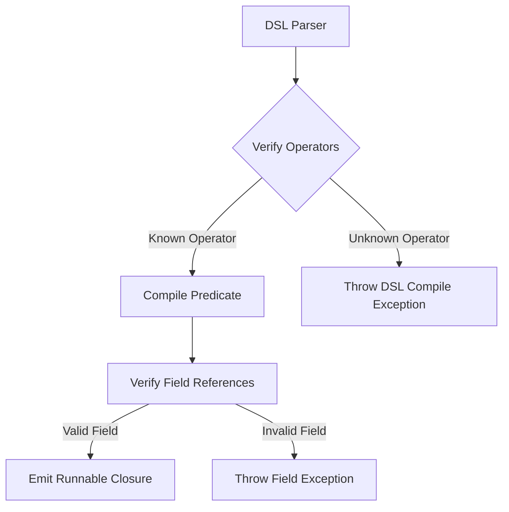

# Rule Declarative Domain-Specific Language (DSL)

## Purpose
This document specifies the grammar, operator syntax, and evaluation logic of the Trothix declarative Rule JSON Domain-Specific Language (DSL).

## Current Repository Implementation
The DSL format is defined by the `RulesSchema.js` validator located in `assets/js/engine/knowledge/schemas/RulesSchema.js`.
- Rules are defined as JSON objects containing `id`, `name`, `severity`, `when`, and `then` blocks.
- **`when` Condition Blocks:** Support logical combinators (`and`, `or`, `not`, `all`, `any`) and operator conditions (`field` constraints).
- **Operators:** Implemented inside `rules/RuleCompiler.js` (`_compileCondition()`):
  - String/Existence: `exists`, `missing`, `equals`, `contains`, `starts_with`, `ends_with`, `in`.
  - Numeric: `greater_than`, `less_than`.

## Research Findings
The research corpus highlights two critical defects in generic DSL models:
1. **Silent Fall-through:** Unrecognized operators in condition blocks compilation are ignored, leading to rules that compile successfully but silently evaluate to `false` forever.
2. **Missing Deontic Scopes:** Inability to formally express modal legal constructs (e.g. obligations, permissions, prohibitions) without translating them into flat string field comparisons.

## Gap Analysis
1. **Silent Unrecognized Conditions:** Unrecognized condition keys in `RuleCompiler._compileCondition()` fall through to `() => false` without throwing or logging compile errors. This affects `CONCEPT_` rules that try to use `conceptExists` or `documentRequiresConcept` operators.
2. **Flat Evaluation:** The DSL cannot reference active concepts in the ontology graph directly; it is restricted to matching fields in the flat Legal IR objects.

## Recommended Architecture
1. **Enforce Strict Compilation:** Update `RuleCompiler.js` to throw a `CompileError` on any unrecognized condition format.
2. **Ontology Operator Support:** Add native DSL operators: `concept_exists`, `concept_linked_to`, and `relation_exists` to compile graph-matching predicate blocks.

| Operator | Syntax Shape | Compiled Expression |
|---|---|---|
| `concept_exists` | `{"concept": "Obligation"}` | `(ctx) => ctx.hasConcept(conceptId)` |
| `relation_exists`| `{"relation": "applies_to"}`| `(ctx) => ctx.hasRelation(relId)` |
| `field: in` | `{"field": "...", "in": []}` | `(ctx) => list.includes(ctx.get(field))` |

### Recommendation Rationale
- **Why:** To prevent silent rule failure bugs that compromise contract compliance checks.
- **Benefits:** Logical safety guarantees, ontology integration.
- **Tradeoffs:** Requires migrating legacy metadata rule stubs to conform to the strict parser schema.
- **Risks:** High schema strictness might break runtime compatibility with older domain rule packs.
- **Dependencies:** None.
- **Estimated Effort:** 4 engineering days.
- **Rollback Strategy:** Allow warning-only modes on unrecognized operators via configuration settings.

## Repository Impact
### Files Affected
- `assets/js/engine/rules/RuleCompiler.js` (strict throw on compiler fall-through, implement ontology operators).
- `assets/js/engine/knowledge/schemas/RulesSchema.js` (add new operators to validator enum).

### Files Untouched
- `assets/js/engine/rules/RuleEvaluator.js`
- `assets/js/engine/core/parser/*`

## Migration Strategy
Phase 1: Update `RulesSchema.js` to warn on unrecognized operators. Phase 2: Update `RuleCompiler.js` to throw compile exceptions. Phase 3: Update domain rules to migrate legacy stubs to strict syntax formats.

## Performance Considerations
Graph-matching operators (`concept_exists`) should look up nodes in the `KnowledgeProvider`'s `$nodes` map, maintaining fast $O(1)$ lookup times.

## Test Strategy
Create test rules in `tests/rules/` that contain malformed operators. Verify that the compilation throws descriptive errors containing the rule ID and invalid operator string.

## Future Evolution
Eventually, implement a Visual Rule Builder that outputs validated JSON DSL code directly to developers.

## References
- `chat-Enterprise_Legal_AI_Contract_Analysis.txt` (Task 3)
- `assets/js/engine/rules/RuleCompiler.js`
- `assets/js/engine/knowledge/schemas/RulesSchema.js`
