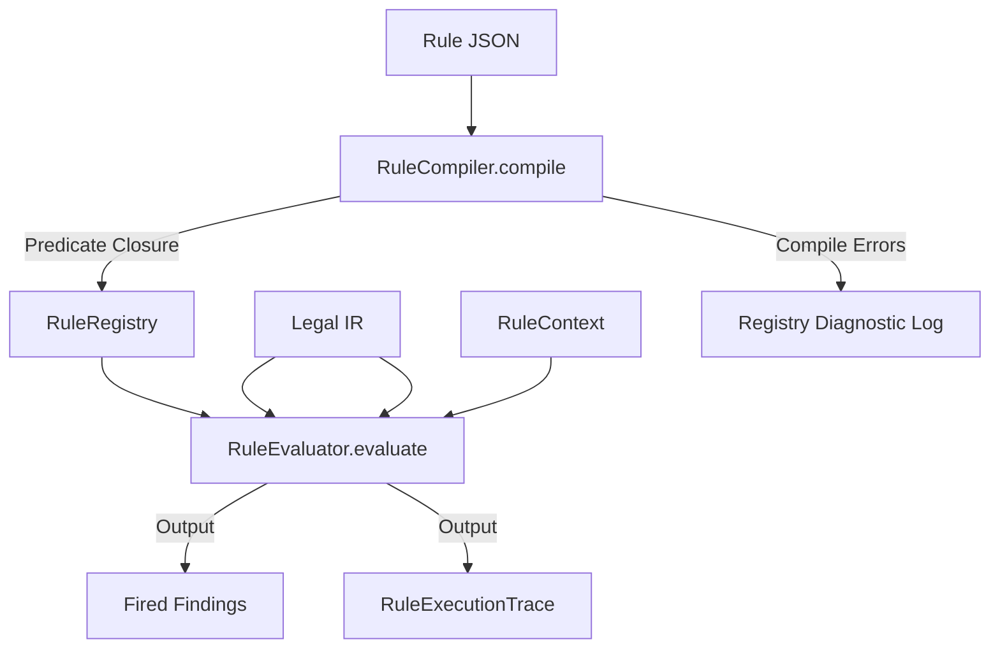

# Rule Engine Architecture

## Purpose
This document specifies the architecture of the Trothix rule evaluation engine. It details the runtime lifecycle of compiled contract compliance rules.

## Current Repository Implementation
The rule engine is implemented across four core modules in `assets/js/engine/rules/`:
1. **Rule Registry (`rules/RuleRegistry.js`):** Manages the collection of active rule schemas loaded from domain `rules.json` files.
2. **Rule Compiler (`rules/RuleCompiler.js`):** Compiles declarative JSON `when` / `then` blocks into executable JavaScript predicate functions.
3. **Rule Evaluator (`rules/RuleEvaluator.js`):** Evaluates compiled rule predicates against the parsed Legal IR, accumulating findings.
4. **Rule Context (`rules/RuleContext.js`):** Provides the execution context, mapping IR search helpers (e.g. `findNodes()`, `getActions()`) to the rule predicate scope.

## Research Findings
The research corpus suggests that rule engines for contract compliance should:
- Compile rules into in-memory executable closures rather than evaluating interpreted DSL nodes on the fly.
- Implement truth maintenance systems (TMS) to trace precisely why a rule fired or failed to fire.
- Support defeasible logic categories (strict rules, defeasible rules, and defeaters).

## Gap Analysis
1. **Uninformative Errors:** `RuleRegistry.js` swallows rule compilation errors, returning `null` with a generic warning instead of generating structured diagnostic records.
2. **Binary Outcomes only:** The engine evaluates rules as simple true/false predicates, lacking the ability to express defeasibility (i.e. rules that hold unless overridden by a defeater).

## Recommended Architecture
1. **Enhanced Compile Diagnostics:** Modify `RuleRegistry.js` to collect compile exceptions and write them into a structured `compilerContext.errors` array.
2. **Trace Generation:** Extend `RuleEvaluator.js` to return a `RuleExecutionTrace` detailing each sub-condition match outcome.

| Subsystem Component | Current Implementation | Proposed Target | File Location |
|---|---|---|---|
| **Compiler** | In-memory code compiler | Compile trace compiler | `rules/RuleCompiler.js` |
| **Evaluator** | Plain closure execution | Trace-yielding execution | `rules/RuleEvaluator.js` |
| **Registry** | Swallows errors | Diagnostic accumulation | `rules/RuleRegistry.js` |

### Recommendation Rationale
- **Why:** Essential for auditable legal analysis: users must see exactly *why* a penalty clause was flagged.
- **Benefits:** Auditable proof trails, robust logic bug tracking.
- **Tradeoffs:** Slight increase in runtime execution footprint to store execution traces.
- **Risks:** Verbose tracing might consume excessive memory on document portfolios with high node counts.
- **Dependencies:** None.
- **Estimated Effort:** 5 engineering days.
- **Rollback Strategy:** Disable trace returns in `RuleEvaluator.js` compile arguments.

## Repository Impact
### Files Affected
- `assets/js/engine/rules/RuleEvaluator.js` (return execution traces).
- `assets/js/engine/rules/RuleRegistry.js` (accumulate compile diagnostics).

### Files Untouched
- `assets/js/engine/core/parser/*`
- `assets/js/engine/assessment/*`

## Migration Strategy
Deploy the trace generation logic as an optional return property in `RuleEvaluator.evaluate()`. Unwire legacy generic warnings step-by-step.

## Performance Considerations
Trace structures should be allocated lazily: only when diagnostic trace flags are explicitly enabled by the API caller context.

## Test Strategy
Create a test suite in `tests/rules/` that executes rules with compound logical conditions. Assert that the generated output trace maps the evaluation outcomes of all individual `and` / `or` operands.

## Future Evolution
Eventually, implement a RETE-network compiler to optimize multi-rule evaluation matches over huge documents.

## References
- `chat-Enterprise_Legal_AI_Contract_Analysis.txt` (Task 3)
- `assets/js/engine/rules/RuleCompiler.js`
- `assets/js/engine/rules/RuleEvaluator.js`
