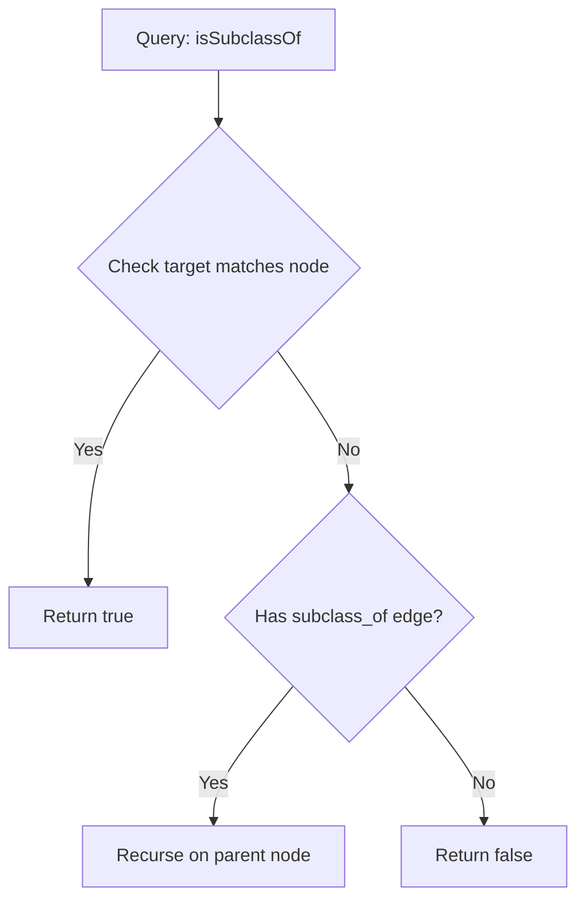

# Ontology Graph Model

## Purpose
This document specifies the structure and graph traversal operations of the Trothix in-memory ontology graph model.

## Current Repository Implementation
The ontology graph is managed in `assets/js/engine/knowledge/KnowledgeProvider.js`.
- It registers nodes under `this.graph.nodes` (a map of IDs to node records).
- It registers edges under `this.graph.edges` (an array of `{ id, from, to, relation }` elements).
- Path resolution is limited to single-hop checks (e.g. looking up direct relations on a concept node).
- Cross-node validations are managed during initialization in `_validateAndResolveGraph()`.

## Research Findings
The research corpus suggests that legal ontology graphs must support:
- **Multi-hop path traversals:** Traversing multiple relationship hops (e.g., finding if a "Clause" is governed by a "Section" which is subject to "GoverningLaw").
- **Subclass Polymorphism:** Evaluating rules against broad parent concepts and matching child concepts automatically (e.g., a rule matching "Obligation" should match "PaymentObligation").
- **Cycle Avoidance:** Ensuring the graph is a directed acyclic graph (DAG) for taxonomy containment.

## Gap Analysis
1. **No Path Traversal Engine:** The codebase lacks a general query traversal utility, requiring custom loops for multi-hop graph checks.
2. **Missing Inheritance Logic:** The graph has no concept of class inheritance or subclass relation checks during node matching.

## Recommended Architecture
1. **Graph Query Engine:** Implement a traversal class `GraphQueryEngine.js` under `knowledge/` providing BFS/DFS helpers (such as `findPaths()`, `isSubclassOf()`).
2. **Inheritance Matching:** Extend the `KnowledgeProvider` resolution checks to follow `subclass_of` relationships during node evaluations.

| Graph Operation | Current Implementation | Proposed Target |
|---|---|---|
| **Direct lookup** | `graph.nodes.get(id)` | `graph.nodes.get(id)` |
| **Relation check**| Search array loops | Map-indexed lookups |
| **Path search** | Not implemented | Multi-hop search utilities |

### Recommendation Rationale
- **Why:** To simplify rule authoring; rather than referencing every child concept, rules can match parent nodes like "ConfidentialInformation".
- **Benefits:** Reduced rule complexity, simpler playbooks.
- **Tradeoffs:** Adds minor traversal processing overhead to evaluations.
- **Risks:** Infinite loops if cycles checks fail to detect circular subclass edges.
- **Dependencies:** None.
- **Estimated Effort:** 4 engineering days.
- **Rollback Strategy:** Revert query helper calls and reference absolute node IDs in rules.

## Repository Impact
### Files Affected
- `assets/js/engine/knowledge/KnowledgeProvider.js` (integrate query engine classes).
- `assets/js/engine/core/types.js` (define query parameter shapes).

### New Files
- `assets/js/engine/knowledge/GraphQueryEngine.js` (implement graph traversal algorithms).

### Files Untouched
- `assets/js/engine/rules/*`
- `assets/js/engine/core/parser/*`

## Migration Strategy
Phase 1: Build the traversal helper library `GraphQueryEngine.js`. Phase 2: Add `subclass_of` edges to the definitions ontology JSON files. Phase 3: Wire query calls into the rule evaluation context.

## Performance Considerations
Cache query path results (such as transitive subclass mappings) at startup to avoid repeated deep traversals during contract analysis evaluations.

## Test Strategy
Create test ontologies containing multi-level hierarchies in `tests/knowledge/`. Assert that the query engine correctly maps child nodes to parent classes.

## Future Evolution
Eventually, implement a GraphQL interface over the graph model to simplify third-party client integrations.

## References
- `chat-Enterprise_Legal_AI_Contract_Analysis.txt` (Task 4)
- `assets/js/engine/knowledge/KnowledgeProvider.js`
- `assets/js/engine/knowledge/schemas/RelationSchema.js`
