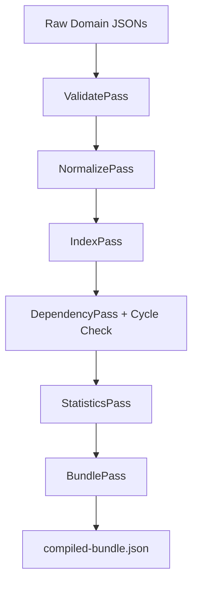

# Knowledge Compiler Subsystem

## Purpose
This document specifies the design, compilation passes, and output targets of the offline Knowledge Compiler subsystem.

## Current Repository Implementation
The compiler system is implemented in `assets/js/engine/knowledge/compiler/`.
- **Knowledge Compiler (`KnowledgeCompiler.js`):** Manages the compile process, maintaining a list of active `CompilerPass` implementations.
- **Compiler Passes (`passes/`):**
  - `ValidatePass.js`: Verifies JSON structures against schemas.
  - `IndexPass.js`: Indexes domain terms and identifiers.
  - `DependencyPass.js`: Resolves cross-references and registers dependencies.
  - `BundlePass.js`: Bundles domain assets into a single JSON release candidate.
- **Compiler Context (`CompilerContext.js`):** Maintains the shared state, logs, and error arrays during compilation.

## Research Findings
The research corpus highlights:
- **Compiler pipeline optimization:** A six-pass compiler design including normalization and statistical validation is required for logical consistency.
- **Offline validation:** Checking for logical contradictions, cycles, and orphans before packaging domains for release.

## Gap Analysis
1. **Missing passes:** The repository lacks the designed `NormalizePass` (to enforce casing and terminology standards) and `StatisticsPass` (to report compilation metrics), implementing only 4 of the 6 passes.
2. **No Cycle Checking:** `DependencyPass` builds the dependency graph but does not execute a cycle detection traversal.

## Recommended Architecture
1. **Wire missing passes:** Create `NormalizePass.js` and `StatisticsPass.js` under `passes/` and wire them into `KnowledgeCompiler.js`.
2. **Cycle Checking Pass:** Implement cycle checks inside `DependencyPass.js`.

| Pass Order | Pass Name | Primary Responsibility | File Location |
|---|---|---|---|
| **1** | `ValidatePass` | Check JSON structure | `passes/ValidatePass.js` |
| **2** | `NormalizePass` | Enforce casing and terms | `passes/NormalizePass.js` |
| **3** | `IndexPass` | Index terms and IDs | `passes/IndexPass.js` |
| **4** | `DependencyPass` | Resolve refs and cycles | `passes/DependencyPass.js` |
| **5** | `StatisticsPass` | Report metrics | `passes/StatisticsPass.js` |
| **6** | `BundlePass` | Emit bundle JSON | `passes/BundlePass.js` |

### Recommendation Rationale
- **Why:** To complete the 6-pass compiler design and prevent circular references from reaching production bundle releases.
- **Benefits:** Logical consistency, clean release metrics.
- **Tradeoffs:** Adds small build-time processing latency.
- **Risks:** Normalization might alter casing on custom definitions used in downstream applications.
- **Dependencies:** None.
- **Estimated Effort:** 4 engineering days.
- **Rollback Strategy:** Revert compiler changes and execute only the original 4 passes.

## Repository Impact
### Files Affected
- `assets/js/engine/knowledge/compiler/KnowledgeCompiler.js` (wire new passes).
- `assets/js/engine/knowledge/compiler/passes/DependencyPass.js` (add cycle detection).

### New Files
- `assets/js/engine/knowledge/compiler/passes/NormalizePass.js` (implement casing normalization).
- `assets/js/engine/knowledge/compiler/passes/StatisticsPass.js` (implement compilation statistics).

### Files Untouched
- `assets/js/engine/rules/*`
- `assets/js/engine/core/parser/*`

## Migration Strategy
Phase 1: Implement the cycle checker in `DependencyPass.js`. Phase 2: Author `NormalizePass.js` and `StatisticsPass.js` as separate modules. Phase 3: Wire the new passes into the `KnowledgeCompiler.js` constructor list.

## Performance Considerations
Offline compilation only executes during code compilation or build phases, having no impact on runtime API latency.

## Test Strategy
Run compiler integration tests under `tests/compiler/` using mock domains containing casing issues and circular dependency maps. Verify the compilation output is correctly normalized and metrics are generated.

## Future Evolution
Add SMT solvers (such as Z3) to the compiler pipeline to perform logical validation checks on rule files at compile time.

## References
- `chat-Enterprise_Legal_AI_Contract_Analysis.txt` (Task 4)
- `assets/js/engine/knowledge/compiler/KnowledgeCompiler.js`
- `assets/js/engine/knowledge/compiler/passes/DependencyPass.js`
