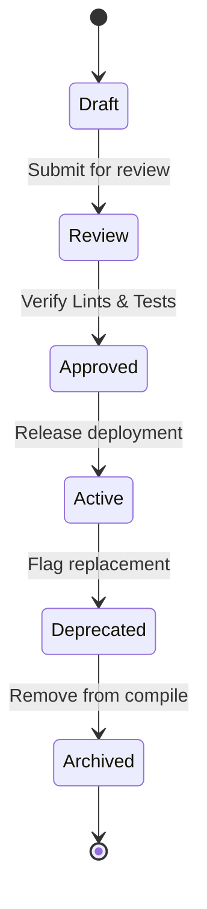

# Knowledge Governance

## Purpose
This document specifies the governance policies, release lifecycles, and verification frameworks for managing domain ontologies in the Trothix platform.

## Current Repository Implementation
There is no automated governance or status lifecycle tracking implemented in the codebase today.
- `RuleRegistry.js` contains a basic check for `status === 'deprecated'`.
- All other rules are treated as active and compiled.
- Changes to rules are written directly to JSON files and committed to Git, with no intermediate verification stages.

## Research Findings
The research transcript recommends implementing:
- **Rule Lifecycle Statuses:** A transition path (e.g. `Draft` -> `Review` -> `Approved` -> `Active` -> `Deprecated` -> `Archived`).
- **Audit Trails:** Tracking author, revision, and verification status in headers.
- **Git-based Audits:** Explicit association of rule revisions with verification tests.

## Gap Analysis
1. **No Rule Status Management:** The engine does not support rule statuses like `Draft` or `Review`, compiling any rule committed to the folder.
2. **Missing Metadata Fields:** Rule definitions lack tracking metadata (such as authors, review date, ticket reference).

## Recommended Architecture
1. **Rule Status Lifecycle:** Add validation support for `Draft`, `Review`, `Approved`, `Active`, `Deprecated`, and `Archived` to `RulesSchema.js`.
2. **Compilation Filters:** Modify `RuleRegistry.js` to compile only rules with status `Approved` or `Active`.
3. **Audit Headers:** Update the `MetadataSchema.js` to require author, source policy, and modification date tags.

| Rule Status | Compiled? | Target Action |
|---|---|---|
| **Draft** | No | Ignore in compilation |
| **Review** | No | Run diagnostic lints |
| **Approved** | Yes | Load into engine |
| **Active** | Yes | Load into engine |
| **Deprecated**| No | Skip compilation |

### Recommendation Rationale
- **Why:** To prevent unverified rules or draft modifications from leaking into production analysis runs.
- **Benefits:** Strict compliance controls, auditable rule lifecycles.
- **Tradeoffs:** Adds process steps to domain engineering work.
- **Risks:** Delaying urgent hotfixes due to approvals blocking deployment pipelines.
- **Dependencies:** Schema validation updates.
- **Estimated Effort:** 3 engineering days.
- **Rollback Strategy:** Revert compile filters in `RuleRegistry.js` to load all rules.

## Repository Impact
### Files Affected
- `assets/js/engine/rules/RuleRegistry.js` (implement status filters).
- `assets/js/engine/knowledge/schemas/RulesSchema.js` (add status validation).
- `assets/js/engine/knowledge/schemas/MetadataSchema.js` (require audit headers).

### Files Untouched
- `assets/js/engine/core/parser/*`
- `assets/js/engine/assessment/*`

## Migration Strategy
Phase 1: Update the rule schema to support lifecycle tags, defaulting rules without tags to `Active`. Phase 2: Add status routing logic to `RuleRegistry.js`. Phase 3: Roll out mandatory audit headers across domain JSON files.

## Performance Considerations
Since status checks are evaluated during initialization, they have zero impact on runtime contract analysis speeds.

## Test Strategy
Create rule fixtures under `tests/rules/` containing different status configurations. Assert that only `Approved` and `Active` rules are registered in the compiler context.

## Future Evolution
Integrate with corporate version control systems (such as GitHub Actions) to enforce approvals before rules are merged.

## References
- `chat-Enterprise_Legal_AI_Contract_Analysis.txt` (Tasks 3 and 9)
- `assets/js/engine/rules/RuleRegistry.js`
- `assets/js/engine/knowledge/schemas/RulesSchema.js`
