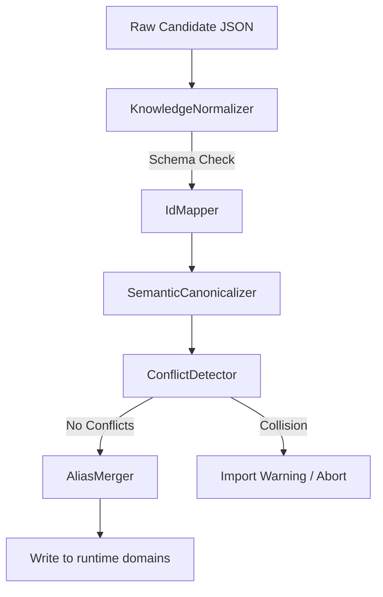

# Knowledge Importer Subsystem

## Purpose
This document specifies the offline Knowledge Importer subsystem, detailing candidate resolution, schema alignment, and import conflict detection.

## Current Repository Implementation
The importer is implemented under `assets/js/engine/knowledge/importer/`.
- **Knowledge Importer (`KnowledgeImporter.js`):** Manages the import process, reading candidate schema JSON files.
- **Normalizer (`KnowledgeNormalizer.js`):** Normalizes candidate structures before import validation.
- **Semantic Canonicalizer (`SemanticCanonicalizer.js`):** Matches candidate synonyms to existing ontology IDs.
- **Conflict Detector (`ConflictDetector.js`):** Checks for ID collisions and overlapping rules.
- **Alias Merger (`AliasMerger.js`):** Merges synonym definitions under canonical identities.
- **Id Mapper (`IdMapper.js`):** Maps candidate IDs to target namespace identifiers.
- **Import Report (`ImportReport.js`):** Formats output logs and lists import issues.

## Research Findings
The research corpus suggests that importing external playbooks or rule packs requires:
- **Conflict resolution logic:** Managing ID overlaps and schema version variations.
- **Synonym clustering:** Using semantic models to map candidate terms (e.g. "disclosing party" vs "Discloser") to unified concept nodes.
- **Governance tracing:** Mapping imported rules back to their origin files and authors.

## Gap Analysis
1. **No Versioning Support:** The importer assumes all files are current, with no capacity to handle schema changes over time.
2. **Missing Author Metadata:** Imported files are merged without author or origin tracing tags, creating audit difficulties.

## Recommended Architecture
1. **Version Alignment Pass:** Add a version checking check in `KnowledgeNormalizer.js` to align legacy files to the active schema version.
2. **Provenance Tagging:** Modify `KnowledgeImporter.js` to inject import metadata (author, source, import timestamp) into the `metadata.json` of target directories.

| Importer Component | Responsibility | Key File |
|---|---|---|
| **Normalizer** | Convert files to standard formats | `KnowledgeNormalizer.js` |
| **Canonicalizer** | Map synonyms to unified IDs | `SemanticCanonicalizer.js` |
| **Conflict Detector** | Identify ID collision issues | `ConflictDetector.js` |
| **Alias Merger** | Merge synonym nodes | `AliasMerger.js` |

### Recommendation Rationale
- **Why:** To support importing regional or external legal compliance playbooks into the runtime domain without breaking existing logic structures.
- **Benefits:** Schema safety, audit trails.
- **Tradeoffs:** Increased import validation times.
- **Risks:** Automatic synonym matching might cluster semantically distinct legal terms.
- **Dependencies:** None.
- **Estimated Effort:** 4 engineering days.
- **Rollback Strategy:** Archive imported changes and restore domain directories using Git.

## Repository Impact
### Files Affected
- `assets/js/engine/knowledge/importer/KnowledgeImporter.js` (tag provenance metadata).
- `assets/js/engine/knowledge/importer/ConflictDetector.js` (detect rule conflicts).

### Files Untouched
- `assets/js/engine/rules/*`
- `assets/js/engine/core/parser/*`

## Migration Strategy
Deploy the version alignment check as an initial pass in the normalization pipeline. Integrate provenance logging during final file writes.

## Performance Considerations
Since import checks run exclusively during offline playbook updates, runtime contract evaluation latency is unaffected.

## Test Strategy
Execute test suites in `test_importer.js` using conflicting rule IDs. Assert that import operations are aborted and logged correctly.

## Future Evolution
Eventually, implement an interactive UI dashboard allowing legal engineers to resolve import conflicts visually.

## References
- `chat-Enterprise_Legal_AI_Contract_Analysis.txt` (Task 4)
- `assets/js/engine/knowledge/importer/KnowledgeImporter.js`
- `assets/js/engine/knowledge/importer/ConflictDetector.js`
