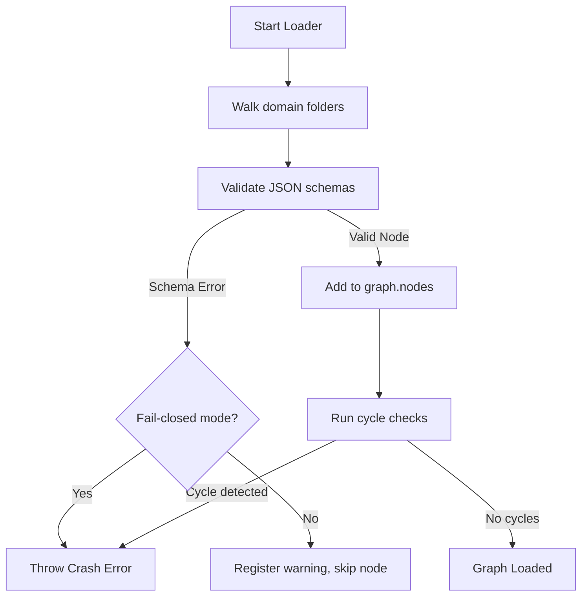

# Knowledge Provider Subsystem

## Purpose
This document specifies the design, runtime loading sequences, and APIs of the `KnowledgeProvider` subsystem, which serves as the core ontology repository.

## Current Repository Implementation
The subsystem is implemented in `assets/js/engine/knowledge/KnowledgeProvider.js`.
- During startup, it executes `_loadDomains()`, walking the directory tree of `assets/js/engine/knowledge/v1/domains/`.
- It reads files matching registered schema names, instantiates schema checkers, and verifies structural validity.
- Validated records are registered in two in-memory collections:
  - `this.graph.nodes`: A JavaScript `Map` of concept ID to concept attributes.
  - `this.graph.edges`: A JavaScript array of relationship edges.
- It exposes query helper interfaces, such as `resolveActionSynonym(term)` and `_validateAndResolveGraph()`.

## Research Findings
The research corpus suggests that runtime ontology providers must:
- Implement robust cycle detection checks to prevent circular references in loaded concept graphs.
- Allow dynamic, run-time layering of domain rules (such as overriding base domain definitions with regional rules).
- Support soft schema warning logging rather than binary fail-hard crashes.

## Gap Analysis
1. **No Cycle Detection:** `KnowledgeProvider.js` validates node references, but does not traverse the loaded graph to verify that no containment cycles exist.
2. **Binary Crash on Bad Data:** The loader throws hard runtime exceptions on missing references, which crashes the engine instead of gracefully reporting errors.

## Recommended Architecture
1. **Cycle Validation Pass:** Implement a Cycle Validation check in `_validateAndResolveGraph()` using a standard DFS path-tracking stack.
2. **Soft Failure Mode:** Allow the loader to catch schema warnings, registering them in a diagnostic trace array while continuing to load valid parts of the graph.

| Loader Stage | Current Behavior | Proposed Target |
|---|---|---|
| **JSON Loading** | Sequential file reads | Cached memory reads |
| **Verification** | Throws on bad schema | Accumulates soft warnings |
| **Cycle check** | No cycle verification | Strict DFS cycle check |

### Recommendation Rationale
- **Why:** To prevent circular logic bugs from locking the evaluation engine at runtime and allow for robust debugging.
- **Benefits:** Logic safety guarantees, high availability.
- **Tradeoffs:** Adds small processing overhead at engine startup.
- **Risks:** Bypassing schema exceptions might allow corrupt rule sets to evaluate.
- **Dependencies:** None.
- **Estimated Effort:** 3 engineering days.
- **Rollback Strategy:** Revert loader refactoring and throw exceptions immediately.

## Repository Impact
### Files Affected
- `assets/js/engine/knowledge/KnowledgeProvider.js` (implement DFS cycle checks, update error catching).

### Files Untouched
- `assets/js/engine/rules/*`
- `assets/js/engine/core/parser/*`

## Migration Strategy
Deploy the cycle checker as a final pass in the graph resolution method. Implement the soft-error model behind a configuration flag `strictValidation: false`.

## Performance Considerations
Since cycle checks run exactly once during startup, the latency impact on standard document analysis operations is zero.

## Test Strategy
Create circular domain configurations in `tests/knowledge/`. Verify that the loader identifies the circular path and halts with a diagnostic cycle error.

## Future Evolution
Eventually, compile the loaded ontology maps into an in-memory SQL database (such as SQLite/WASM) to leverage SQL search indexes.

## References
- `chat-Enterprise_Legal_AI_Contract_Analysis.txt` (Task 4)
- `assets/js/engine/knowledge/KnowledgeProvider.js`
- `assets/js/engine/knowledge/compiler/passes/DependencyPass.js`
