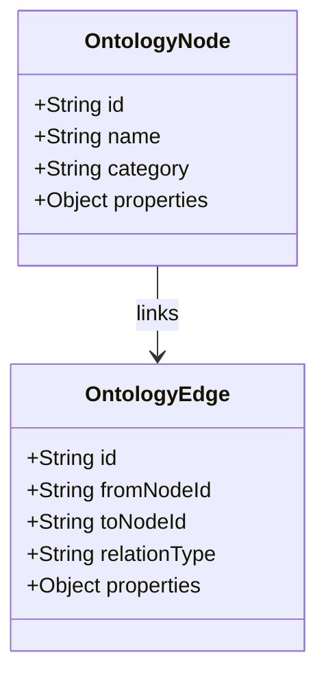

# Ontology Structure & Schema Reference

## Purpose
This document specifies the ontology model, graph schemas, and concepts used to classify and link legal clauses in the Trothix platform.

## Current Repository Implementation
The ontology system is defined across two main locations in the repository:
1. **Ontology Definitions (`ontology/`):** Contains concepts and relationships (e.g. `concepts/Obligation.md`, `relationships/conflicts_with.md`).
2. **Domain Schemas (`knowledge/schemas/`):** Implements the 15 runtime schema validators (e.g. `ConceptSchema.js`, `RulesSchema.js`, `EntitiesSchema.js`).
3. **Runtime loading:** Managed by `knowledge/KnowledgeProvider.js`, which walks the active domain JSON directories, parses files, and builds the in-memory graph.

## Research Findings
The research corpus suggests that ontology models must support:
- **SHACL-style graph validation:** Ensuring that concept nodes conform to structural constraints (e.g. an "Obligation" node must have a "Subject" and an "Action" edge).
- **Reified Edges:** Modeling relationship edges as nodes themselves when they carry properties (e.g., an "overrides" edge carrying a "reason" or "validity" field).
- **Taxonomies:** Strict hierarchical groupings of concepts (e.g., "PaymentObligation" is a subclass of "Obligation").

## Gap Analysis
1. **No Edge Properties:** Edges in `KnowledgeProvider.js` are simple directed arrows with a relation string, making it impossible to add parameters (such as condition scopes) to relations.
2. **Inert Vocabulary Files:** Many legacy vocabulary files (such as `Assignment/templates.json` and `Lifecycle/states.json`) lack an `id` field and are silently discarded by the loader at runtime.

## Recommended Architecture
1. **Reified Edge Model:** Extend the graph model to represent edges as instances of `OntologyEdge` carrying dynamic properties.
2. **Strict Node Schema Enforcement:** Modify `KnowledgeProvider.js` to throw validation exceptions when encountering vocabulary entries missing an `id` field.

| Schema Class | Target JSON File | Validator Code File |
|---|---|---|
| **Concept Schema** | `concept.json` | `knowledge/schemas/ConceptSchema.js` |
| **Rules Schema** | `rules.json` | `knowledge/schemas/RulesSchema.js` |
| **Relations Schema** | `relations.json` | `knowledge/schemas/RelationsSchema.js` |

### Recommendation Rationale
- **Why:** To support complex contractual relationships, such as an indemnification clause that *excludes* specific liability limits under certain conditions.
- **Benefits:** Rich semantic representation, validation safety.
- **Tradeoffs:** Increased complexity in graph traversal algorithms.
- **Risks:** Memory overhead will increase slightly as edges expand into full objects.
- **Dependencies:** Schema validation updates.
- **Estimated Effort:** 4 engineering days.
- **Rollback Strategy:** Fall back to simple string-labeled edge definitions.

## Repository Impact
### Files Affected
- `assets/js/engine/knowledge/KnowledgeProvider.js` (enforce node IDs, support reified edges).
- `assets/js/engine/core/types.js` (add `OntologyEdge` structural shape).

### Files Untouched
- `assets/js/engine/rules/*`
- `assets/js/engine/core/parser/*`

## Migration Strategy
Phase 1: Update the schema linter to throw errors on missing `id` fields. Phase 2: Refactor the loader in `KnowledgeProvider.js` to construct `OntologyEdge` objects, maintaining backwards compatibility with string relationships.

## Performance Considerations
Lookup operations on reified edges can be optimized by indexing relationships in a dual-adjacency map (`incoming` and `outgoing`) in memory.

## Test Strategy
Create test domain fixtures under `tests/knowledge/` containing circular and missing-ID concept nodes. Assert that the linter correctly flags and halts execution on validation errors.

## Future Evolution
Eventually, migrate the ontology database to an external Graph Database (such as Neo4j) to support complex multi-hop queries.

## References
- `chat-Enterprise_Legal_AI_Contract_Analysis.txt` (Task 4)
- `assets/js/engine/knowledge/KnowledgeProvider.js`
- `assets/js/engine/knowledge/schemas/ConceptSchema.js`
