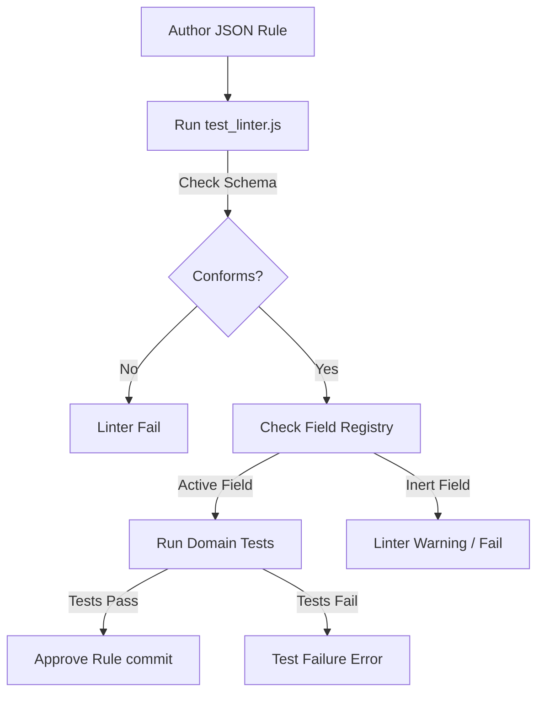

# Rule Authoring Standards

## Purpose
This document establishes the official authoring standards, syntax rules, and verification patterns for creating compliance rules in the Trothix platform.

## Current Repository Implementation
The authoring guidelines are stored in `assets/js/engine/knowledge/standards/AUTHORING_GUIDE.md`.
- Rules must be defined inside domain-specific `rules.json` directories.
- Structural schema conformance is enforced by the validator `knowledge/schemas/RulesSchema.js`.
- Active fields must map to paths registered in `rules/RuleFieldRegistry.js`.

The repository contains only 4 domains with executable rule logic (ForceMajeure, Indemnification, Liability, Payment); other domains contain only descriptive metadata stubs.

## Research Findings
The research corpus suggests that rule authoring requires:
- **Strict Linting passes:** Automated syntax checks to verify field casing and type accuracy before committing rules.
- **Verification Tests:** Colocating unit tests (positive and negative cases) with rule definitions.
- **Diagnostic tracking:** Registering why rules are written (e.g. policy references) in metadata headers.

## Gap Analysis
1. **Metadata-only Stubs:** Several domains (such as Definitions, Assignment, Notice) feature `rules.json` files that lack `when`/`then` evaluation blocks.
2. **Incomplete Linter checks:** The linter verifies JSON structure, but does not check if referenced fields are active in the parser engine registry.

## Recommended Architecture
1. **Strict Linting Integration:** Update the linter `test_linter.js` to run field existence checks against `RuleFieldRegistry.js`.
2. **Mandatory Test Cases:** Enforce that every rule folder contain at least one positive and one negative test file.

| Metric | Legacy Rules | Target Standard Rules |
|---|---|---|
| **Condition block** | Metadata only | Mandatory `when` + `then` |
| **Field checks** | Ignored | Verified against `RuleFieldRegistry` |
| **Colocated tests**| Optional | Mandatory positive + negative |

### Recommendation Rationale
- **Why:** To eliminate inert rules from production builds and ensure logic behaves as specified.
- **Benefits:** Guaranteed execution safety, simplified debugging.
- **Tradeoffs:** Increases playbooks development overhead.
- **Risks:** Banning inactive fields might block the commits of rules intended for future parser updates.
- **Dependencies:** None.
- **Estimated Effort:** 2 engineering days.
- **Rollback Strategy:** Allow ignoring linter errors via a command flag.

## Repository Impact
### Files Affected
- `assets/js/engine/knowledge/schemas/RulesSchema.js` (enforce field check validations).
- `assets/js/engine/knowledge/KnowledgeLinter.js` (integrate field registry verification).

### Files Untouched
- `assets/js/engine/rules/RuleCompiler.js`
- `assets/js/engine/core/parser/*`

## Migration Strategy
Deploy the strict linter checks in the pre-commit Git hooks. Phase in domain rule conversions step-by-step.

## Performance Considerations
Since linter checks run during local development and CI/CD pipelines, runtime contract evaluation performance is unaffected.

## Test Strategy
Run `npm run lint` on mock domains containing invalid fields. Verify that the compiler linter logs descriptive warnings and returns a non-zero exit code.

## Future Evolution
Eventually, implement a web-based portal allowing domain experts to author and test rules without writing JSON code.

## References
- `chat-Enterprise_Legal_AI_Contract_Analysis.txt` (Task 3)
- `assets/js/engine/knowledge/standards/AUTHORING_GUIDE.md`
- `assets/js/engine/knowledge/KnowledgeLinter.js`
