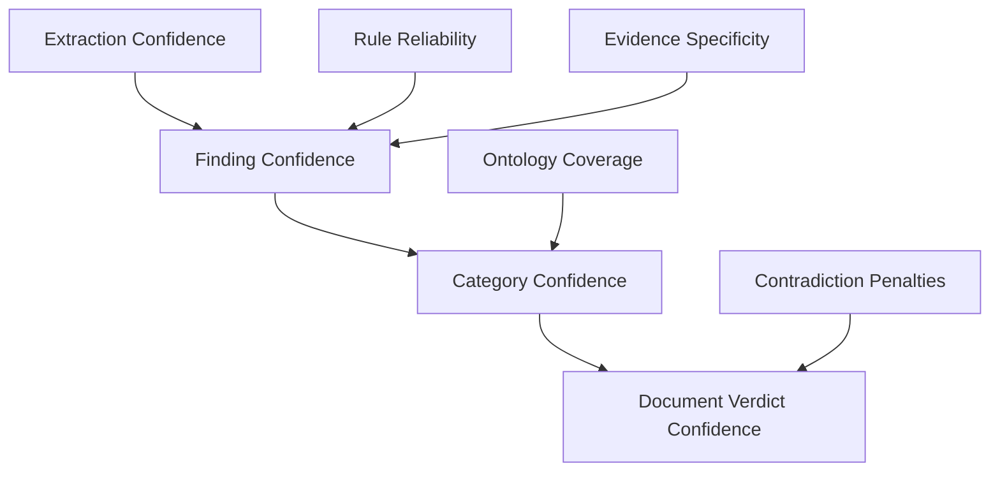

# Confidence Resolution System

## Purpose
This document specifies the architecture, math model, and execution pipeline of the Trothix derived confidence resolution system. It details the transition from hardcoded confidence values to a structured, mathematically derived audit trail.

## Current Repository Implementation
Confidence is currently hardcoded in six independent, unconnected locations in the repository:
1. `VerdictEngine.js`: Hardcodes `confidence = 0.95` on every evaluation.
2. `actionBuilder.js`: Hardcodes `confidence: 0.90` on every extracted action.
3. `RiskAssessment.js`: Always sets `confidence: 1.0`.
4. `FairnessAssessment.js`: Always sets `confidence: 0.9`.
5. `CompletenessAssessment.js`: Sets `0.95` or `1.0` depending on branch.
6. `RuleEvaluator.js`: Fails back to `rule.metadata.confidence || 1.0`.

These values are literal constants and are not aggregated or derived from upstream analysis signals.

## Research Findings
The research corpus highlights the necessity of derived confidence scoring:
- Confidence must be a mathematically sound function of actual signals (extraction quality, rule coverage, evidence completeness).
- Global arithmetic averages are inappropriate for legal compliance because a single severe failure (such as missing evidence) should pull the overall score down.
- A **weighted geometric mean** should be used to aggregate individual confidence signals.

## Gap Analysis
1. **Fabricated Scores:** The overall verdict confidence is a literal value (`0.95`) with no relation to extraction or logic checks.
2. **Ignored Plugin Signals:** The scoring and assessment layers do not consume the confidence metrics returned by the extraction plugins (such as `actionBuilder`).

## Recommended Architecture
We recommend replacing the hardcoded confidence values with a dynamic, derived confidence score calculated at three layers: finding, category/assessment, and document/verdict.

### Aggregation Model
$$\text{Confidence} = \prod_{i=1}^{k} S_i^{w_i}$$
Where $S_i \in [0, 1]$ represents the normalized signal value, and $w_i$ represents the weight configuration such that $\sum w_i = 1$.

### Data Model
- **`EvidenceScore`:** Evaluates text span, section, and rule citations.
- **`RuleScore`:** Evaluates field status (`active`/`inert`/`unverified` from `RuleFieldRegistry.js`) and rule status.
- **`ConfidenceRecord`:** The top-level output containing the aggregated score and trace descriptions.

### Recommendation Rationale
- **Why:** To eliminate fabricated confidence metrics and provide enterprise customers with mathematically auditable findings.
- **Benefits:** Authentic risk assessments, transparent compliance analysis.
- **Tradeoffs:** Requires calibrating weight maps.
- **Risks:** Divergence between customer expectations and actual confidence outputs.
- **Dependencies:** None.
- **Estimated Effort:** 5 engineering days.
- **Rollback Strategy:** Revert calibration file configuration.

## Repository Impact
### Files Affected
- `assets/js/engine/assessment/VerdictEngine.js` (use derived score).
- `assets/js/engine/assessment/ScoringEngine.js` (collate confidence scores).
- `assets/js/engine/plugins/actionBuilder.js` (replace literal confidence).

### New Files
- `assets/js/engine/assessment/ConfidenceResolver.js` (implement derived calculations).
- `assets/js/engine/assessment/confidence-weights.json` (calibrated weight maps).

### Files Untouched
- `assets/js/engine/core/parser/*`
- `assets/js/engine/rules/RuleCompiler.js`

## Migration Strategy
Phase 1: Deploy `ConfidenceResolver.js` alongside the active engine. Phase 2: Calibrate weights to approximate legacy `0.95` outputs under clean runs. Phase 3: Wire calculations to `VerdictEngine.evaluate()` and disable hardcoded literals.

## Performance Considerations
Derived confidence runs in $O(F)$ where $F$ is findings. Pre-calculating rule statuses at startup ensures sub-millisecond query evaluation times.

## Test Strategy
Run unit tests in `tests/confidence/`. Verify that contracts with missing required fields output lower derived scores than clean contracts.

## Future Evolution
Eventually, implement machine learning models to adjust signal weights dynamically based on user feedback.

## References
- `chat-Enterprise_Legal_AI_Contract_Analysis.txt` (Task 10)
- `Trothix_Confidence_Evidence_Architecture.md`
- `assets/js/engine/assessment/VerdictEngine.js`
