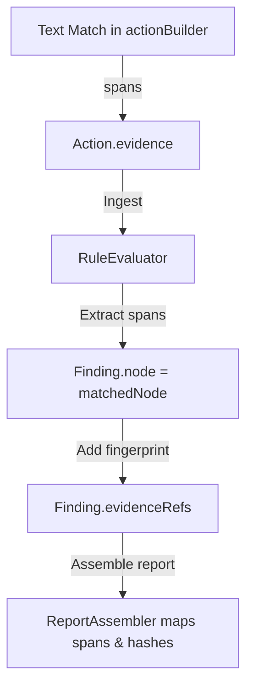

# Evidence Resolution System

## Purpose
This document specifies the Evidence Resolution System of the Trothix platform. It details how the engine binds compliance findings to character spans and node definitions.

## Current Repository Implementation
- **`TraceEvidence`:** Declared in `assets/js/engine/core/types.js` (`matchedText`, `start`, `end`).
- **Linguistic Extraction:** `assets/js/engine/plugins/actionBuilder.js` correctly maps extracted actions to specific character ranges.
- **Rule Evaluator Gap:** In `assets/js/engine/rules/RuleEvaluator.js`, the evaluator returns `node: null` with the comment `"In the future, pinpoint exact node by evaluating locally instead of globally."` on finding objects.
- **Report Assembler:** `assets/js/engine/assessment/ReportAssembler.js` attempts to build traceability references (`_buildTraceability()`), but always outputs `"Unknown"` because the node references are null.

## Research Findings
The research corpus highlights:
- Every finding must be linked back to a character offset span.
- Evidence references must include text spans, node references, and rule paths.
- Content-addressable hashes (fingerprints) must be used to ensure evidence is tamper-evident.

## Gap Analysis
1. **Broken Traceability Chain:** Real evidence is collected by `actionBuilder.js`, but it is discarded in `RuleEvaluator.js`, preventing the final report from generating character-level citations.
2. **Missing Fingerprints:** The evidence matching pipeline does not associate findings with the `LegalNode.fingerprints` values computed during parsing.

## Recommended Architecture
We recommend closing the trace gap by modifying the evaluator and extending the evidence schemas to support reified citations.

| Reference Type | Source Field | Target Structure |
|---|---|---|
| **Text Span** | `action.evidence` | `TraceEvidence` |
| **Node Link** | `node.id` | `clauseNode` reference |
| **Fingerprint** | `node.fingerprints.raw` | Tamper-proof hash check |

### Recommendation Rationale
- **Why:** To resolve the "Unknown" citation bug, restoring character-level auditing for compliance reports.
- **Benefits:** Exact citation traces, audit compliance.
- **Tradeoffs:** Increases finding object memory allocations.
- **Risks:** Offsets might shift if document structures are edited post-parsing.
- **Dependencies:** None.
- **Estimated Effort:** 2 engineering days.
- **Rollback Strategy:** Revert evaluator node mappings to return null pointers.

## Repository Impact
### Files Affected
- `assets/js/engine/rules/RuleEvaluator.js` (pass node structures to findings).
- `assets/js/engine/assessment/ReportAssembler.js` (map node IDs in traceability methods).

### Files Untouched
- `assets/js/engine/core/parser/*`
- `assets/js/engine/plugins/*`

## Migration Strategy
Phase 1: Update the finding constructor to accept node references. Phase 2: Refactor `RuleEvaluator.js` to extract matching nodes. Phase 3: Wire node references to `ReportAssembler._buildTraceability()`.

## Performance Considerations
Since node references are passed as memory pointers rather than cloned objects, this change has negligible memory impact.

## Test Strategy
Create test contracts with target terms. Assert that the compliance JSON report outputs the correct character range (`start` and `end` indices) matching the target term.

## Future Evolution
Extend visual client renderers to highlight cited text spans dynamically in browser frames.

## References
- `chat-Enterprise_Legal_AI_Contract_Analysis.txt` (Task 10)
- `assets/js/engine/rules/RuleEvaluator.js`
- `assets/js/engine/assessment/ReportAssembler.js`
