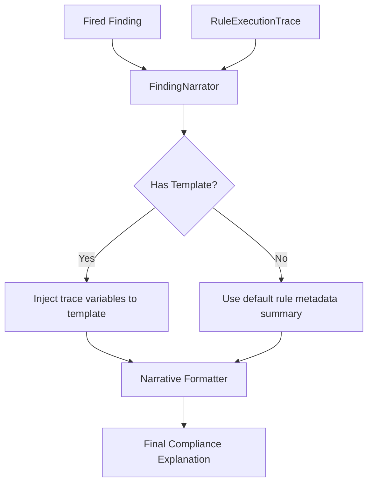

# Explainability Subsystem

## Purpose
This document specifies the Explainability architecture of the Trothix platform. It details how logical findings are translated into human-readable compliance explanations.

## Current Repository Implementation
The explainability components are structured under `assets/js/engine/assessment/`:
- **Finding Narrator (`FindingNarrator.js`):** Orchestrates the generation of finding descriptions.
- **Explanation Library (`ExplanationLibrary.js`):** Manages the collection of explanation schemas.
- **Explanation Templates (`ExplanationTemplates.js`):** Declares templates mapping rules to human-readable text.
- **Narrative Formatter (`NarrativeFormatter.js`):** Formats output blocks (e.g. paragraphs, bullet points).

These components construct static text descriptions from rule metadata, rather than generating dynamic reasoning traces.

## Research Findings
The research corpus suggests that explainability must:
- Avoid generative LLM text for explanations to prevent hallucinations.
- Build structured explanation traces showing exactly which conditions failed or succeeded.
- Explicitly identify what information was missing (e.g., list inert fields or missing terms).

## Gap Analysis
1. **Static Explanations:** The narrative system uses static strings from `ExplanationTemplates.js` without detailing why a specific clause failed.
2. **No Diagnostics Mapping:** If a rule fails to compile or evaluate, the narrative system does not explain why.

## Recommended Architecture
1. **Dynamic Narrative Injection:** Modify `FindingNarrator.js` to accept `RuleExecutionTrace` inputs and inject matching parameters into the template placeholders.
2. **Missing Field Exposure:** Query `RuleFieldRegistry.js` to report when rules failed to fire due to unpopulated or inert fields.

| Question | Answered by | Key Component |
|---|---|---|
| **Why did it fire?** | Logical match path | `FindingNarrator.js` |
| **Why is confidence low?** | Weak signals breakdown | `ConfidenceResolver.js` |
| **What was missing?** | Inert field checks | `RuleFieldRegistry.js` |

### Recommendation Rationale
- **Why:** To replace static templated text with context-aware explanations, helping users resolve contract compliance violations.
- **Benefits:** Auditable reasoning, zero hallucinations.
- **Tradeoffs:** Requires defining more complex placeholders in templates.
- **Risks:** Template parameters might throw formatting errors if fields mismatch.
- **Dependencies:** Complete execution of the Evidence Resolution System.
- **Estimated Effort:** 3 engineering days.
- **Rollback Strategy:** Fall back to displaying static rule metadata descriptions.

## Repository Impact
### Files Affected
- `assets/js/engine/assessment/FindingNarrator.js` (accept execution traces).
- `assets/js/engine/assessment/ExplanationTemplates.js` (define dynamic placeholders).

### Files Untouched
- `assets/js/engine/core/parser/*`
- `assets/js/engine/rules/RuleCompiler.js`

## Migration Strategy
Phase 1: Update templates to support variables like `{targetAmount}`. Phase 2: Refactor `FindingNarrator.js` to extract variable values from the `finding.node` object. Phase 3: Add diagnostic explanation helper methods.

## Performance Considerations
String template evaluation runs in $O(F)$ where $F$ is findings. Memory overhead is minimal as no deep traversals are required.

## Test Strategy
Run unit tests in `tests/assessment/`. Assert that the generated narrative string correctly interpolates contract-specific values (such as currency amounts and dates).

## Future Evolution
Eventually, implement multi-language template packages to localize explanations across regional compliance playbooks.

## References
- `chat-Enterprise_Legal_AI_Contract_Analysis.txt` (Task 10)
- `assets/js/engine/assessment/FindingNarrator.js`
- `assets/js/engine/assessment/ExplanationTemplates.js`
