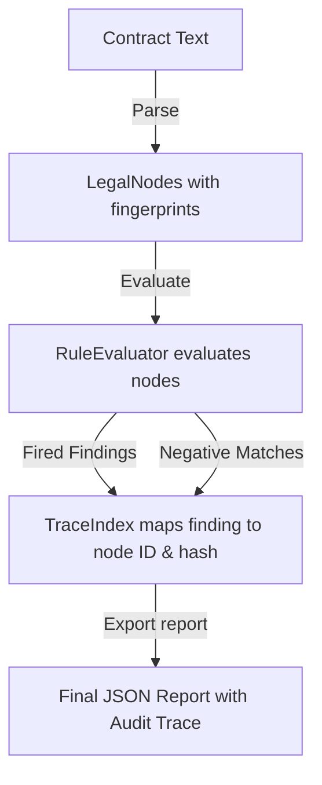

# Traceability Specification

## Purpose
This document specifies the traceability requirements, schemas, and verification passes of the Trothix contract analysis execution pipeline.

## Current Repository Implementation
- **Citations mapping:** Implemented in `assets/js/engine/assessment/ReportAssembler.js` (`_buildTraceability()`).
- **Data Models:** Node IDs are registered in the `CompilerContext` during compilation.
- **Diagnostics logging:** Basic tracking exists in `rules/RuleDiagnostics.js`.

Currently, the traceability output in reports defaults to `"Unknown"` because the node links are not populated by the evaluator.

## Research Findings
The research corpus suggests that enterprise contract analysis requires:
- **Bi-directional Traceability:** The ability to trace a finding to a source node, and conversely, find all rules evaluated against a specific source node.
- **Immutable References:** Using cryptographic content hashes (fingerprints) to track document node versions and identify modifications.

## Gap Analysis
1. **Broken Traceability Links:** Node mapping references are null, preventing bi-directional tracing from report findings back to source paragraphs.
2. **No Traversal Logging:** The execution path does not record which rules were evaluated against a specific node and returned negative results.

## Recommended Architecture
1. **Bi-directional Trace Index:** Implement a `TraceIndex` map in `ReportAssembler.js` associating node IDs with evaluated findings lists.
2. **Cryptographic Fingerprint Checks:** Include node hashes (`fingerprints.raw` from `core/types.js`) in all traceability records to detect document changes.

| Traversal Path | Source Identifier | Target Output |
|---|---|---|
| **Forward** | Finding ID | `LegalNode.id` + `TraceEvidence` |
| **Reverse** | `LegalNode.id` | List of Rules matched / missed |

### Recommendation Rationale
- **Why:** To support regulatory compliance audits: users must verify that all clauses were evaluated, not just those that failed check parameters.
- **Benefits:** Complete audit verification, logic safety.
- **Tradeoffs:** Increases report payload sizes.
- **Risks:** Trace structures might grow excessively large on long agreements.
- **Dependencies:** Complete execution of the Evidence Resolution System.
- **Estimated Effort:** 2 engineering days.
- **Rollback Strategy:** Revert report compiler modifications.

## Repository Impact
### Files Affected
- `assets/js/engine/assessment/ReportAssembler.js` (construct bi-directional trace index).
- `assets/js/engine/core/types.js` (add trace index schemas).

### Files Untouched
- `assets/js/engine/core/parser/*`
- `assets/js/engine/rules/RuleCompiler.js`

## Migration Strategy
Phase 1: Build the trace index map after rule evaluations. Phase 2: Add cryptographic fingerprint tags to finding reference schemas. Phase 3: Export findings lists via the API report.

## Performance Considerations
Optimize payload sizes by compressing the traceability section of the JSON report, or making it accessible only via an optional query parameter.

## Test Strategy
Create verification tests in `tests/assessment/`. Verify that the exported report contains the correct node hashes and maps all evaluated rules to their corresponding nodes.

## Future Evolution
Eventually, implement standard bitemporal tracing to track logic evaluations across multiple historical versions of corporate playbooks.

## References
- `chat-Enterprise_Legal_AI_Contract_Analysis.txt` (Task 10)
- `assets/js/engine/assessment/ReportAssembler.js`
- `assets/js/engine/core/types.js`
