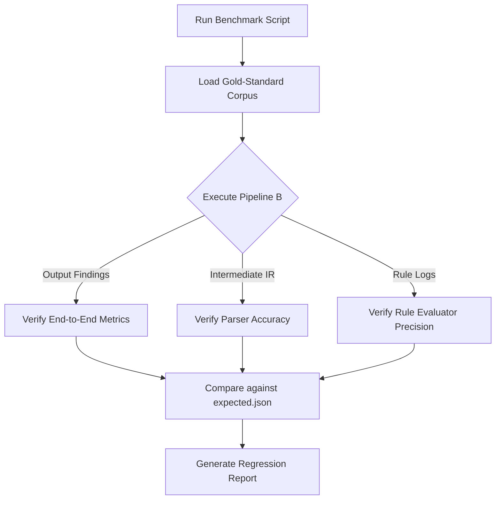

# Benchmarking Framework

> **Resolution note:** The gap this document originally identified has since
> been addressed — not by repointing `run-benchmark.mjs` as recommended
> below, but by adding a new script, `benchmark/run-benchmark-pipelineB.mjs`
> (run via `npm run benchmark`), which drives the real production engine
> (`Trothix.js`/Pipeline B) directly. The old `run-benchmark.mjs` has been
> retired and moved to `archive/benchmark/run-benchmark.mjs`; the
> `benchmark:legacy` npm script that invoked it has been removed. The
> "Recommended Architecture" section below is preserved for historical
> context but describes a repoint-in-place approach that was not the path
> actually taken.

## Purpose
This document specifies the benchmarking framework used to measure the accuracy, recall, latency, and correctness of the Trothix contract analysis engine.

## Current Repository Implementation
The benchmark components are stored under `benchmark/`:
- **Run Benchmark (`run-benchmark-pipelineB.mjs`):** Live script (via `npm run benchmark`) that runs each fixture document through the real production engine (`Trothix.js`) and diffs its finding-id list against a checked-in snapshot baseline (`benchmark/pipeline-b-baseline.json`), plus a zero-findings coverage check.
- **Fixture documents (`benchmark/{nda,lease,tos}/*.txt`):** Shared by both the live script and the retired `run-benchmark.mjs`.
- **Expected Results (`expected.json`):** Defined the expected compliance findings and severity mappings for benchmark contracts under the retired per-field extraction model. Not read by the live script.
- **Retired harness:** `archive/benchmark/run-benchmark.mjs` (formerly `benchmark/run-benchmark.mjs`) drove the legacy Pipeline C (`core/router.js`), which no longer exists in the repository — running it throws `ERR_MODULE_NOT_FOUND`.

## Research Findings
The research corpus suggests that evaluation frameworks must:
- Implement a clear separation between component-level tests (e.g. parser, rule engine) and end-to-end (E2E) compliance tests.
- Maintain a gold-standard benchmark corpus (curated contracts with resolved disagreements between legal experts).
- Measure and track performance regression metrics over time.

## Gap Analysis (historical — see resolution note above)
1. **Divergent Test Harness:** The benchmarking script executed dead legacy code, providing false confidence in the active production engine. *(Resolved — `run-benchmark-pipelineB.mjs` now exercises the live engine.)*
2. **No Component-Level Benchmarking:** The framework only evaluates end-to-end outputs, making it difficult to pinpoint whether a regression was caused by parser modifications or rule adjustments. *(Still open.)*

## Recommended Architecture
1. **Unify Test Pipeline:** Repoint `run-benchmark.mjs` to execute analyses using `Trothix.js` (Pipeline B).
2. **Component-Level Evaluation Harness:** Add parsing and rule evaluation metrics tracking hooks directly into the benchmark execution script.

| Benchmark Stage | Legacy Behavior | Target Behavior | File Location |
|---|---|---|---|
| **Pipeline target** | Legacy Pipeline C | Production Pipeline B | `benchmark/run-benchmark.mjs` |
| **Verification** | Compare severity totals | Direct finding structure match | `benchmark/expected.json` |
| **Component test** | Not implemented | Granular parser/rule tests | `benchmark/run-benchmark.mjs` |

### Recommendation Rationale
- **Why:** To ensure that correctness metrics track production capabilities, preventing silent regressions.
- **Benefits:** Auditable accuracy measurements, modular regressions tracking.
- **Tradeoffs:** Requires updating legacy benchmark expectation files.
- **Risks:** The initial test run against Pipeline B might reveal many failing tests that were previously ignored.
- **Dependencies:** None.
- **Estimated Effort:** 3 engineering days.
- **Rollback Strategy:** Revert script paths to point back to the legacy router.

## Repository Impact
### Files Affected
- `benchmark/run-benchmark.mjs` (repoint pipeline execution target).
- `benchmark/expected.json` (update schema checks to match Pipeline B output formats).

### Files Untouched
- `assets/js/engine/core/parser/*`
- `assets/js/engine/rules/*`

## Migration Strategy
Phase 1: Repoint the benchmark runner to imports from `assets/js/engine/Trothix.js`. Phase 2: Refactor `expected.json` to match modern JSON schemas. Phase 3: Wire validation tests to CI/CD workflows.

## Performance Considerations
Optimize benchmark execution times by caching intermediate parsed IRs, allowing rule-engine benchmarks to execute without rebuilding document graphs.

## Test Strategy
Run `npm run benchmark` locally and assert that the script completes execution, reports error lists, and returns zero exit codes when all assertions pass.

## Future Evolution
Eventually, implement automated fuzzing pipelines to generate thousands of synthetically modified documents to test parser boundaries.

## References
- `chat-Enterprise_Legal_AI_Contract_Analysis.txt` (Task 5)
- `docs/trothix-architecture-audit.md`
- `benchmark/run-benchmark.mjs`
