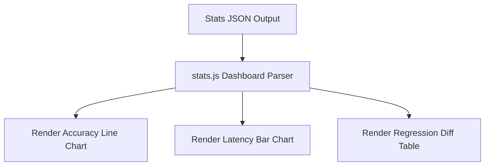

# Evaluation & Regression Dashboards

## Purpose
This document specifies the dashboard views, metric aggregations, and layout requirements for visualizing evaluation and regression results.

## Current Repository Implementation
Trothix features a basic statistics UI:
- **`stats.html` / `stats.js`:** Loads run metrics from a local stats JSON and renders basic HTML tables displaying processed characters and node counts.
- **`feedback.html` / `feedback.js`:** Renders a basic feedback collection form.

No interface exists to display historical F1 scores, parser precision tracking, or differential regression analysis.

## Research Findings
The research corpus suggests that evaluation dashboards must:
- Visualize accuracy metrics (Precision, Recall, F1 Score) across document domains over time.
- Display latency breakdowns (parsing, plugin execution, rule evaluation).
- Highlight differential regressions, showing exactly which findings appeared or disappeared across commits.

## Gap Analysis
1. **No Trend Visualization:** The dashboard displays single-run statistics, with no support for visualizing performance trends.
2. **Missing Differential Diffs:** Developers cannot see which rules triggered regressions directly from the UI.

## Recommended Architecture
We recommend expanding the local stats dashboard into a multi-tab visualization interface:
- **Tab 1: Accuracy Trends:** Renders line charts for Precision, Recall, and F1 scores over Git commits.
- **Tab 2: Latency Profiler:** Renders bar charts breaking down execution times by plugin phase.
- **Tab 3: Regression Diff Viewer:** Displays differential outputs, color-coded by modification type (additions in green, removals in red).

| Dashboard View | Primary Metrics Visualized | Target Audience |
|---|---|---|
| **Accuracy Trends** | F1 Score, Precision, Recall | Legal Engineers |
| **Latency Profiler** | Parse, plugin, and evaluation times | System Architects |
| **Regression Diff** | Added/Removed findings | QA Engineers |

### Recommendation Rationale
- **Why:** To enable engineers to identify accuracy regressions and latency bottlenecks instantly.
- **Benefits:** Auditable metric trends, simple regression tracking.
- **Tradeoffs:** Requires importing a charting library (such as Chart.js) into `stats.html`.
- **Risks:** Chart rendering might slow down the stats page on very large logs datasets.
- **Dependencies:** None.
- **Estimated Effort:** 3 engineering days.
- **Rollback Strategy:** Revert dashboard updates to the legacy HTML table model.

## Repository Impact
### Files Affected
- `stats.html` (include Chart.js script, define layout tabs).
- `stats.js` (parse metrics log files, render chart objects).

### Files Untouched
- `assets/js/engine/*`
- `api/analyze.js`

## Migration Strategy
Phase 1: Update `stats.html` with basic tab controls. Phase 2: Add Chart.js to render latency breakdowns. Phase 3: Integrate regression diff comparisons into the visualization view.

## Performance Considerations
Render charts on the client-side using canvas elements. Limit log parsing to the most recent 100 benchmark runs to prevent browser memory slowdowns.

## Test Strategy
Open `stats.html` in a web browser using a mock history log. Verify that charts render correctly, tabs toggle without errors, and diff layouts are formatted correctly.

## Future Evolution
Eventually, migrate stats reporting to an enterprise dashboard tool (such as Grafana) connected to the telemetry bus.

## References
- `chat-Enterprise_Legal_AI_Contract_Analysis.txt` (Task 5)
- `stats.html`
- `stats.js`
