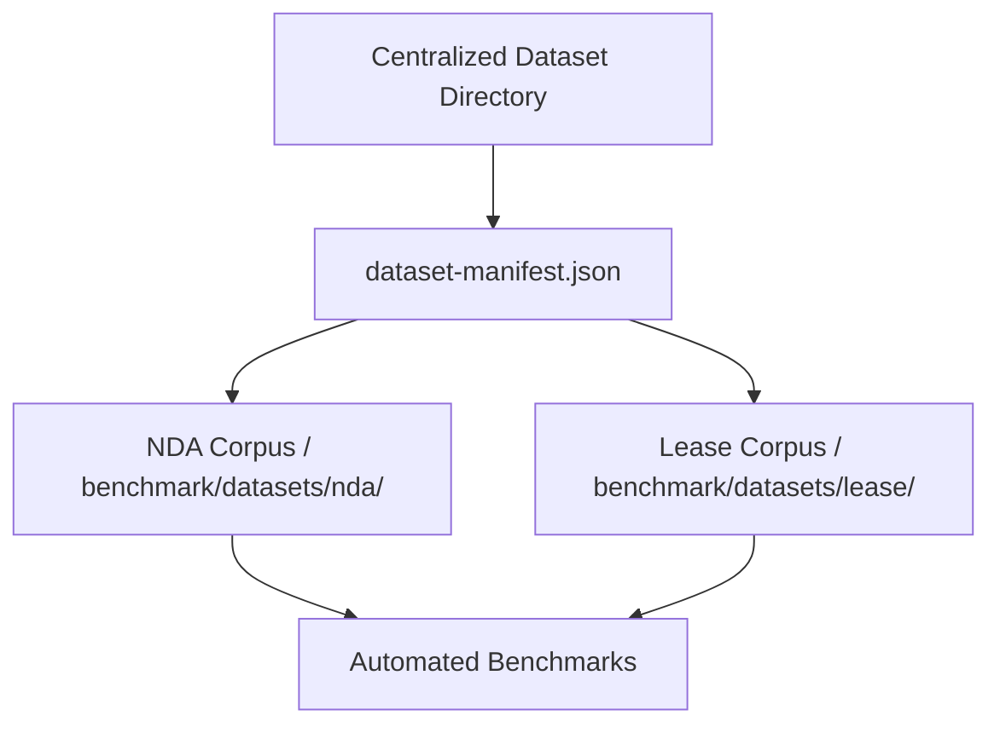

# Gold-Standard Datasets & Fixtures

> **Resolution note:** The "Unorganized Fixtures" gap described below has
> since been addressed: test contracts now live under `benchmark/{nda,
> lease,tos}/*.txt` (organized by document type, matching the recommended
> architecture's intent), not scattered at the repository root — see
> `CHANGELOG.md` ("Cleaned up root workspace by removing transient
> contract segment text files"). No `dataset-manifest.json` was added.
> Separately, `benchmark/run-benchmark.mjs` (referenced throughout this
> document) has been retired and moved to
> `archive/benchmark/run-benchmark.mjs`; the live benchmark script is
> `benchmark/run-benchmark-pipelineB.mjs` (via `npm run benchmark`).

## Purpose
This document specifies the structure, management guidelines, and schema formats of the gold-standard test datasets and regression fixtures.

## Current Repository Implementation
The repository contains contract test files at its root and under `benchmark/`:
- **Raw Test Contracts:** Files like `lease_03.txt`, `nda_01.txt`, `nda_02.txt`, `tos_01.txt`, `tos_04.txt` contain realistic agreement text.
- **Mock domains:** Colocated test scripts under `domains/` containing mock JSON rules.

Currently, there is no centralized database tracking domain coverage, and test contracts are flat files.

## Research Findings
The research corpus suggests that test datasets must:
- Maintain a **Gold-Standard Corpus**: Curated real-world agreements annotated with canonical findings.
- Implement a **Disagreement Resolution Protocol**: Guidelines for resolving differing annotations between legal experts before updates are committed to the corpus.
- Group contracts by domain (e.g. NDAs, Leases, MSAs) and complexity (simple, standard, adversarial).

## Gap Analysis
1. **Unorganized Fixtures:** Flat text files are scattered in the root directory without domain classifications or complexity tags.
2. **Missing Metadata:** Contract files do not specify which domains they test, making coverage analysis a manual task.

## Recommended Architecture
1. **Centralized Dataset Folder:** Move all test contracts into `/benchmark/datasets/` organized by type (e.g. `nda/`, `lease/`).
2. **Dataset Manifest:** Create a `dataset-manifest.json` describing each contract (e.g. source, complexity, active domains).

| Contract File | Document Type | Complexity | Target Domains Tested |
|---|---|---|---|
| `nda_01.txt` | Non-Disclosure | Simple | Confidentiality |
| `lease_03.txt` | Real Estate Lease | Complex | Payment, Liability, Term |
| `tos_01.txt` | Terms of Service | Standard | Dispute Resolution |

### Recommendation Rationale
- **Why:** To enable automated test coverage analysis and help engineers select appropriate test agreements for new rules.
- **Benefits:** Structured test assets, measurable domain coverage.
- **Tradeoffs:** Requires moving files and updating test import configurations.
- **Risks:** Broken file paths in older benchmark scripts if path changes are incomplete.
- **Dependencies:** None.
- **Estimated Effort:** 2 engineering days.
- **Rollback Strategy:** Restore original file locations using Git.

## Repository Impact
### Files Affected
- `benchmark/run-benchmark.mjs` (update contract paths).
- Root test files (move to `/benchmark/datasets/`).

### Files Untouched
- `assets/js/engine/*`
- `api/analyze.js`

## Migration Strategy
Create `/benchmark/datasets/` directories. Move text agreements into their corresponding type subdirectories. Write `dataset-manifest.json` at the root of the dataset folder.

## Performance Considerations
Organizing files has no impact on runtime API latency, but improves CI/CD caching by separating large text assets from core code.

## Test Strategy
Verify that `run-benchmark.mjs` can locate and parse the agreements from their new directories, producing identical analysis outcomes.

## Future Evolution
Eventually, store the gold-standard corpus in a cloud bucket with automated versioning and download pipelines.

## References
- `chat-Enterprise_Legal_AI_Contract_Analysis.txt` (Task 5)
- `GOLDEN_CORPUS_STRATEGY.md`
- `benchmark/run-benchmark.mjs`
