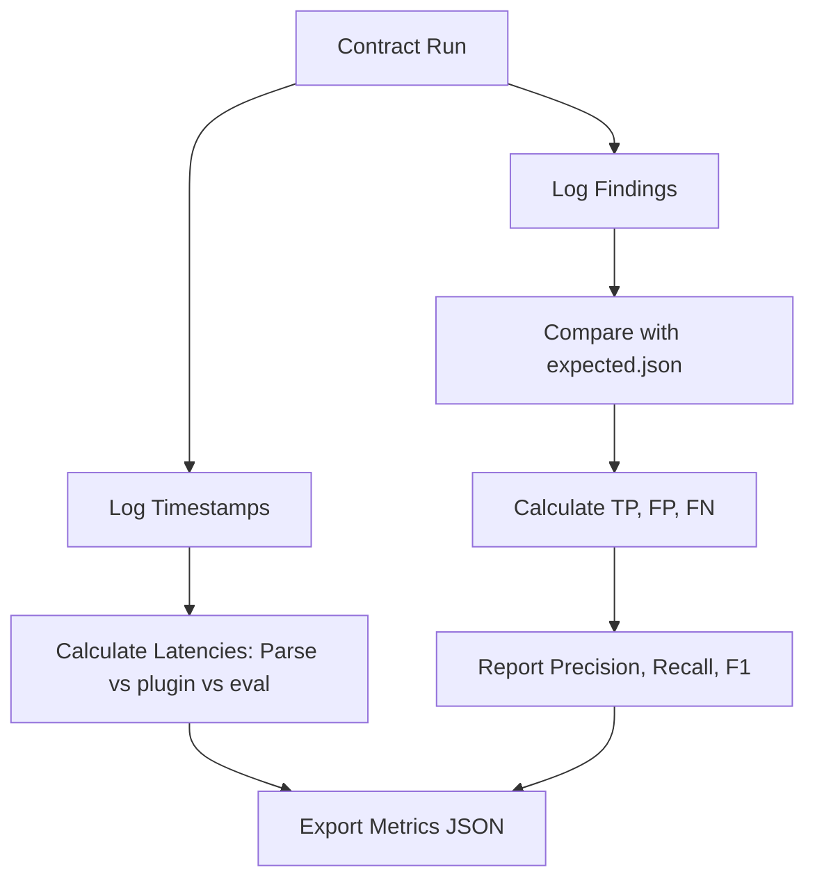

# System Quality & Performance Metrics

> **Note:** This proposal predates the retirement of `benchmark/run-benchmark.mjs`.
> That script has since been moved to `archive/benchmark/run-benchmark.mjs`
> (it drove the now-deleted Pipeline C) and is no longer runnable. The live
> benchmark script is `benchmark/run-benchmark-pipelineB.mjs` (via `npm run
> benchmark`), which currently does finding-id baseline diffing, not
> precision/recall/F1 scoring. The F1/precision/recall proposal below is
> still unimplemented; if pursued, it should target the live script, not
> the archived one.

## Purpose
This document specifies the metrics used to evaluate the accuracy, precision, logical consistency, and execution latency of the Trothix platform.

## Current Repository Implementation
Trothix compiles basic execution statistics:
- **`_stats.js`:** Calculates execution metrics (number of processed nodes, token counts, character lengths).
- **`stats.js` / `stats.html`:** Formats statistics reports for display.
- **`Expected.json`:** Compares compiled severity counts to baseline scores.

Currently, there is no support for tracking standard machine learning metrics (such as Precision, Recall, F1 Score) or logical graph metrics.

## Research Findings
The research corpus suggests that evaluation frameworks must track:
- **Linguistic metrics:** Precision, Recall, and F1 Score for node classification and entity extraction.
- **Logical metrics:** Proportion of compiled rules, cycle count, and number of unresolved concept references.
- **Latency metrics:** P50, P90, and P99 latency times for parsing, compiling, and evaluating rules.

## Gap Analysis
1. **No F1 Score Tracking:** The framework compares absolute finding counts but does not calculate Precision, Recall, or F1 scores against expected targets.
2. **Missing Latency Tracking:** Latency is measured globally, with no breakdown of time spent in parsing vs. engine registry plugins vs. rule evaluation.

## Recommended Architecture
1. **Precision-Recall Calculator:** Update `run-benchmark.mjs` to calculate true positives ($TP$), false positives ($FP$), and false negatives ($FN$) per rule, reporting F1 Scores:
   $$F_1 = \frac{2 \times \text{Precision} \times \text{Recall}}{\text{Precision} + \text{Recall}}$$
2. **Phase-Level Telemetry:** Use `performance.now()` in `Trothix.js` to log latency breakdowns for the tokenizer, lexer, plugins, and rule evaluator.

| Metric Type | Metric Name | Calculation Method | Target Threshold |
|---|---|---|---|
| **Accuracy** | Precision | $TP / (TP + FP)$ | $> 95\%$ |
| **Accuracy** | Recall | $TP / (TP + FN)$ | $> 90\%$ |
| **Latency** | P90 Evaluation | P90 of rule run times | $< 100 \text{ ms}$ |

### Recommendation Rationale
- **Why:** To identify whether rule updates cause high false-positive rates (low precision) or miss actual issues (low recall).
- **Benefits:** Auditable accuracy metrics, performance bottleneck tracking.
- **Tradeoffs:** Adds minor performance-tracking code to execution files.
- **Risks:** F1 calculations require maintaining highly precise `expected.json` files.
- **Dependencies:** None.
- **Estimated Effort:** 3 engineering days.
- **Rollback Strategy:** Disable performance metrics flags in the runner configuration.

## Repository Impact
### Files Affected
- `benchmark/run-benchmark.mjs` (calculate F1, precision, recall).
- `assets/js/engine/Trothix.js` (add phase-level latency instrumentation).

### Files Untouched
- `assets/js/engine/core/parser/*`
- `assets/js/engine/rules/RuleCompiler.js`

## Migration Strategy
Phase 1: Instrument `Trothix.js` with latency markers. Phase 2: Refactor `run-benchmark.mjs` to calculate precision/recall metrics. Phase 3: Export metrics to deployment pipeline consoles.

## Performance Considerations
Using standard Node.js performance APIs (`performance.now()`) adds less than 1 microsecond of overhead per request, maintaining fast execution speeds.

## Test Strategy
Run mock tests with a mismatched expected results file. Verify that the benchmark runner correctly calculates and logs a low F1 score without crashing.

## Future Evolution
Eventually, export system metrics in Prometheus format to support real-time application monitoring.

## References
- `chat-Enterprise_Legal_AI_Contract_Analysis.txt` (Task 5)
- `assets/js/engine/_stats.js`
- `benchmark/run-benchmark.mjs`
