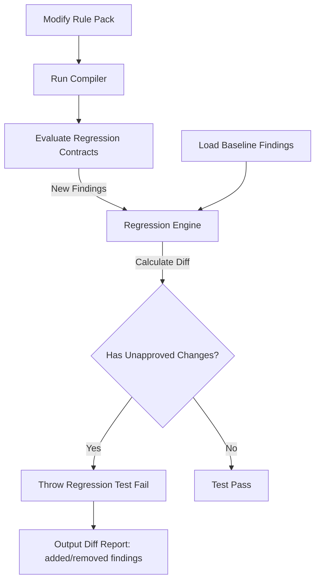

# Regression Testing Framework

## Purpose
This document specifies the regression testing framework designed to prevent accuracy regressions during rule pack and code updates.

## Current Repository Implementation
Trothix features basic unit tests colocated in domain folders (e.g. `domains/Indemnification/tests/positive_positive.test.js`).
- Test execution is triggered using Jest or simple Node test commands (`npm run lint` / `test_linter.js`, `npm run rule-diagnostics`, etc. — see `package.json` `scripts`). An earlier one-off script, `test_pipeline.js`, is not wired into any npm script and has been moved to `archive/dev-scripts/`.
- There is no automated framework to run differential tests comparing outputs between two rule pack versions.

## Research Findings
The research corpus suggests that regression testing in symbolic compliance systems must:
- Implement a **Regression Control Corpus**: A collection of historical contracts whose analysis outputs are frozen.
- Perform **Differential Testing**: Comparing the findings of two compiler runs, highlighting any changes (additions, deletions, severity changes) in results.
- Link regression checks directly to rule status promotions (e.g., a rule cannot transition from `Review` to `Approved` if it breaks any regression control test case).

## Gap Analysis
1. **No Version-Aware Tests:** The framework evaluates tests against the current code version only, with no historical baseline comparisons.
2. **Missing Differential Reports:** Developers must manually compare JSON reports to identify changes.

## Recommended Architecture
1. **Regression Control Index:** Maintain a regression control directory under `benchmark/fixtures/regression/` containing historic JSON output documents.
2. **Differential Engine:** Implement `RegressionEngine.js` to execute differential comparisons on findings.

| Change Type | Meaning | Action Required |
|---|---|---|
| **Added Finding** | New issue identified | Approve if new rule works correctly |
| **Removed Finding** | Existing issue missed | Investigate: potential regression |
| **Modified Severity**| Severity level changed | Verify consistency |

### Recommendation Rationale
- **Why:** To ensure that hotfixes or additions to one domain (e.g. Liability) do not silently break evaluations in another domain (e.g. Indemnification).
- **Benefits:** Safety guarantees, simplified change audits.
- **Tradeoffs:** Requires maintaining a larger set of test fixtures.
- **Risks:** Frequent changes in default rule styles could create high maintenance overhead for test expectations.
- **Dependencies:** None.
- **Estimated Effort:** 3 engineering days.
- **Rollback Strategy:** Allow forcing releases by ignoring regression diff check failures.

## Repository Impact
### Files Affected
- `package.json` (add `test:regression` scripts).

### New Files
- `assets/js/engine/assessment/RegressionEngine.js` (implement differential verification logic).

### Files Untouched
- `assets/js/engine/core/parser/*`
- `assets/js/engine/rules/*`

## Migration Strategy
Phase 1: Build the differential matching class `RegressionEngine.js`. Phase 2: Save the current production output results of 10 baseline contracts as frozen assets. Phase 3: Add regression testing checks to deployment pipelines.

## Performance Considerations
Since regression tests execute locally or in CI/CD environments, they do not affect runtime API analysis response times.

## Test Strategy
Create mock rule updates that intentionally delete rules. Assert that the regression framework flags the missing findings, reports the rule ID, and returns validation errors.

## Future Evolution
Eventually, implement a web interface allowing legal analysts to approve finding diffs directly.

## References
- `chat-Enterprise_Legal_AI_Contract_Analysis.txt` (Task 5)
- `assets/js/engine/assessment/ScoringEngine.js`
