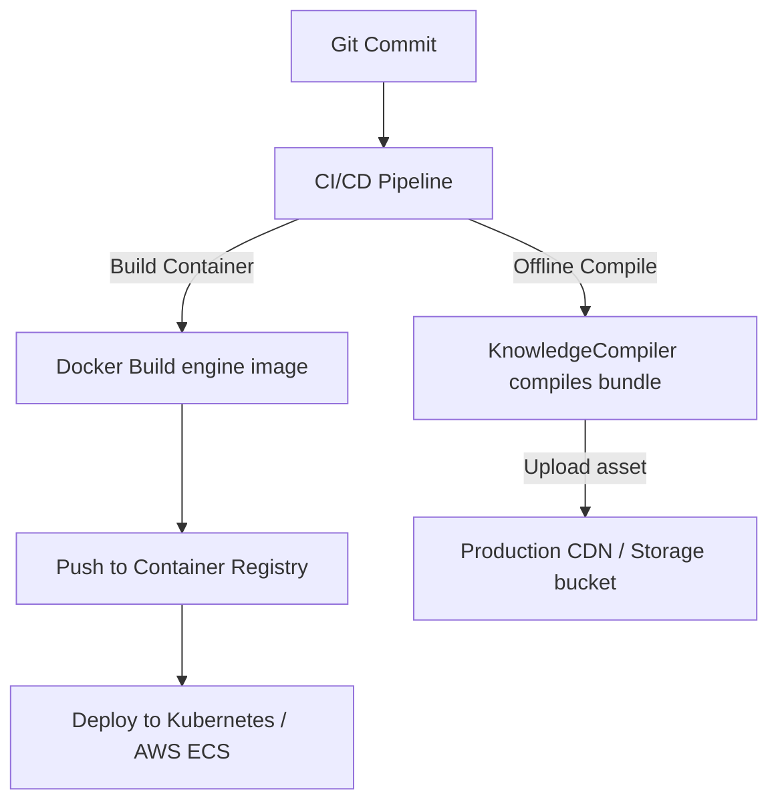

# Deployment & Scaling Architecture

## Purpose
This document specifies the deployment architecture, container configurations, and scaling strategies for hosting the Trothix platform in enterprise cloud environments.

## Current Repository Implementation
Trothix features a lightweight deployment footprint:
- **`vercel.json`:** Declares deployment configurations, bundling `assets/js/engine/**` using `includeFiles` to deploy the analyzer API to Vercel Serverless Functions.
- **`package.json`:** Lists Node.js dependencies and declares execution scripts.
- **Worker thread bindings:** `worker.js` exists in the engine directory, exposing execution wrappers suitable for background processing.

Currently, the engine is deployed as a single monolith, with no support for distributed scaling or autoscaling orchestrations.

## Research Findings
The research corpus suggests that enterprise legal AI deployments must support:
- **Serverless Scaling:** Designing the symbolic engine to run statelessly inside serverless runtimes (such as AWS Lambda, Vercel Functions).
- **Separate Build Pipelines:** Separating compile-time processes (ontology compiling and validation) from runtime request execution.
- **Memory Footprint Optimization:** Keeping the runtime memory usage of the engine minimal to ensure sub-second cold start times.

## Gap Analysis
1. **Bundled Development Tools:** Dev tools (such as the knowledge linter and importer) are packaged into production serverless bundles, increasing file size and function cold-start latencies.
2. **Missing Docker Files:** The repository lacks container configurations (Dockerfiles), making cloud-native deployments (such as Kubernetes) manual tasks.

## Recommended Architecture
1. **Bundle Separation:** Update `vercel.json` to exclude `/knowledge/build/` and test suites from serverless function bundles.
2. **Dockerization:** Create `Dockerfile` configurations under the root directory to package Pipeline B as a lightweight container.

| Environment | Current Footprint | Proposed Target Footprint | Key File |
|---|---|---|---|
| **Vercel** | Bundles all test files | Excludes test/dev assets | `vercel.json` |
| **Docker** | Not implemented | Alpine Node.js Container | `Dockerfile` |
| **Orchestration**| Serverless monolith | Autoscaled Kubernetes pods | `Kubernetes config` |

### Recommendation Rationale
- **Why:** To improve deployment automation and optimize serverless API cold-start times.
- **Benefits:** Low runtime cold start latencies, automated cloud deployments.
- **Tradeoffs:** Requires managing container orchestration files.
- **Risks:** Divergence between local file paths and container paths if Dockerfiles are misconfigured.
- **Dependencies:** None.
- **Estimated Effort:** 3 engineering days.
- **Rollback Strategy:** Revert deployment bundle settings to vercel monolith.

## Repository Impact
### Files Affected
- `vercel.json` (update bundle exclusions).

### New Files
- `Dockerfile` (engine deployment packaging).
- `.dockerignore` (exclude test/dev assets).

### Files Untouched
- `assets/js/engine/*`
- `api/analyze.js`

## Migration Strategy
Phase 1: Create the root `Dockerfile` and verify local container builds. Phase 2: Update `vercel.json` to reduce bundle payload sizes. Phase 3: Wire container builds into release pipelines.

## Performance Considerations
Use lightweight base images (such as `node:18-alpine`) to keep the container size under 150MB, ensuring container boot times remain under 500ms.

## Test Strategy
Trigger container builds and run integration tests inside the running docker instance. Assert that the containerized API matches execution metrics of the local engine.

## Future Evolution
Eventually, implement serverless edge function support, executing rule evaluations inside Vercel Edge or Cloudflare Workers.

## References
- `chat-Enterprise_Legal_AI_Contract_Analysis.txt` (Tasks 7 and 8)
- `vercel.json`
- `package.json`
