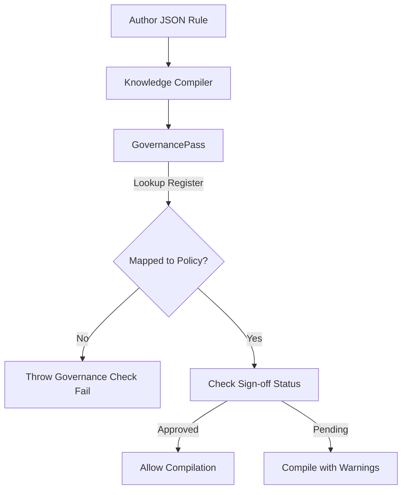

# Corporate Governance & Compliance

## Purpose
This document specifies the corporate governance framework, compliance check lists, and audit tracking capabilities of the Trothix platform.

## Current Repository Implementation
There is no automated compliance tracking or governance verification in the active codebase today.
- Rule revisions are committed directly as code files.
- The system does not check rule packs against corporate compliance rules or record signed audits.

## Research Findings
The research corpus suggests that enterprise compliance systems must:
- Maintain a **Compliance Register**: An audit catalog linking every rule back to a specific corporate policy, contract standard, or statutory article.
- Implement **Verification Logging**: Recording who authorized, reviewed, and tested each rule change.
- Support **Regulatory Drift Analysis**: Identifying when rules must be updated in response to changes in external laws.

## Gap Analysis
1. **Unlinked Rules:** Rules do not contain explicit references to policy documents, making audits a manual task.
2. **Missing Approvals Trail:** The codebase does not enforce that rule changes be verified by compliance teams before compilation.

## Recommended Architecture
1. **Rule Precedence and Policy Fields:** Update `RulesSchema.js` to require a `governance` block on all rules, specifying `policyReference`, `authorizedBy`, and `reviewCycle` variables.
2. **Policy Compliance Check Pass:** Implement a compliance validator pass `GovernancePass.js` in the offline Knowledge Compiler to verify that all active rules map to entries in a central compliance register JSON.

| Governance Requirement | Current Code implementation | Proposed Target |
|---|---|---|
| **Policy Mapping** | None | Required `governance.policyReference` field |
| **Review Cycle** | None | Required `governance.reviewCycle` check |
| **Authorization Sign-off** | None | Required `governance.authorizedBy` metadata |

### Recommendation Rationale
- **Why:** To ensure that all deployed rules strictly align with corporate legal playbooks and regulatory standards.
- **Benefits:** Auditable compliance, simplified regulatory audits.
- **Tradeoffs:** Increases rule authoring overhead.
- **Risks:** Rigorous approval gates might block urgent rule hotfixes.
- **Dependencies:** Schema validation updates.
- **Estimated Effort:** 3 engineering days.
- **Rollback Strategy:** Allow compile overrides via configuration settings.

## Repository Impact
### Files Affected
- `assets/js/engine/knowledge/schemas/RulesSchema.js` (add governance block validator).
- `assets/js/engine/knowledge/compiler/KnowledgeCompiler.js` (wire governance pass).

### New Files
- `assets/js/engine/knowledge/compiler/passes/GovernancePass.js` (implement register verification).
- `assets/js/engine/knowledge/standards/compliance-register.json` (central policy mappings).

### Files Untouched
- `assets/js/engine/core/parser/*`
- `assets/js/engine/rules/RuleCompiler.js`

## Migration Strategy
Phase 1: Update the rule schema to support optional governance tags. Phase 2: Create the compliance register catalog. Phase 3: Enforce governance mappings in compiler passes, reporting anomalies.

## Performance Considerations
Since governance validations execute during offline compilation, they have zero impact on runtime contract evaluation latencies.

## Test Strategy
Run compiler runs with rules referencing invalid or unregistered policy IDs. Assert that `GovernancePass` correctly logs warning/error records and halts compilation.

## Future Evolution
Eventually, implement automated integrations with contract lifecycle management (CLM) platforms to synchronize playbooks dynamically.

## References
- `chat-Enterprise_Legal_AI_Contract_Analysis.txt` (Tasks 7 and 9)
- `assets/js/engine/knowledge/schemas/RulesSchema.js`
- `assets/js/engine/knowledge/compiler/KnowledgeCompiler.js`
