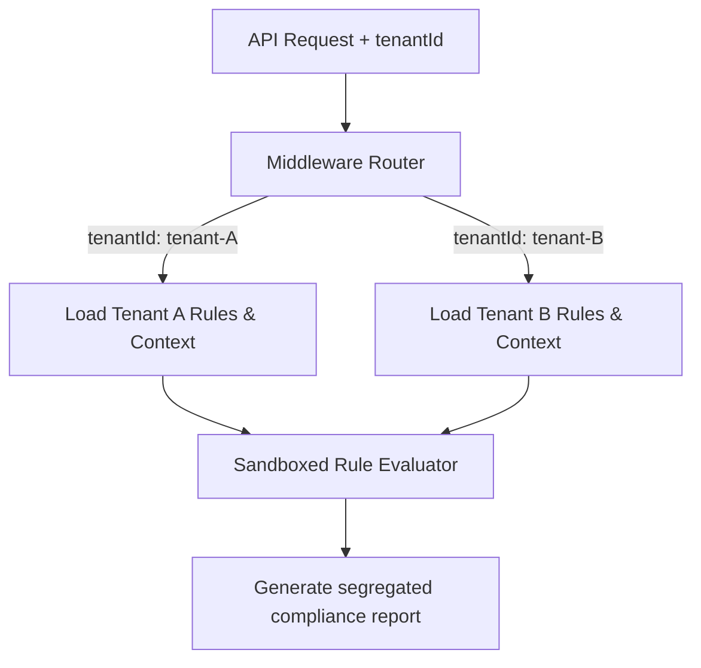

# Multi-Tenancy Architecture

## Purpose
This document specifies the multi-tenant architecture of the Trothix platform, detailing data isolation, tenant-specific rule customisation, and namespace segmentation.

## Current Repository Implementation
Trothix does not currently feature multi-tenancy controls in its core engine files.
- The ontology domain tree (`v1/domains/`) and rule engine are loaded globally from the file system.
- Analyzed contracts are loaded into local memory scopes without any tenant identification identifiers.
- The pipeline (`api/analyze.js` -> `Trothix.js`) runs with global system-wide scopes.

## Research Findings
The research corpus suggests that multi-tenant legal AI architectures must support:
- **Logical/Physical Segregation:** Ensuring that no customer data, intermediate representations, or custom playbooks leak across tenant boundaries.
- **Tenant-Specific Rule Packs:** Permitting tenants to inherit base corporate rules while layering custom overrides (tenant-specific `rules.json` modifications).
- **Request Context Injections:** Explicitly passing tenant identification metrics (`tenantId`) through every stage of the parser, compiler, and evaluation execution pipelines.

## Gap Analysis
1. **Global Filesystem Scope:** Playbook rules and ontologies are loaded from a single shared directory, preventing customer-specific overrides.
2. **Missing Request Scopes:** The analysis endpoint does not accept or track tenant identifier parameters, risking cross-tenant data leaks in shared memory environments.

## Recommended Architecture
1. **Tenant Namespace Isolation:** Modify `KnowledgeProvider.js` to look up ontologies under tenant-specific directories (e.g. `/v1/domains/tenant-A/`).
2. **Context-Aware Evaluator:** Extend `RuleContext.js` to accept tenant parameters and scope the evaluation run to matching rules.

| Tenant Isolation | Current Implementation | Proposed Target | File Location |
|---|---|---|---|
| **Data Scope** | Flat global filesystem | Tenant-scoped paths | `knowledge/KnowledgeProvider.js` |
| **Rule Context** | Shared memory ruleset | Segmented tenant maps | `rules/RuleContext.js` |
| **Request Scope** | Global endpoint | Segmented tenant token | `api/analyze.js` |

### Recommendation Rationale
- **Why:** To support software-as-a-service (SaaS) deployments, guaranteeing that Tenant A cannot access or evaluate Tenant B's proprietary contract standards.
- **Benefits:** Segregated data safety, customizable playbooks.
- **Tradeoffs:** Increases filesystem and context configuration overhead.
- **Risks:** Misconfigured routing middleware could route requests to incorrect tenant folders.
- **Dependencies:** API Gateway tenant routing configurations.
- **Estimated Effort:** 6 engineering days.
- **Rollback Strategy:** Fall back to loading global rulesets.

## Repository Impact
### Files Affected
- `api/analyze.js` (pass tenant tokens).
- `assets/js/engine/knowledge/KnowledgeProvider.js` (look up tenant paths).
- `assets/js/engine/rules/RuleContext.js` (apply tenant filters).

### Files Untouched
- `assets/js/engine/core/parser/*`
- `assets/js/engine/assessment/*`

## Migration Strategy
Phase 1: Update the API wrapper to extract `tenantId` parameters. Phase 2: Refactor the file loader to support nesting (e.g., `v1/domains/{tenantId}/*`). Phase 3: Enforce tenant filters in rule compilations.

## Performance Considerations
Cache tenant-specific rule predicate functions in memory using a LRU cache system to avoid recompiling rules on every analysis request.

## Test Strategy
Create test request profiles with differing tenant keys. Verify that execution paths correctly load separate rule sets and assert that cross-access attempts trigger security exceptions.

## Future Evolution
Eventually, implement physical multi-tenancy configurations, deploying containerized instances of the symbolic engine per enterprise client.

## References
- `chat-Enterprise_Legal_AI_Contract_Analysis.txt` (Tasks 7 and 8)
- `assets/js/engine/knowledge/KnowledgeProvider.js`
- `assets/js/engine/rules/RuleContext.js`
