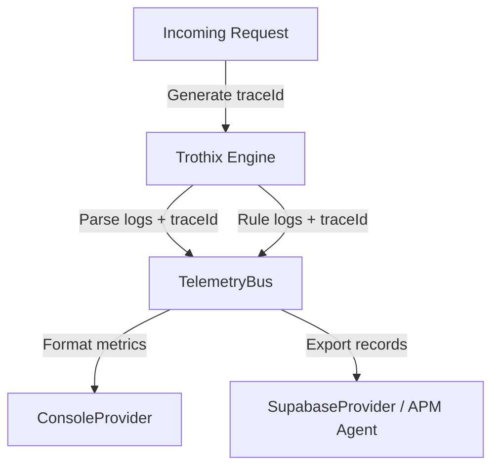

# System Observability & Telemetry

## Purpose
This document specifies the telemetry, logging, and observability architectures of the Trothix platform.

## Current Repository Implementation
Trothix contains a modular logging architecture under `assets/js/engine/telemetry/`:
- **Telemetry Bus (`TelemetryBus.js`):** Coordinates metrics broadcasts to multiple telemetry providers.
- **Supabase Provider (`SupabaseProvider.js`):** Publishes log metrics to an external Supabase database.
- **Console Provider (`ConsoleProvider.js`):** Logs metrics directly to system standard outputs.
- **Telemetry Provider Base (`TelemetryProvider.js`):** Defines the base interface for custom log targets.

Currently, telemetry logs do not track individual request context IDs, making it impossible to correlate multiple logs from a single client request.

## Research Findings
The research corpus suggests that enterprise monitoring requires:
- **Trace-Id Correlation:** Propagating a unique `traceId` through all parser, plugin, and evaluator executions.
- **Rule Performance Tracing:** Logging execution times and results (success, failure, throw) per rule ID.
- **Error Diagnostics Logs:** Storing detailed execution context details (e.g. input snippet offsets) when exceptions occur.

## Gap Analysis
1. **No Request Correlation:** The Telemetry Bus logs metrics independently, lacking correlation identifiers to link a parser log to its corresponding rule-evaluator log.
2. **Missing Rule Latency Traces:** Latency is logged globally, but not mapped to individual rules.

## Recommended Architecture
1. **Propagate Trace Identifiers:** Update the `TelemetryBus` to accept and log `traceId` parameters with every call.
2. **Rule-Level Telemetry:** Instrument `RuleEvaluator.js` to log latency and match outcomes per rule ID.

| Log Parameter | Current Implementation | Proposed Target | File Location |
|---|---|---|---|
| **Correlation** | None | Request-level `traceId` | `TelemetryBus.js` |
| **Rule Latency**| None | Microsecond rule tracking | `RuleEvaluator.js` |
| **Provider** | Supabase / Console | APM (e.g. OpenTelemetry) | `telemetry/` |

### Recommendation Rationale
- **Why:** To enable operations teams to debug API latency spikes and track rule matching performance in production environments.
- **Benefits:** Auditable error traces, performance diagnostics.
- **Tradeoffs:** Adds minor logging processing overhead.
- **Risks:** High logging frequencies might flood standard outputs or database tables.
- **Dependencies:** None.
- **Estimated Effort:** 3 engineering days.
- **Rollback Strategy:** Disable rule-level latency logs via telemetry configurations.

## Repository Impact
### Files Affected
- `assets/js/engine/telemetry/TelemetryBus.js` (accept correlation tokens).
- `assets/js/engine/rules/RuleEvaluator.js` (instrument execution log calls).

### Files Untouched
- `assets/js/engine/core/parser/*`
- `assets/js/engine/assessment/*`

## Migration Strategy
Phase 1: Update `TelemetryBus.js` to require `traceId` arguments. Phase 2: Add logging calls to `RuleEvaluator.js`. Phase 3: Build OpenTelemetry integration providers.

## Performance Considerations
Keep logging operations non-blocking: publish metrics asynchronously to avoid delaying active analysis request responses.

## Test Strategy
Run mock analysis executions. Assert that the generated telemetry logs contain identical `traceId` strings across the parser, plugins, and evaluator phases.

## Future Evolution
Eventually, integrate with standard APM monitoring suites (such as Datadog or New Relic) using the OpenTelemetry SDK.

## References
- `chat-Enterprise_Legal_AI_Contract_Analysis.txt` (Tasks 7 and 8)
- `assets/js/engine/telemetry/TelemetryBus.js`
- `assets/js/engine/rules/RuleEvaluator.js`
