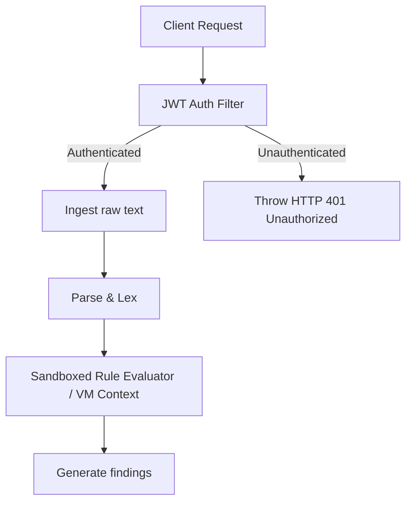

# Security Architecture

## Purpose
This document specifies the security controls, data isolation frameworks, and compliance policies required to secure the Trothix platform in enterprise environments.

## Current Repository Implementation
Trothix features basic code security:
- **Input Sanitization:** Found in `pdfProcessor.js` and `parsers/` to clean ingested text structures.
- **Dependency Isolation:** Relies on a clean node package list (`package.json`) with minimal third-party dependencies, reducing the attack surface.

However, the codebase lacks data encryption frameworks, API authentication filters, role-based access control (RBAC), or secure key management solutions.

## Research Findings
The research corpus highlights the necessity of strict enterprise security controls:
- **Data Isolation:** Complete segregation of customer documents and metadata in transit and at rest.
- **Rule Sanitization:** Verifying that rule sets cannot execute arbitrary code blocks or access server file systems (sandboxed execution).
- **Audit Logging:** Immutably tracking all analysis requests, user interactions, and configuration changes.

## Gap Analysis
1. **No Sandboxing:** Rules are compiled directly into Javascript closures and executed on the main event loop, meaning compromised rules could execute arbitrary Javascript.
2. **Missing Access Filters:** The API (`api/analyze.js`) does not verify request authentication headers, accepting raw text inputs from any network source.

## Recommended Architecture
1. **Sandboxed Rule Context:** Modify `RuleCompiler.js` to compile predicates into a restricted sandbox context (using Node.js `vm` or `vm2` modules) to prevent arbitrary code execution.
2. **API Authentication Integration:** Integrate JWT validation filters into the `api/analyze.js` handler.

| Security Dimension | Current Implementation | Target Implementation | File Location |
|---|---|---|---|
| **Rule Sandbox** | Main node process context | Node `vm` sandboxed context | `rules/RuleCompiler.js` |
| **API Auth** | None (open endpoint) | JWT Auth Middleware | `api/analyze.js` |
| **Data Encryption** | Flat text storage | AES-256 GCM in transit | `pdfProcessor.js` |

### Recommendation Rationale
- **Why:** To prevent malicious domain rule packs or compromised user inputs from executing system commands or exposing server assets.
- **Benefits:** Sandboxed execution safety, secure endpoint access.
- **Tradeoffs:** VM execution adds minor CPU overhead to rule evaluations.
- **Risks:** Node's `vm` module has known sandbox escapes. Use `isolated-vm` for high-risk deployments.
- **Dependencies:** None.
- **Estimated Effort:** 4 engineering days.
- **Rollback Strategy:** Disable VM execution and run compiled closures directly.

## Repository Impact
### Files Affected
- `api/analyze.js` (integrate authentication verification).
- `assets/js/engine/rules/RuleCompiler.js` (wrap predicates in VM scopes).

### Files Untouched
- `assets/js/engine/core/parser/*`
- `assets/js/engine/assessment/*`

## Migration Strategy
Phase 1: Implement authentication filters in the API routes. Phase 2: Refactor rule compilation to execute inside Node `vm` sandboxes, verifying rule behaviors. Phase 3: Roll out secure key rotation policies.

## Performance Considerations
Spawning VM contexts can be slow. Pre-compile and reuse VM script contexts for active rulesets during startup to maintain low execution latencies.

## Test Strategy
Create test scripts containing rules with malicious system calls (e.g. `require('fs').readFileSync()`). Assert that compiler execution in VM sandboxes blocks access, throws security exceptions, and logs violations.

## Future Evolution
Eventually, implement WebAssembly-based execution sandboxes to support language-agnostic rule compilers.

## References
- `chat-Enterprise_Legal_AI_Contract_Analysis.txt` (Task 7)
- `assets/js/engine/rules/RuleCompiler.js`
- `api/analyze.js`
