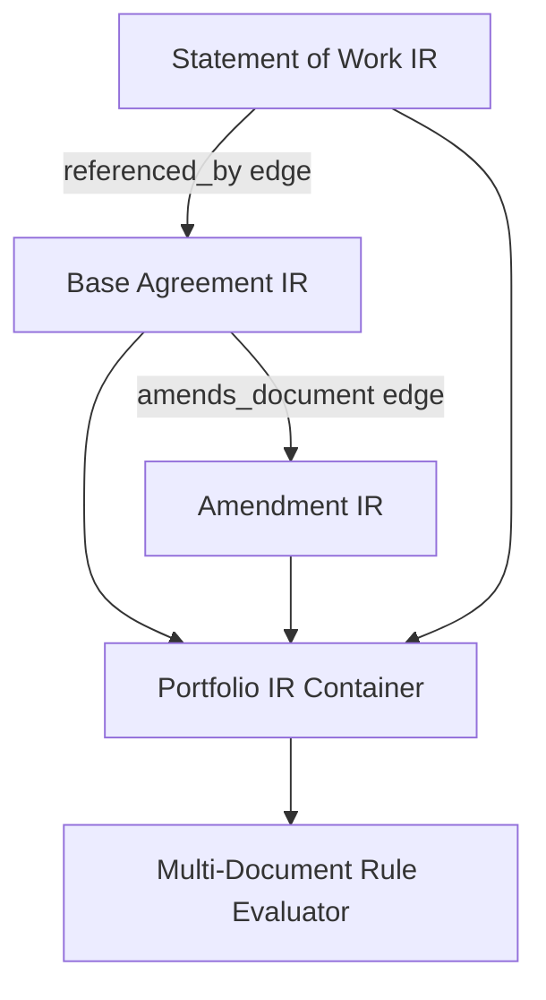

# Cross-Document Linking & Relationships

## Purpose
This document specifies the cross-document linking architecture of the Trothix platform, detailing how references, amendments, and overrides are resolved across document sets.

## Current Repository Implementation
Trothix does not currently support cross-document relationships.
- The parser and IR builder (`legalIRBuilder.js`) evaluate a single text document stream per request.
- Edge relationships in `types.js` are restricted to containment within a single document hierarchy graph.
- The `referenceResolver.js` plugin resolves internal references (e.g. "Section 4.1" of the active document), but cannot resolve references pointing to external agreements (e.g. "per the NDA dated January 1").

## Research Findings
The research corpus suggests that multi-document reasoning requires:
- **Reference Resolution:** Identifying and linking references to external agreements (such as amendments, statement of works, service level agreements).
- **Amendment Overrides Logic:** Resolving cases where an amendment overrides specific terms in a base agreement (e.g., updating payment rates).
- **Multi-Document Graphs:** Linking multiple document IR graphs under a single portfolio parent node.

## Gap Analysis
1. **Single-Document Containment:** The Legal IR and graph models assume a 1:1 mapping between an analysis request and a single contract document.
2. **Missing Reference Anchors:** The `referenceResolver` ignores external date and document type identifiers, preventing cross-document associations.

## Recommended Architecture
1. **Multi-Document IR Wrapper:** Introduce a `PortfolioIR` wrapper in `types.js` to group multiple `LegalIR` instances under a parent portfolio.
2. **External Link Resolver:** Extend `referenceResolver.js` to search for document names and dates, compiling `amends_document` or `referenced_by` edges between separate document graphs.

| Link Relation | Origin Document | Target Document | Primary Meaning |
|---|---|---|---|
| `amends_document` | `Amendment` | `Master Agreement` | Modifies base terms |
| `references_doc` | `Statement of Work` | `Master Agreement` | Inherits master terms |
| `supersedes_doc` | `New Agreement` | `Legacy Agreement` | Replaces active terms |

### Recommendation Rationale
- **Why:** To support corporate contract portfolio audits: users must verify compliance across whole agreement packages, not just single documents in isolation.
- **Benefits:** Auditable contract portfolios, automated amendment tracking.
- **Tradeoffs:** Significantly increases the complexity of the IR graph.
- **Risks:** Broken link chains if a referenced base document is missing from the portfolio upload batch.
- **Dependencies:** Schema validation updates.
- **Estimated Effort:** 6 engineering days.
- **Rollback Strategy:** Fall back to evaluating documents as separate, independent requests.

## Repository Impact
### Files Affected
- `assets/js/engine/core/types.js` (add `PortfolioIR` and cross-document edge types).
- `assets/js/engine/plugins/referenceResolver.js` (add cross-document resolution checks).

### Files Untouched
- `assets/js/engine/core/parser/*`
- `assets/js/engine/rules/RuleCompiler.js`

## Migration Strategy
Phase 1: Update the types module to support cross-document relationships. Phase 2: Add portfolio wrappers to the analysis runner. Phase 3: Update `referenceResolver.js` to map cross-document links.

## Performance Considerations
Optimize cross-document traversals by indexing document nodes in a global portfolio map, avoiding deep graph traversals across unrelated agreements.

## Test Strategy
Create test fixtures under `tests/plugins/` containing a master agreement and an amendment text. Assert that the resolution pass correctly compiles cross-document override links.

## Future Evolution
Eventually, implement automated machine learning classifiers to extract external references and suggest potential document pairings.

## References
- `chat-Enterprise_Legal_AI_Contract_Analysis.txt` (Task 6)
- `assets/js/engine/plugins/referenceResolver.js`
- `assets/js/engine/core/types.js`
