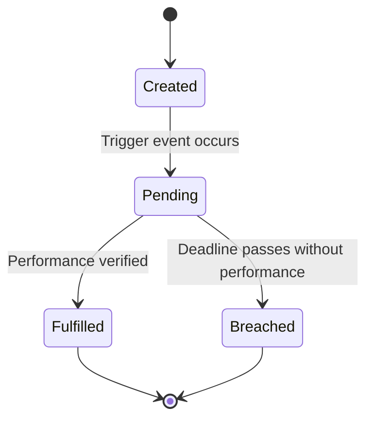

# Cross-Document Obligation Tracking

## Purpose
This document specifies the architecture and tracking mechanisms for monitoring obligations and deadlines across multi-document portfolios.

## Current Repository Implementation
Trothix contains basic single-document deadline and obligation checks:
- **`deadlineNormalizer.js`:** Identifies and normalizes deadline terms (e.g. "within 30 days of the End Date") in extracted actions.
- **`constraintEngine.js`:** Maps constraints and preconditions to actions.

There is no capability to track obligations that span multiple agreements or aggregate deadlines into a master compliance calendar.

## Research Findings
The research corpus suggests that enterprise obligation tracking requires:
- **Obligation Lifecycle State Machines:** Tracking obligations through states: `Created` -> `Pending` -> `Fulfilled` / `Breached`.
- **Cross-Document Dependencies:** Modeling dependencies where an obligation in one document (e.g. paying an invoice in an SOW) is triggered by an event in another document (e.g. deliverable approval in a Master Agreement).
- **Compliance Calendars:** Aggregating normalized deadlines into a chronological action register.

## Gap Analysis
1. **No Obligation Lifecycle:** The engine flags obligation presence but does not track execution states or completion events.
2. **Missing Portfolio Timelines:** Deadline calculations are isolated to individual documents, with no support for cross-agreement timelines.

## Recommended Architecture
1. **Obligation Lifecycle State Machine:** Define the `ObligationState` schema in `types.js` and implement tracking hooks in the evaluator.
2. **Portfolio Timeline Assembler:** Build a timeline compiler `TimelineAssembler.js` under `assessment/` to collate and sort deadlines from all portfolio documents.

| Tracking Dimension | Current Implementation | Proposed Target | File Location |
|---|---|---|---|
| **Obligation Scope** | Single document flag | Multi-document state | `types.js` |
| **Deadlines** | Text normalization | Chronological timeline | `TimelineAssembler.js` |
| **Triggers** | Intra-document reference | Cross-document event | `constraintEngine.js` |

### Recommendation Rationale
- **Why:** To support proactive vendor management audits, helping users monitor active compliance dates across master services agreements and statements of work.
- **Benefits:** Auditable compliance calendars, automated breach detection.
- **Tradeoffs:** Requires integrating runtime event notifications to track performance events.
- **Risks:** Ambiguous trigger definitions in contracts might lead to incorrect state assignments.
- **Dependencies:** Complete execution of the Cross-Document Linking System.
- **Estimated Effort:** 5 engineering days.
- **Rollback Strategy:** Disable state tracking and output simple list tables.

## Repository Impact
### Files Affected
- `assets/js/engine/plugins/deadlineNormalizer.js` (pass normalized dates to portfolio index).
- `assets/js/engine/core/types.js` (add state structures).

### New Files
- `assets/js/engine/assessment/TimelineAssembler.js` (implement timeline collation).

### Files Untouched
- `assets/js/engine/core/parser/*`
- `assets/js/engine/rules/RuleCompiler.js`

## Migration Strategy
Phase 1: Implement the timeline aggregator `TimelineAssembler.js`. Phase 2: Add obligation state definitions to the core models. Phase 3: Wire performance triggers to CLM system hooks.

## Performance Considerations
Sorting and compiling timelines runs in $O(O \log O)$ where $O$ is obligations. Given a typical portfolio contains fewer than 100 obligations, execution is sub-millisecond.

## Test Strategy
Create test portfolios containing a Master Agreement (defining payment terms) and an SOW (defining project milestones). Assert that the compliance timeline correctly calculates the payment dates relative to SOW milestone dates.

## Future Evolution
Eventually, integrate with external financial applications (such as ERP systems) to verify invoice payment events automatically.

## References
- `chat-Enterprise_Legal_AI_Contract_Analysis.txt` (Task 6)
- `assets/js/engine/plugins/deadlineNormalizer.js`
- `assets/js/engine/plugins/constraintEngine.js`
