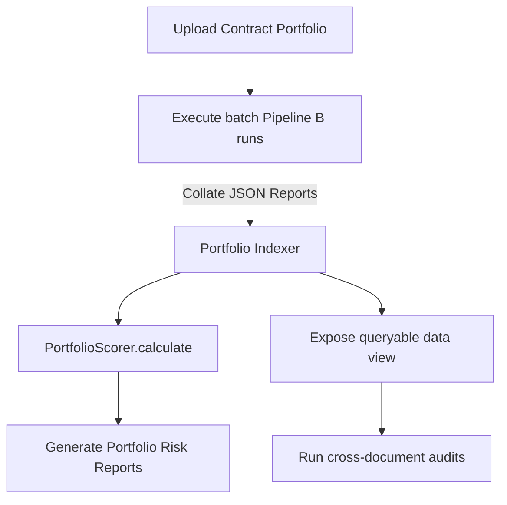

# Portfolio Analysis & Aggregation

## Purpose
This document specifies the portfolio analysis framework of the Trothix platform, detailing aggregate risk metrics, compliance tracking, and cross-portfolio reporting capabilities.

## Current Repository Implementation
Trothix is optimized for evaluating single documents per execution request:
- **`ScoringEngine.js`:** Calculates risk, fairness, and completeness scores per contract.
- **`VerdictEngine.js`:** Aggregates findings to output a single overall compliance verdict.
- **`ReportAssembler.js`:** Compiles the final analysis findings list.

No capability exists to aggregate risk scores across multi-document portfolios or build portfolio-wide analytics charts.

## Research Findings
The research corpus suggests that enterprise contract portfolio management requires:
- **Risk Aggregation:** Visualizing risk distribution (e.g. tracking liability exposure) across all active contracts in a business unit.
- **Obligation Exposure Reporting:** Identifying aggregated financial obligations or compliance liabilities (such as payment schedules across vendors).
- **Adversarial Queries:** Querying portfolios for specific terms or risk factors (e.g., listing all contracts lacking a GDPR data protection addendum).

## Gap Analysis
1. **No Portfolio Scoring:** Risk scores are calculated for single agreements, with no support for aggregate portfolio risk scoring.
2. **Missing Multi-Doc Queries:** Users cannot execute queries across all document analysis reports in a single step.

## Recommended Architecture
1. **Portfolio Scorer:** Implement `PortfolioScorer.js` under `assessment/` to calculate aggregate risk indexes.
2. **Portfolio Index Database:** Create an indexing step to load metadata from analysis reports into a queryable data view.

| Metric / Dimension | Single Document | Portfolio Aggregated |
|---|---|---|
| **Risk Score** | Weighted sum of findings | Total liability exposure |
| **Obligation** | Single due date | Collated cash flow forecast |
| **Audit Coverage** | Single checklist | Portfolio-wide compliance heat map |

### Recommendation Rationale
- **Why:** To support corporate risk management, helping executives identify aggregated liability exposure across the enterprise.
- **Benefits:** Auditable portfolio risks, simplified exposure reporting.
- **Tradeoffs:** Requires building an indexing layer to cache query results.
- **Risks:** High document volumes might degrade aggregation speeds.
- **Dependencies:** Complete execution of the Cross-Document Linking System.
- **Estimated Effort:** 5 engineering days.
- **Rollback Strategy:** Disable portfolio reports and display document lists.

## Repository Impact
### Files Affected
- `assets/js/engine/assessment/ScoringEngine.js` (expose scoring indexes to aggregators).

### New Files
- `assets/js/engine/assessment/PortfolioScorer.js` (implement portfolio aggregation).

### Files Untouched
- `assets/js/engine/core/parser/*`
- `assets/js/engine/rules/RuleCompiler.js`

## Migration Strategy
Phase 1: Implement the portfolio aggregator `PortfolioScorer.js`. Phase 2: Add portfolio reporting metrics to dashboard pages. Phase 3: Wire query pipelines to business intelligence applications.

## Performance Considerations
Optimize portfolio aggregation by pre-calculating and caching document-level scores, executing only simple additions during portfolio report compilations.

## Test Strategy
Create mock portfolios containing multiple NDAs with varying liability limits. Assert that the aggregate risk score accurately reflects total portfolio exposure limits.

## Future Evolution
Eventually, implement machine learning models to identify anomaly trends (such as non-standard liability limits) in large portfolios.

## References
- `chat-Enterprise_Legal_AI_Contract_Analysis.txt` (Task 6)
- `assets/js/engine/assessment/ScoringEngine.js`
- `assets/js/engine/assessment/VerdictEngine.js`
