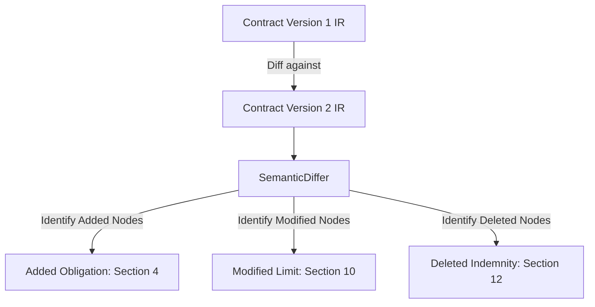

# Cross-Document Versioning & Lineage

## Purpose
This document specifies the cross-document version control, lineage tracking, and modification history architecture of the Trothix platform.

## Current Repository Implementation
Trothix features basic code-level versioning:
- **`v1/manifest.json`:** Tracks active ontology versions and engine compatibility.
- **Node Fingerprints:** `legalIRBuilder.js` calculates raw, structural, and canonical hashes per node to detect content changes.

There is no support for tracking historical revisions of contracts or computing semantic diffs between two document versions.

## Research Findings
The research corpus suggests that enterprise contract lifecycle management requires:
- **Semantic Diffing:** Identifying changes in obligations, risks, or compliance states between contract versions, rather than just simple text line diffs.
- **Lineage Graphs:** Constructing version lineage maps linking renewals, replacements, and amendments.
- **Immutable Audit Trails:** Recording cryptographic node hashes to prove document modifications.

## Gap Analysis
1. **No Semantic Diff Engine:** The platform cannot compare two analyses, forcing users to manually read through reports to identify rule outcome changes.
2. **Missing Lineage Maps:** The system has no capacity to link a renewal document back to the master agreement it replaces.

## Recommended Architecture
1. **Semantic Diff Engine:** Implement `SemanticDiffer.js` under `assessment/` to compare two `LegalIR` DAGs and identify changed, added, or deleted nodes.
2. **Lineage Tracker:** Extend `types.js` to define `supersedes_document` edges, compiling document version history lines.

| Change Class | Text Diff | Semantic Diff Output |
|---|---|---|
| **Addition** | Line inserted | New concept node added |
| **Modification** | Text replaced | Constraint value updated (e.g. 30 -> 60 days) |
| **Deletion** | Line removed | Existing concept node omitted |

### Recommendation Rationale
- **Why:** To help legal departments instantly identify hidden modifications in incoming negotiation drafts.
- **Benefits:** Auditable change logs, high-speed contract reviews.
- **Tradeoffs:** Requires keeping historical analysis runs in memory for comparison.
- **Risks:** Paragraph renumbering might cause false mismatch signals if structural identifiers change.
- **Dependencies:** Complete execution of the Fingerprint and Hash System.
- **Estimated Effort:** 4 engineering days.
- **Rollback Strategy:** Disable diff reports and export standard analysis findings.

## Repository Impact
### Files Affected
- `assets/js/engine/core/types.js` (add lineage edge definitions).

### New Files
- `assets/js/engine/assessment/SemanticDiffer.js` (implement semantic comparison logic).

### Files Untouched
- `assets/js/engine/core/parser/*`
- `assets/js/engine/rules/RuleCompiler.js`

## Migration Strategy
Phase 1: Build the semantic comparison utility `SemanticDiffer.js`. Phase 2: Add version lineage mappings to database layers. Phase 3: Expose comparison views in application dashboards.

## Performance Considerations
Semantic comparisons run in $O(N_1 + N_2)$ where $N_1$ and $N_2$ are node counts, using node fingerprints as fast change keys, keeping execution under 10ms.

## Test Strategy
Create test fixtures containing original and edited contract text. Assert that `SemanticDiffer` correctly identifies the changed payment dates and logs them in a differential report.

## Future Evolution
Eventually, implement automated change suggestion models, helping users restore compliance after unapproved revisions.

## References
- `chat-Enterprise_Legal_AI_Contract_Analysis.txt` (Task 6)
- `assets/js/engine/core/types.js`
- `assets/js/engine/core/ir/legalIRBuilder.js`
