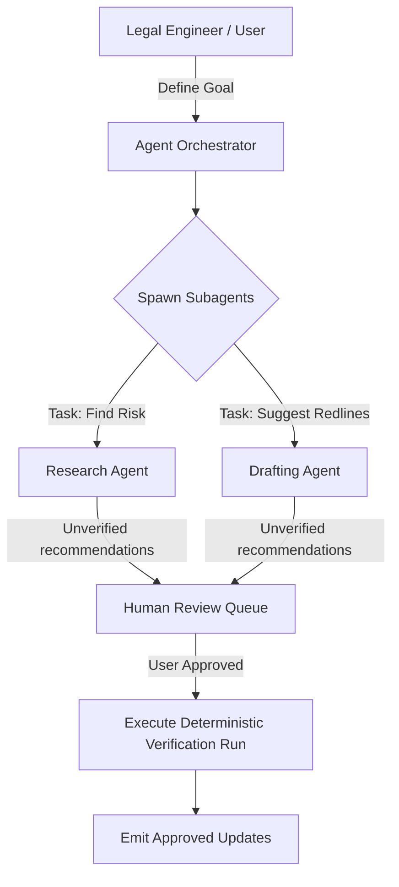

# Agentic AI Architecture

## Purpose
This document specifies the agentic AI architecture of the Trothix platform, detailing orchestration, task execution boundaries, and human-in-the-loop verification processes.

## Current Repository Implementation
Trothix does not currently feature autonomous agents, agent coordinators, or agent tools in its active codebase.
- The analysis execution pipeline is synchronous and deterministic.
- External calls to LLMs or non-deterministic processing modules are kept upstream of the core parsing engine.
- Finding evaluations are executed solely by compiled rule closures.

## Research Findings
The research corpus suggests that agentic workflows in legal AI require:
- **Task-Specific Subagents:** Deploying specialized subagents (such as a Research Agent, a Drafting Agent, or a Verification Agent) to execute complex legal tasks.
- **Orchestration Layers:** State-machine based routing to manage subagent tasks and prevent infinite execution loops.
- **Deterministic Bounds:** Ensuring that subagents cannot modify rule code or execute compliance checks outside the deterministic symbolic engine.
- **Human-in-the-loop (HITL):** Enforcing approval workflows for agent recommendations before updates are committed.

## Gap Analysis
1. **No Agent Environment:** The runtime engine cannot invoke, coordinate, or evaluate output from autonomous agents.
2. **Missing HITL Scopes:** There is no queue management framework to route agent outputs to human legal reviewers.

## Recommended Architecture
1. **Agent Integration Seam:** Define the `AgentTaskContract` schema under `types.js` to structure communications between the core engine and external agent frameworks.
2. **Deterministic Sandbox:** Enforce that agents can query the `KnowledgeProvider` and run rule evaluations, but cannot modify rule code directly.

| Agent Type | Capabilities | Deterministic Bounds |
|---|---|---|
| **Research Agent** | Searches external regulations | Read-only access to ontology |
| **Drafting Agent** | Proposes clause edits | Proposes diffs; cannot commit |
| **Verification** | Runs benchmark regression suites | Read/Write test configurations |

### Recommendation Rationale
- **Why:** To support complex legal tasks (such as redrafting a clause to restore compliance) that require iterative reasoning, while keeping the compliance engine deterministic first.
- **Benefits:** Automated drafting support, logic safety.
- **Tradeoffs:** High execution cost and latency due to iterative agent runs.
- **Risks:** Agents might suggest non-compliant clauses if validation checks are bypassed.
- **Dependencies:** Web application queue managers.
- **Estimated Effort:** 8 engineering days.
- **Rollback Strategy:** Disable agent queues and process submissions manually.

## Repository Impact
### Files Affected
- `assets/js/engine/core/types.js` (define agent task interfaces).

### New Files
- `assets/js/engine/plugins/agentTaskWrapper.js` (implement runtime communication wrappers).

### Files Untouched
- `assets/js/engine/core/parser/*`
- `assets/js/engine/rules/RuleCompiler.js`

## Migration Strategy
Phase 1: Update type definitions to support task communication models. Phase 2: Build the agent communication wrapper plugin. Phase 3: Connect verification agents to CI/CD regression suites.

## Performance Considerations
Since agent runs are asynchronous and execute out-of-band, they do not block runtime API analysis requests.

## Test Strategy
Create mock task queues under `tests/agents/`. Assert that the task coordinator correctly routes tasks to verification runs and captures performance metrics.

## Future Evolution
Eventually, implement multi-agent collaboration frameworks to automate complex contract negotiation workflows.

## References
- `chat-Enterprise_Legal_AI_Contract_Analysis.txt` (Task 9)
- `assets/js/engine/core/types.js`
