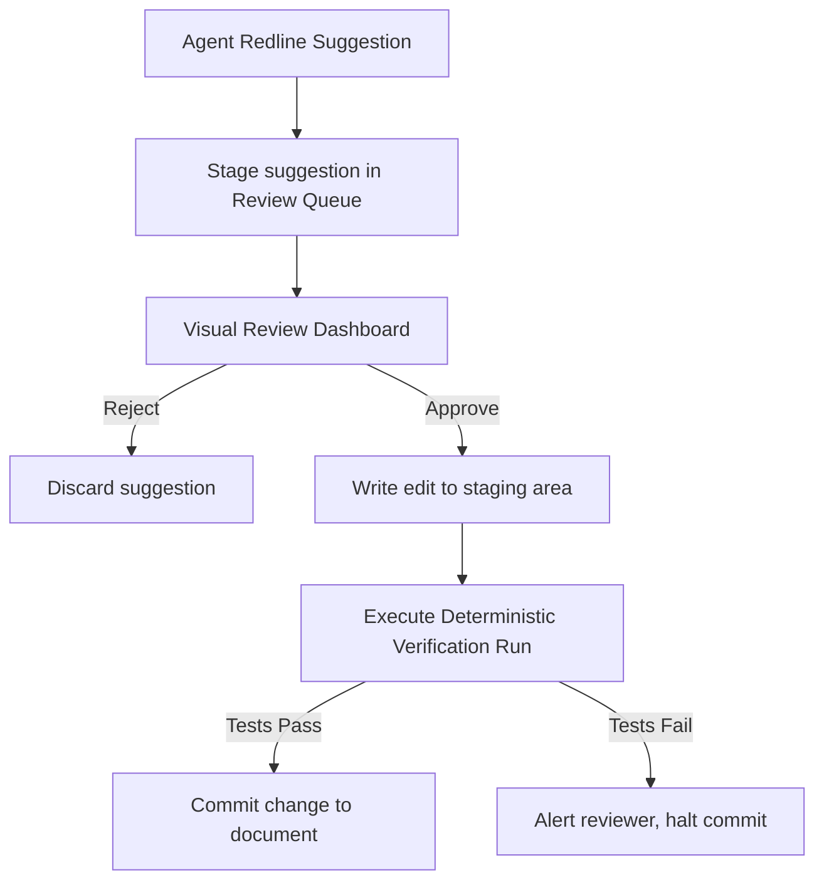

# Human-in-the-Loop Review System

## Purpose
This document specifies the Human-in-the-Loop (HITL) review system, detailing review queues, audit logs, and approval workflows.

## Current Repository Implementation
Trothix features a basic user feedback form:
- **`feedback.html` / `feedback.js`:** Collects and logs user ratings and comments.

There is no structured queue manager, change staging area, or approval workflow for validating agentic recommendations in the codebase.

## Research Findings
The research corpus suggests that enterprise legal AI systems must:
- Implement a **Human-in-the-Loop (HITL) queue**: Routing agent recommendations to qualified legal professionals.
- Support **Staged Changes**: Staging agent-suggested edits in a temporary review database rather than writing directly to active files.
- Record **Signed Audits**: Log user approvals (including reviewer identity, timestamp, and verification logs) for compliance audits.

## Gap Analysis
1. **No Review Queue:** The system executes analyses and outputs reports, lacking support for staging or routing unapproved edits.
2. **Missing Staging Database:** Proposing contract redlines requires writing directly to files, risking data corruption.

## Recommended Architecture
1. **Review Queue Manager:** Implement a queue schema `ReviewQueueContract` in `types.js` to manage staging tables.
2. **Staged Execution Wrapper:** Update the API wrapper to process unstaged requests using the standard engine, while staging unapproved recommendations in a temporary sandbox.

| HITL Dimension | Current Implementation | Proposed Target |
|---|---|---|
| **Staging** | Direct file writes | Staging database tables |
| **Routing** | None | Role-based queues |
| **Audit Logs** | Simple feedback form | Signed compliance records |

### Recommendation Rationale
- **Why:** To prevent unverified agent outputs (such as suggested clause modifications) from leaking into active enterprise agreements without human sign-off.
- **Benefits:** Logical safety guarantees, auditable edit trails.
- **Tradeoffs:** Adds administrative steps to contract review cycles.
- **Risks:** Slow review queues could delay critical business negotiations.
- **Dependencies:** User authorization framework integration.
- **Estimated Effort:** 4 engineering days.
- **Rollback Strategy:** Revert document states to baseline checks and discard staged tables.

## Repository Impact
### Files Affected
- `assets/js/engine/core/types.js` (add review queue interfaces).

### New Files
- `assets/js/engine/plugins/ReviewQueueManager.js` (implement queue and staging logic).

### Files Untouched
- `assets/js/engine/core/parser/*`
- `assets/js/engine/rules/RuleCompiler.js`

## Migration Strategy
Phase 1: Update type definitions to support review scopes. Phase 2: Build the queue staging manager `ReviewQueueManager.js`. Phase 3: Expose review dashboards in client portals.

## Performance Considerations
Keep staging operations non-blocking: store staged edits in separate database tables to avoid degrading active production database queries.

## Test Strategy
Create test request profiles with staged suggestions. Assert that the queue manager blocks commits until approvals are registered, and verifies regression test status on final writes.

## Future Evolution
Eventually, implement automated routing models, dispatching specific clause edits to specialized legal review teams.

## References
- `chat-Enterprise_Legal_AI_Contract_Analysis.txt` (Tasks 9 and 10)
- `assets/js/engine/core/types.js`
- `feedback.html`
