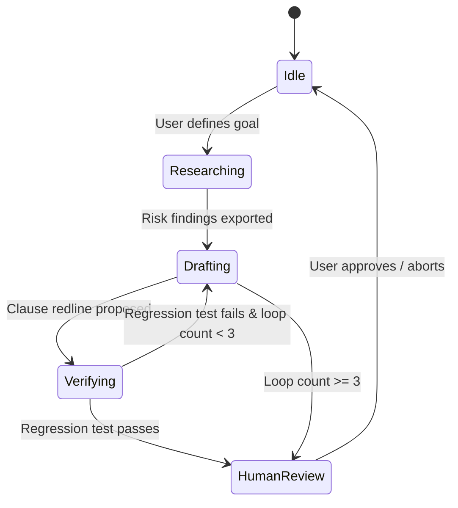

# Agent Orchestration & Coordination

## Purpose
This document specifies the agent orchestration layer of the Trothix platform, detailing task routing, state management, and loop prevention mechanisms.

## Current Repository Implementation
No agent coordination, message loops, or state-machine routers exist in the active codebase today. All execution flows are sequential and managed directly by `Trothix.js`.

## Research Findings
The research corpus recommends that agent orchestration systems:
- Implement a **State-Machine Router** to govern transitions between agent tasks (e.g. from research to drafting to verification).
- Use **Task Isolation** to run subagents in isolated workspaces, preventing state corruption.
- Enforce **Loop Limits**: Restricting the maximum number of iterative agent runs (e.g., max 3 rewrite attempts) to avoid infinite execution loops.

## Gap Analysis
1. **No State Router:** The codebase cannot orchestrate multi-step agent tasks.
2. **Missing Loop Prevention:** Iterative agent workflows cannot be restricted, risking runaway api usage.

## Recommended Architecture
1. **State Machine Router:** Implement `AgentOrchestrator.js` under `plugins/` providing state transitions and loop limit tracking.
2. **Isolated Workspaces:** Set up workspace branching models (inheriting the parent repository state but isolating runtime files) for subagent runs.

| Orchestration Parameter | Current Implementation | Proposed Target | File Location |
|---|---|---|---|
| **State Routing** | Synchronous sequential | State-Machine transitions | `AgentOrchestrator.js` |
| **Workspace** | Shared global | Branched isolation folders | `plugins/` |
| **Execution Limit** | None (sequential run) | Strict iteration cap (e.g. 3) | `AgentOrchestrator.js` |

### Recommendation Rationale
- **Why:** To enable complex, multi-stage legal engineering workflows (such as analyzing a contract, identifying risk, and suggesting redlines) while guaranteeing system stability.
- **Benefits:** Structured agent coordination, loop safety.
- **Tradeoffs:** Increased orchestration processing complexity.
- **Risks:** Complex routing logic might lead to deadlock states if error transitions are unmapped.
- **Dependencies:** None.
- **Estimated Effort:** 5 engineering days.
- **Rollback Strategy:** Disable state routing and execute subagent tasks sequentially.

## Repository Impact
### Files Affected
- `assets/js/engine/core/types.js` (add orchestrator state schemas).

### New Files
- `assets/js/engine/plugins/AgentOrchestrator.js` (implement routing state machine).

### Files Untouched
- `assets/js/engine/core/parser/*`
- `assets/js/engine/rules/RuleCompiler.js`

## Migration Strategy
Phase 1: Build the orchestration state machine `AgentOrchestrator.js`. Phase 2: Add loop limit validation. Phase 3: Integrate state triggers into UI workflows.

## Performance Considerations
Keep orchestrator state updates lightweight: store state parameters in memory, writing to persistent databases only at critical transition stages.

## Test Strategy
Run unit tests under `tests/agents/` containing simulated looping workflows. Assert that the orchestrator correctly halts task execution and outputs warnings when the iteration limit (e.g., 3) is reached.

## Future Evolution
Eventually, support dynamic subagent registration, allowing users to load custom agent modules at runtime.

## References
- `chat-Enterprise_Legal_AI_Contract_Analysis.txt` (Task 9)
- `assets/js/engine/core/types.js`
- `assets/js/engine/plugins/agentTaskWrapper.js`
