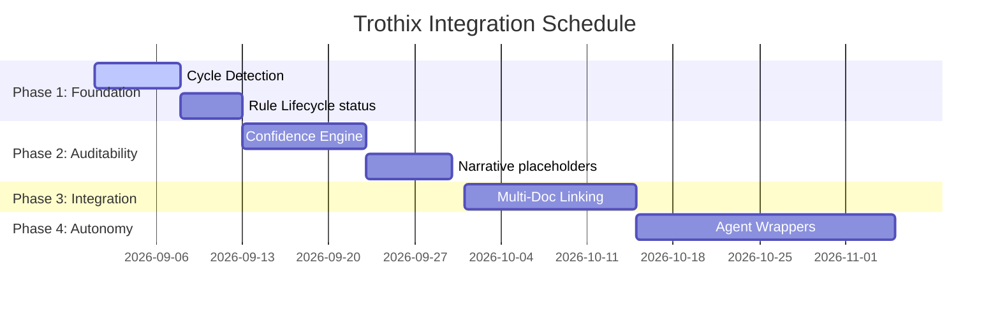

# Implementation Phases & Schedule

## Purpose
This document presents the phased implementation schedule and release roadmap for integrating the research findings into the Trothix platform.

## Current Repository Implementation
The current repository contains the active Pipeline B code, and the offline compiler passes. Core development targets are defined in `KNOWLEDGE_BACKLOG.md` and `KNOWLEDGE_CATALOG.md`.

No formal, research-driven integration plan has been executed.

## Research Findings
The research corpus suggests that system integrations must:
- Prioritize logical correctness (such as cycle detection) first.
- Complete the core validation and confidence engine before adding advanced capabilities (like multi-document linking or agentic workflows).
- Execute regular regression test iterations at each phase boundary.

## Gap Analysis
1. **Unstructured Development:** Backlog items are listed without sequencing or dependency details.
2. **Missing Integration Phases:** There is no roadmap defining how to transit from the legacy engine to the target system design.

## Recommended Architecture
A four-phase implementation schedule designed to minimize risk and verify correctness:
- **Phase 1: Foundation (Correctness):** Implement cycle detection in `DependencyPass.js` and strict rule status checks in `RuleRegistry.js`.
- **Phase 2: Auditability (Confidence):** Deploy the `ConfidenceResolver.js` and wire dynamic confidence scoring into `VerdictEngine.js`.
- **Phase 3: Integration (Multi-Doc):** Build cross-document linking and portfolio risk scorers.
- **Phase 4: Autonomy (Agents):** Introduce the agent task wrappers and review queue controllers.

| Phase | Targeted Subsystem | Key Files Touched | Estimated Effort |
|---|---|---|---|
| **Phase 1** | Compiler / Registry | `DependencyPass.js`, `RuleRegistry.js` | 5 days |
| **Phase 2** | Assessment / Scorer | `VerdictEngine.js`, `ConfidenceResolver.js` | 10 days |
| **Phase 3** | Plugins / Core | `referenceResolver.js`, `types.js` | 14 days |
| **Phase 4** | Plugins / Queue | `agentTaskWrapper.js`, `ReviewQueueManager.js` | 21 days |

### Recommendation Rationale
- **Why:** To verify logic safety and confidence calculations before introducing non-deterministic agent suggestions.
- **Benefits:** Low risk, stable development cycles, verified correctness.
- **Tradeoffs:** Delays the release of agentic features.
- **Risks:** Scope drift in Phase 2 could delay multi-document features.
- **Dependencies:** Complete execution of the test environment migrations.
- **Estimated Effort:** 50 engineering days total.
- **Rollback Strategy:** Archive each phase commit separately using Git.

## Repository Impact
### Files Affected
- `assets/js/engine/knowledge/compiler/passes/DependencyPass.js` (Phase 1).
- `assets/js/engine/rules/RuleRegistry.js` (Phase 1).
- `assets/js/engine/assessment/VerdictEngine.js` (Phase 2).

### Files Untouched
- `assets/js/engine/core/parser/*`
- `assets/js/engine/core/ir/legalIRBuilder.js`

## Migration Strategy
Deploy updates as distinct Git branches (`feature/phase-1`, `feature/phase-2`). Merge branches into the main integration branch only after all regression tests pass.

## Performance Considerations
Optimize build pipelines by running compile-time linter tests only when JSON files are modified, keeping build runs fast.

## Test Strategy
Run full regression suite checks (`npm run benchmark`) at the end of each phase. Assert that findings count and scoring matches expected controls.

## Future Evolution
Eventually, set up automated deployment pipelines to compile and push ontology bundles to production CDNs.

## References
- `chat-Enterprise_Legal_AI_Contract_Analysis.txt` (Task 10)
- `Trothix_Research_Integration_Plan.md`
- `KNOWLEDGE_BACKLOG.md`
