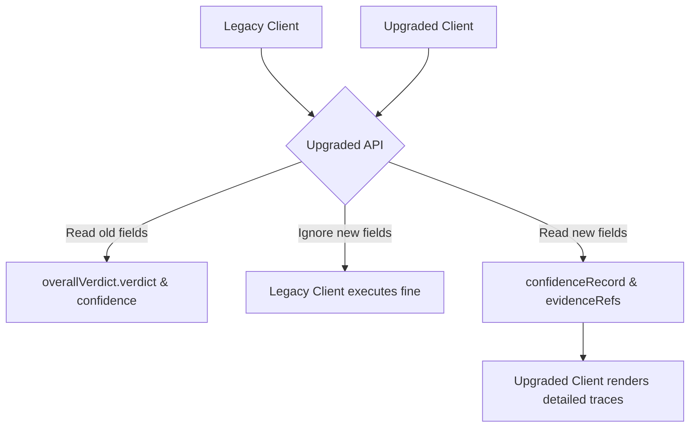

# Migration Guide & API Compatibility

## Purpose
This document provides migration guidelines and API compatibility instructions for upgrading Trothix deployments to the new target design.

## Current Repository Implementation
Trothix API endpoints (`api/analyze.js`) consume contract text payloads and output standard JSON reports containing findings lists:
- **`overallVerdict`:** `{ verdict, confidence, reason }`.
- **`findings`:** List of `{ id, ruleId, severity, category, summary, details }`.

Confidence scores are static (`0.95`), and traceability references in findings default to `"Unknown"`.

## Research Findings
The research corpus highlights the necessity of maintaining backwards compatibility during system upgrades. Any change to output JSON schemas must:
- Be strictly additive (new keys, no renaming of existing keys).
- Maintain existing data types (e.g. `confidence` remains a float between 0 and 1).
- Avoid changing legacy status codes or error messages.

## Gap Analysis
1. **Broken API Fields:** The `confidence` field is a static literal, and findings do not export text references.
2. **Path Schema Drift:** Moving domains or updating structures might break downstream dashboard parsers.

## Recommended Architecture
Enforce strict API compatibility rules during migration:
- **Add new keys:** Add `confidenceRecord` (object) and `evidenceRefs` (array) to the output report.
- **Maintain existing fields:** Retain `overallVerdict.confidence` and `overallVerdict.verdict` with the same types, populating them with derived scores.
- **Graceful fallbacks:** If confidence calculation fails, fall back to returning `0.95` without throwing errors.

| Output JSON Key | Type | Migration Status | Target Value |
|---|---|---|---|
| **`overallVerdict.confidence`** | Float | Updated | Derived overall score |
| **`overallVerdict.verdict`** | String | Untouched | Compliance status string |
| **`findings[*].clauseNode`** | String | Updated | Resolved section node ID |
| **`confidenceRecord`** | Object | New | Detailed confidence breakdown |

### Recommendation Rationale
- **Why:** To prevent breaking upstream integrations (such as client-side dashboards or CLM platforms) when upgrading the compliance engine.
- **Benefits:** Seamless upgrades, zero API integration downtime.
- **Tradeoffs:** Requires maintaining legacy fields alongside new fields.
- **Risks:** Client systems relying on the static `0.95` value might throw alerts if scores drop due to missing fields.
- **Dependencies:** None.
- **Estimated Effort:** 2 engineering days.
- **Rollback Strategy:** Revert API response formatting and output original literal configurations.

## Repository Impact
### Files Affected
- `assets/js/engine/assessment/ReportAssembler.js` (format API JSON outputs).

### Files Untouched
- `assets/js/engine/core/parser/*`
- `assets/js/engine/rules/RuleCompiler.js`

## Migration Strategy
Deploy the updated API output formatting in a non-breaking version upgrade (e.g. API v1.1). Maintain the v1.0 route with original output structures until clients migrate.

## Performance Considerations
Keep JSON serialization fast: exclude unnecessary trace logs from production payload outputs, exposing them only when debug headers are explicitly enabled.

## Test Strategy
Run compatibility verification tests using mock legacy client request formats. Assert that the returned JSON contains all original keys and that their values conform to expected datatypes.

## Future Evolution
Eventually, implement standard REST API versioning (e.g. `/api/v2/analyze`) to manage major schema updates cleanly.

## References
- `chat-Enterprise_Legal_AI_Contract_Analysis.txt` (Task 10)
- `assets/js/engine/assessment/ReportAssembler.js`
- `api/analyze.js`
