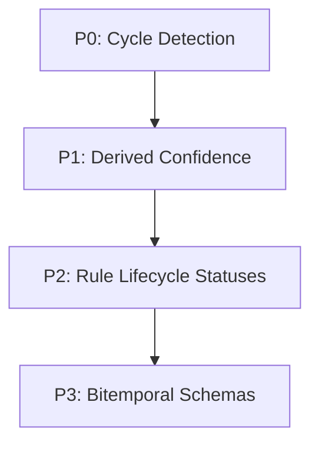

# Integration Priorities & Risk Mitigation

## Purpose
This document specifies the prioritization framework and risk mitigation strategies for integrating the research findings.

## Current Repository Implementation
Trothix does not currently employ a risk-based prioritization framework for codebase updates. Backlog sequencing in `KNOWLEDGE_BACKLOG.md` is based solely on priority flags (High, Medium, Low), with no associated risk ratings.

## Research Findings
The research corpus suggests that integration tasks must be prioritized by:
- **Risk Removal First:** Resolving critical defects (such as circular dependencies or fabricated outputs) before implementing optimization or automation passes.
- **Complexity Assessment:** Estimating developer effort, code footprint impact, and regression risks.
- **Rollback Planning:** Documenting explicit rollback instructions for every prioritized task.

## Gap Analysis
1. **Unstructured Prioritization:** Tasks are scheduled without analyzing their potential impact on compiler safety or runtime stability.
2. **Missing Rollback Frameworks:** Code updates lack explicit rollback pathways, risking service interruptions if updates break.

## Recommended Architecture
A risk-balanced prioritization matrix grouping integration tasks into four priority tiers:

| Task Description | Core Component | Priority | Complexity | Regression Risk | Rollback Plan |
|---|---|---|---|---|---|
| **Cycle detection check** | Compiler Pass | **P0** | Low | Low | Disable cycle check pass |
| **Derived confidence scores**| Scoring Engine | **P1** | Medium | Medium | Restore literal weights |
| **Rule status lifecycle** | Rule Registry | **P2** | Low | Low | Default all rules to active |
| **Bitemporal schemas** | Ontology Schema| **P3** | High | High | Remove date filters |

### Recommendation Rationale
- **Why:** To address the highest-leverage logic and audit defects first, ensuring the engine is stable before deploying complex schema updates.
- **Benefits:** Structured integration pathways, low regression risks.
- **Tradeoffs:** Delays the execution of bitemporal ontology features.
- **Risks:** Unforeseen compilation issues in P0 might delay P1 confidence updates.
- **Dependencies:** None.
- **Estimated Effort:** 20 engineering days total across all four priority tiers.
- **Rollback Strategy:** Follow the task-specific rollback instructions in the matrix above.

## Repository Impact
### Files Affected
- `assets/js/engine/knowledge/compiler/passes/DependencyPass.js` (P0).
- `assets/js/engine/assessment/VerdictEngine.js` (P1).
- `assets/js/engine/rules/RuleRegistry.js` (P2).

### Files Untouched
- `assets/js/engine/core/parser/*`
- `assets/js/engine/core/ir/legalIRBuilder.js`

## Migration Strategy
Phase in updates following the priority tiers. Resolve and verify P0 tasks before beginning P1 developments.

## Performance Considerations
Since P0 and P2 updates occur during startup or compilation, they do not affect runtime contract analysis latencies.

## Test Strategy
Run full regression suite checks (`npm run benchmark`) after resolving each priority tier. Assert that findings match baseline expectations.

## Future Evolution
Eventually, implement automated dependency dashboards to track integration statuses and risk profiles in real-time.

## References
- `chat-Enterprise_Legal_AI_Contract_Analysis.txt` (Task 10)
- `docs/trothix-architecture-audit.md`
- `KNOWLEDGE_BACKLOG.md`
