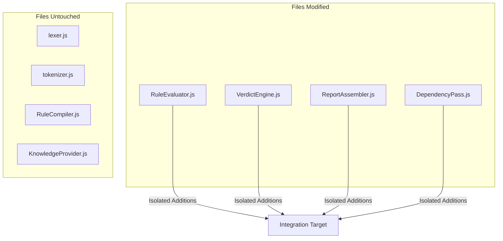

# Repository Impact Analysis

## Purpose
This document specifies the exact code impacts, file changes, and architectural boundaries affected by the integration roadmap.

## Current Repository Implementation
The repository contains the engine directories under `assets/js/engine/` and test datasets under `benchmark/`. Active pipeline files are:
- `core/parser/lexer.js`
- `core/ir/legalIRBuilder.js`
- `rules/RuleCompiler.js`
- `assessment/ScoringEngine.js`

Unused legacy code (Pipeline A and E) exists in adjacent directories.

## Research Findings
The research corpus suggests that repository modifications must:
- Maintain clear boundaries between parser lexing, intermediate representations, compilers, and evaluators.
- Prevent modifying working logic in core files (such as rule compilation or parsing logic) when extending downstream capabilities (like confidence scoring or trace analysis).
- Keep changes additive, avoiding modifications to existing constructor signatures.

## Gap Analysis
1. **Unbounded Code Modifications:** Modifying scoring parameters requires editing core evaluation loops, risking calculation regressions.
2. **Path Clutter:** Unused legacy files are mixed with active production modules, increasing modification risks.

## Recommended Architecture
Enforce strict file isolation boundaries during implementation:
- **Rule engine:** Changes to `RuleEvaluator.js` must be strictly limited to populating evidence pointers and generating traces; the matching engine closures remain untouched.
- **Parser/IR:** No modifications are permitted inside `lexer.js` or `tokenizer.js`; all structural additions (such as table parsing) are isolated to `legalIRBuilder.js`.
- **Scoring:** The scoring math is untouched; `ScoringEngine.js` is updated only to load confidence weight configuration files.

| Subsystem | File Name | Impact Class | Change Target |
|---|---|---|---|
| **Compiler** | `passes/DependencyPass.js` | Additive | Implement DFS cycle check |
| **Evaluator** | `rules/RuleEvaluator.js` | Additive | Pass node pointer, generate traces |
| **Verdict** | `assessment/VerdictEngine.js` | Replacement | Replace literal with derived score |
| **Reporter** | `assessment/ReportAssembler.js`| Additive | Map node IDs in traceability |

### Recommendation Rationale
- **Why:** To protect the stable symbolic core while introducing new, advanced features.
- **Benefits:** Low regression risk, clean code reviews, stable builds.
- **Tradeoffs:** Requires writing helper classes instead of editing inline files.
- **Risks:** Scope leak in helper classes could duplicate existing functionalities.
- **Dependencies:** None.
- **Estimated Effort:** 2 engineering days.
- **Rollback Strategy:** Revert files to main branch configurations using Git.

## Repository Impact
### Files Affected
See the comparative table above. All modifications are strictly scoped to the specified files.

### Files Untouched
Core compilation and lexing modules (`core/parser/lexer.js`, `rules/RuleCompiler.js`) are explicitly isolated and kept untouched.

## Migration Strategy
Create integration feature branches. Verify code formatting and lint checks on all changed files before merging.

## Performance Considerations
Since modifications are additive, there is no impact on existing sequential evaluation execution latencies.

## Test Strategy
Run full regression tests (`npm run benchmark`) comparing output results before and after file changes. Verify that all compliance scores are unchanged.

## Future Evolution
Eventually, migrate compile-time code checks to automated CI/CD runners to block PR merges if untouched files are modified.

## References
- `chat-Enterprise_Legal_AI_Contract_Analysis.txt` (Tasks 1 and 10)
- `docs/trothix-architecture-audit.md`
- `assets/js/engine/rules/RuleEvaluator.js`
