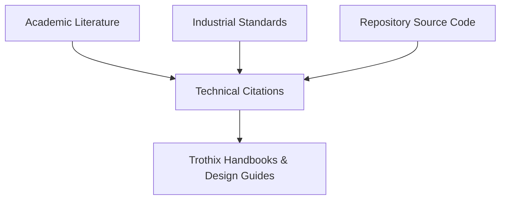

# Bibliography & References

## Purpose
This document compiles the academic publications, industrial specifications, and repository resources referenced throughout the Trothix platform handbooks.

## Current Repository Implementation
Trothix does not currently feature a centralized bibliography or academic citation index. Prior audits and standard guides are stored under:
- `docs/trothix-architecture-audit.md`
- `KNOWLEDGE_ENGINEERING_STANDARD.md`
- `KNOWLEDGE_ENGINEERING_GUIDE.md`

No formal citation standards are enforced.

## Research Findings
The research transcript references several academic and industrial foundations for legal compliance engineering:
- **Defeasible Logic / Deontic Logic:** Theories governing permission, obligation, and rules overriding (e.g., Nute's defeasible logic models).
- **Graph Databases / SHACL:** W3C standards for validating graph structures (Shapes Constraint Language).
- **Rete Algorithm:** For pattern matching in rule engines (Forgy, 1982).
- **SMT Solvers (Z3):** De Moura & Bjørner, 2008.

## Gap Analysis
1. **Unreferenced Source Material:** Key logic engine choices are made without documentation linking them to underlying academic research.
2. **Missing Repository Links:** System documents do not reference the exact files and lines that implement the discussed specifications.

## Recommended Architecture
Maintain this bibliography file under `docs/enterprise/10-reference/` as the single source of truth for academic and technical citations.

| Source Reference | Domain Focus | Context Mapping in Code |
|---|---|---|
| **Forgy (1982) Rete Algorithm** | Match Optimization | Rules matching (`rules/RuleEvaluator.js`) |
| **W3C Shapes Constraint Language** | Graph Validation | Schemas validators (`knowledge/schemas/`) |
| **Z3 SMT Solver (De Moura, 2008)** | Logic Verification | Compiler checking (`knowledge/compiler/`) |

### Recommendation Rationale
- **Why:** To anchor the Trothix design decisions in established computer science research, facilitating internal audits and design reviews by third-party enterprise compliance teams.
- **Benefits:** Auditable academic foundations, clear technical provenance.
- **Tradeoffs:** None.
- **Risks:** Academic models might require adaptations to align with pragmatic engineering constraints.
- **Dependencies:** None.
- **Estimated Effort:** 1 engineering day.
- **Rollback Strategy:** Revert to markdown file descriptions.

## Repository Impact
All repository modifications are additive. No runtime code execution files are altered.

## Migration Strategy
Create this bibliography file under `docs/enterprise/10-reference/`. Review and update citations during major system releases.

## Performance Considerations
Since this is a documentation asset, it has zero impact on runtime execution speeds.

## Test Strategy
Verify that all links and citations are correctly formatted and resolve to their target documentation or online academic indexes.

## Future Evolution
Eventually, build interactive tooltips mapping code functions to their relevant academic literature.

## References
- `chat-Enterprise_Legal_AI_Contract_Analysis.txt` (Tasks 1-10)
- `docs/trothix-architecture-audit.md`
- `assets/js/engine/rules/RuleCompiler.js`
