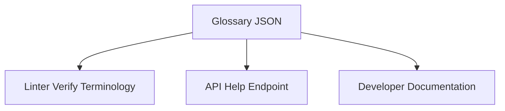

# Glossary of Terms

## Purpose
This document defines the core technical terms, acronyms, and concepts used across the Trothix platform codebase and design handbook.

## Current Repository Implementation
Trothix maintains a flat legacy definition file:
- **`core/legacy/definitions.js`:** Contains strings defining basic legal classifications.

No centralized, modern technical glossary exists in the codebase today.

## Research Findings
The research corpus suggests that technical glossaries must define:
- **Intermediate Representation (IR):** The structured graph DAG representation of parsed documents.
- **Defeasible Logic:** Logic models where rules can be defeated or overridden by exceptions.
- **Truth Maintenance System (TMS):** Frameworks tracking dependencies between logical findings.
- **Ontology Graph:** Directed graph models representing domain-specific concepts and relationships.

## Gap Analysis
1. **Outdated Terms:** The current definitions file references legacy browser pipelines (Pipeline A) and lacks terms relating to compilers or confidence metrics.
2. **Missing System Definitions:** Key runtime modules (such as `RuleCompiler` and `ScoringEngine`) are not defined in any repository documentation.

## Recommended Architecture
Maintain a centralized, compiled glossary JSON `glossary.json` under `knowledge/standards/` containing term definitions, referenced by linter passes and help documents.

| Term | Definition | Context |
|---|---|---|
| **Legal IR** | Hierarchical token DAG | `core/ir/legalIRBuilder.js` |
| **Defeasibility** | Override-tolerant logic | `rules/RuleEvaluator.js` |
| **Ontology Node** | Schema-validated concept | `knowledge/KnowledgeProvider.js` |
| **Evidence Span** | Character offset range | `core/types.js` |

### Recommendation Rationale
- **Why:** To align terminology across engineering, product, and legal teams, preventing naming confusion in rule definitions.
- **Benefits:** Clear naming standards, unified schemas.
- **Tradeoffs:** Requires updating documentation when naming standards evolve.
- **Risks:** Renaming existing concept tags in JSON schemas might break runtime rule queries.
- **Dependencies:** None.
- **Estimated Effort:** 1 engineering day.
- **Rollback Strategy:** Revert to markdown file descriptions.

## Repository Impact
### Files Affected
- `assets/js/engine/knowledge/schemas/ConceptSchema.js` (validate term definitions).

### New Files
- `assets/js/engine/knowledge/standards/glossary.json` (central terms definition).

### Files Untouched
- `assets/js/engine/core/parser/*`
- `assets/js/engine/rules/RuleCompiler.js`

## Migration Strategy
Phase 1: Draft the glossary definitions. Phase 2: Create the JSON resource file. Phase 3: Integrate glossary checks into automated linter runs.

## Performance Considerations
Since glossary lookups are run during build validation or API documentation queries, they have zero impact on runtime contract evaluation speeds.

## Test Strategy
Run linter verification tests on rules containing non-standard glossary terms. Assert that the linter issues appropriate casing warnings.

## Future Evolution
Eventually, implement automated translations to localize the glossary across multiple languages.

## References
- `chat-Enterprise_Legal_AI_Contract_Analysis.txt` (Task 10)
- `assets/js/engine/core/legacy/definitions.js`
- `assets/js/engine/knowledge/schemas/ConceptSchema.js`
