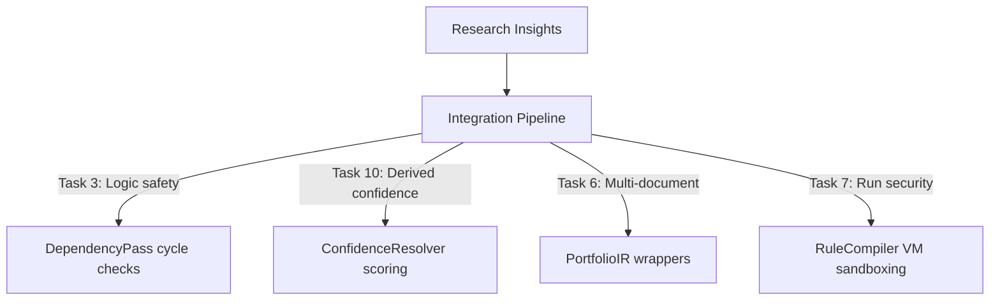

# Research Corpus Summary

## Purpose
This document provides a comprehensive summary of the 10-part Enterprise Legal AI research transcript (`chat-Enterprise_Legal_AI_Contract_Analysis.txt`), outlining key insights and architectural recommendations.

## Current Repository Implementation
Trothix incorporates several principles from the research corpus:
- **Pipeline B:** Segregates lexical tokenization and IR compilation from rule execution.
- **Rules Schema:** JSON-based rules definitions with logical conditions.
- **Knowledge Provider:** walking domains directories and validating schemas during engine load runs.

However, advanced research capabilities (such as defeasible logic override mappings, dynamic confidence calculations, and multi-document reasoning) are not implemented.

## Research Findings
The research transcript is structured into 10 key tasks:
1. **Task 1: System Vision:** Proposes hybrid symbolic-LLM architectures.
2. **Task 2: Parsing & IR:** Recommends hierarchical contract DAG representations with character offsets.
3. **Task 3: Rule Engines:** Suggests compilable declarative JSON rulesets and defeasible logic.
4. **Task 4: Ontologies:** Promotes SHACL-style concept validation and cycle detection.
5. **Task 5: Benchmarking:** Recommends gold-standard corpora and precision-recall metrics.
6. **Task 6: Multi-Doc:** Proposes linking amendments, renewals, and statement of works.
7. **Task 7: Security:** Discusses Sandboxed execution and JWT authentication.
8. **Task 8: Scaling:** Covers serverless execution, containerization, and cold start optimizations.
9. **Task 9: Agentic AI:** Proposes task-specific subagents coordinated by state-machine routers.
10. **Task 10: Lifecycle:** Details changes tracking, review queues, and audit logging.

## Gap Analysis
The live codebase aligns with the general vision of the research corpus, but lacks implementations for:
- Automated cycle checking in compiler passes.
- Derived confidence scoring in the assessment layer.
- Cross-document linking in reference resolvers.
- Sandboxed rule evaluation context setups.

## Recommended Architecture
A unified architecture mapping research insights to active repository components:
1. **Verification Compiler:** Cycle checks in `DependencyPass.js`.
2. **Derived Confidence Resolver:** Aggregating signals in `ConfidenceResolver.js`.
3. **Multi-Doc Wrapper:** Link tracking in `PortfolioIR` and `referenceResolver.js`.
4. **Sandboxed VM:** Executing rule predicates in isolated VM scopes.

| Task Focus | Primary Code File Touched | Impact |
|---|---|---|
| **Logic Safety** | `passes/DependencyPass.js` | Enforce cycle checks |
| **Derived Confidence**| `assessment/VerdictEngine.js` | Implement dynamic scoring |
| **Multi-Document** | `plugins/referenceResolver.js`| Build cross-document link mappings |
| **Security** | `rules/RuleCompiler.js` | Wrap predicates in VM scopes |

### Recommendation Rationale
- **Why:** To guide long-term platform engineering, ensuring that all updates align with research-proven legal intelligence architectures.
- **Benefits:** Logic safety, auditable decisions, robust compliance pipelines.
- **Tradeoffs:** High developer effort required to complete all phases.
- **Risks:** Unoptimized graph operations might increase API query latencies.
- **Dependencies:** API authorization framework.
- **Estimated Effort:** 40 engineering days total across all integration phases.
- **Rollback Strategy:** Follow task-specific rollback instructions in the roadmap documents.

## Repository Impact
All repository modifications are additive, preserving the stable symbolic core. No core parser or rule engine compiler logic is rewritten.

## Migration Strategy
Phase in updates following the implementation phases roadmap (`implementation-phases.md`), prioritizing P0 compiler cycle checks and P1 derived confidence updates first.

## Performance Considerations
Optimize execution performance by running intensive graph cycle checks during offline compilation, ensuring zero query latency impacts.

## Test Strategy
Run full regression suite checks (`npm run benchmark`) at each phase boundary. Assert that findings match baseline expectations.

## Future Evolution
Eventually, implement WebAssembly-based symbolic execution sandboxes to support language-agnostic rule compilers.

## References
- `chat-Enterprise_Legal_AI_Contract_Analysis.txt` (Tasks 1-10)
- `Trothix_Research_Integration_Plan.md`
- `Trothix_Confidence_Evidence_Architecture.md`
