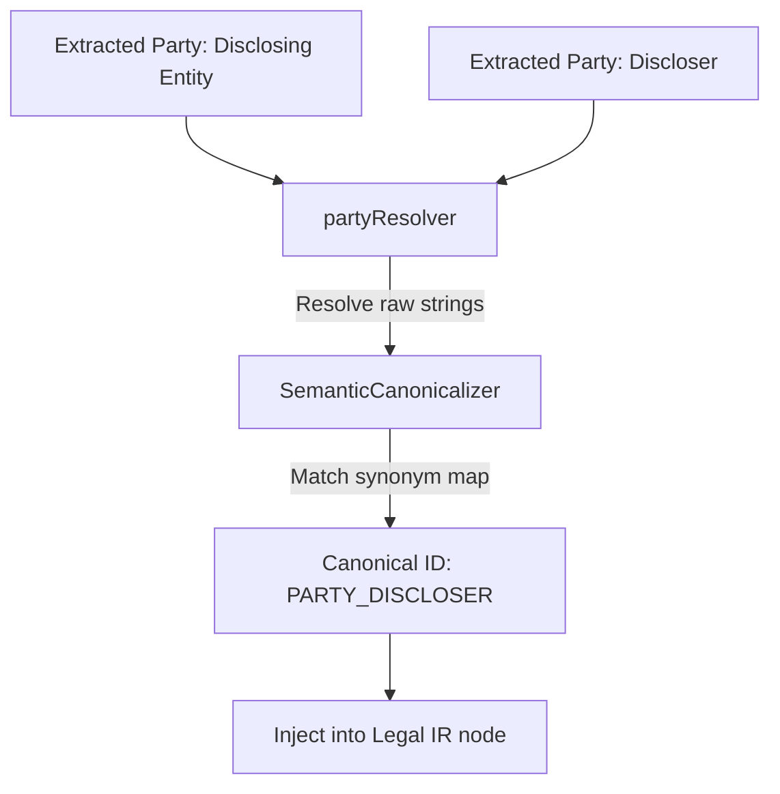

# Legal Domain Terminology Mapping

## Purpose
This document specifies the mappings, synonyms, and translations between raw legal contract text terminology and the canonical ontology identifiers used in the Trothix platform.

## Current Repository Implementation
- **Linguistic Mapping:** Managed under `assets/js/engine/plugins/`.
- **`actionNormalizer.js` / `deadlineNormalizer.js`:** Translate diverse text representations (such as "30 days", "monthly") to unified data types.
- **`partyResolver.js`:** Identifies and resolves party references.
- **Synonyms resolution:** `KnowledgeProvider.js` features a basic `resolveActionSynonym(term)` method, checking if an extracted word matches any registered action synonyms.

## Research Findings
The research corpus suggests that legal terminology mapping requires:
- **Canonicalization:** Mapping fuzzy term variations (e.g. "disclosing party", "Discloser", "disclosing entity") to a single canonical ontology node.
- **Jurisdictional Translation:** Aligning local statutory terms (e.g., "Company" in the US vs. "LTD" in the UK) to core entity concepts.
- **Linguistic Normalization:** Converting passive verb constructions to active relational objects.

## Gap Analysis
1. **Weak Synonym Resolution:** `resolveActionSynonym` checks a hardcoded list, failing to resolve noun synonyms or regional variants.
2. **Missing Entity Canonicalization:** Extracted entity names are passed raw without namespace alignment, causing duplicate findings.

## Recommended Architecture
1. **Unified Semantic Canonicalizer:** Move synonym checks to `SemanticCanonicalizer.js` under `importer/` to build synonym clusters.
2. **Entity Namespace Alignment:** Update `entityEngine.js` to cross-reference extracted entities with the canonical registry.

| Text Variation | Canonical Identifier | Target Concept Node |
|---|---|---|
| "Discloser", "Disclosing Party" | `PARTY_DISCLOSER` | `Party` |
| "Recipient", "Receiving Party" | `PARTY_RECIPIENT` | `Party` |
| "Confidential Info", "Proprietary Data"| `CONCEPT_CONFIDENTIAL_INFO`| `Obligation` |

### Recommendation Rationale
- **Why:** To prevent duplicate or conflicting findings caused by minor phrasing variations in contracts.
- **Benefits:** Auditable entity mappings, high precision.
- **Tradeoffs:** Requires maintaining a comprehensive synonym registry.
- **Risks:** Incorrect mapping of narrow legal exceptions to broad canonical terms.
- **Dependencies:** None.
- **Estimated Effort:** 3 engineering days.
- **Rollback Strategy:** Revert to executing direct text string matches.

## Repository Impact
### Files Affected
- `assets/js/engine/knowledge/KnowledgeProvider.js` (delegate synonym checks).
- `assets/js/engine/plugins/partyResolver.js` (apply namespace mappings).

### New Files
- `assets/js/engine/knowledge/standards/terminology-map.json` (synonyms mapping registry).

### Files Untouched
- `assets/js/engine/core/parser/*`
- `assets/js/engine/rules/RuleCompiler.js`

## Migration Strategy
Phase 1: Compile the terminology map. Phase 2: Refactor `KnowledgeProvider.js` to load the JSON map. Phase 3: Wire synonym mappings to the extraction plugins.

## Performance Considerations
Optimize term resolution by building an in-memory hash index of synonyms during engine initialization, maintaining $O(1)$ lookup times.

## Test Strategy
Run unit tests under `tests/plugins/` using contracts containing non-standard terms (e.g. "disclosing party"). Assert that the resulting IR node ID resolves to `PARTY_DISCLOSER`.

## Future Evolution
Eventually, integrate semantic vector similarity models to resolve complex synonyms dynamically at compile time.

## References
- `chat-Enterprise_Legal_AI_Contract_Analysis.txt` (Task 4)
- `assets/js/engine/plugins/partyResolver.js`
- `assets/js/engine/knowledge/KnowledgeProvider.js`
